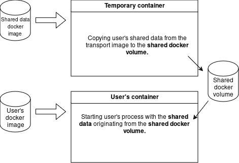

# Custom configs for containers

### Problem definition

A users has a **docker image** from which his software can be started. The image contains pre-compiled binaries with a **default configuration**. However, in many cases (robotics applications), the user's software needs to be started with **different configuration** each time. Configuration can be facilited by several mechanisms:

* config files,
* ROS launch files,
* shell scripts,
* additional files loaded in runtime.

There are two ways how to provide **custom configuration files** to the system:

  1. expose them to the **container** running from the **user's docker image**
  2. paste them as a part of the **compose.yaml** file directly from the Portainer

## Solution 1. - Through docker image

We pack the configurations (**shared data**) in a dedicated transport image which is easily delivered to the robot.
Then, **during runtime**, this image spawns a container in which the data is copied to a **shared docker volume**.
Then, the user's containers are started, all mounting the same **shared docker volume** and accessing the configuration data.



### Packing shared data to a transport image

The following minimalistic dockerfile copies the `shared_data` subfolder in the **transport docker image**:

```dockerfile
FROM alpine

COPY shared_data/ /etc/docker/shared_data/

CMD ["sh"]
```

Build the image using the following command.
Select the appropriate `tag` and `platform`.

```bash
docker build build . --file Dockerfile --tag <shared_data_image_tag> --platform=linux/<my_platform>
```

### Unloading the shared data from the transport image

The following compose session shows the process of unloading the shared data.
The `user_program` can then access the files in the shared docker volume.

```yaml
volumes:

  shared_data:

services:

  # will copy session-specific data shared between containers from the shared_data container to a shared volume
  copy_shared_data:
    image: <shared_data_image_tag>
    volumes:
      - shared_data:/tmp/docker/shared_data:consistent
    tty: true
    command: sh -c "rm -rvf /tmp/docker/shared_data/*; mkdir -pv /tmp/docker/shared_data; cp -rv /etc/docker/shared_data/* /tmp/docker/shared_data/"

  user_program:
    image: <users_base_image>
    depends_on:
      - copy_shared_data
    volumes:
      - shared_data:/etc/docker/shared_data:consistent
    command: my_process /etc/docker/shared_data/config_file.txt
```
## Solution 2. - Inline, through compose.yaml from Portainer

When you are starting the system from the [Portainer](../32-portainer/index.md) using Docker Compose, you can past the yaml config directly to the compose.yaml file. Example:

```
services:
  realsense:
    image: ctumrs/realsense
    #build: .
    privileged: true
    network_mode: "host"
    configs:
      - source: cfg_yaml
        target: /custom_config.yaml
        mode: 0444  # read-only permissions
    command: custom_config:=/custom_config.yaml

configs:
  cfg_yaml:
    content: |
      /uav1/rgbd:
        ros__parameters:
          remappings:
            '~/depth/image_rect_raw': ~/depth/image_raw
            '~/depth/image_rect_raw/compressed': ~/depth/image_raw/compressed
            '~/depth/image_rect_raw/compressedDepth': ~/depth/image_raw/compressedDepth
          aligned_depth_to_color:
            image_raw:
              compressed:
                format: jpeg
```

This is **compose.yaml** for starting Docker container for the Realsense camera. Configuration in the yaml format is under the **configs** section, in the **content** subsection. This content is copied into the file specified in the service section, in the configs/target subsections - **/custom_config.yaml**. It is then passed to the ROS2 launchfile through **command** subsection. The user only needs to modify the **configs** section.