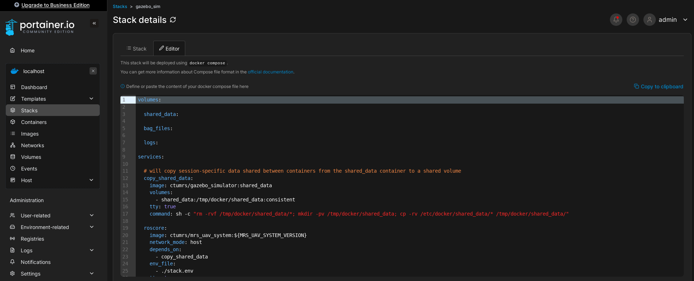
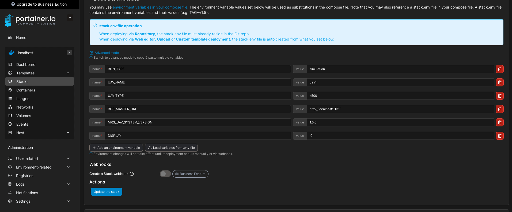

# Example stacks

Stacks are **docker compose sessions** within portainer.
As in vanilla docker, stacks are defined by a [compose file](/docs/prerequisites/docker/compose-sessions).



Moreover, a set of environment variables is defined _by hand_ in Portainer, which can define how the session behave.



## Example simulation session

An example simulation session is located at [mrs_docker/tree/master/compose/1.5.0/portainer](https://github.com/ctu-mrs/mrs_docker/tree/master/compose/1.5.0/portainer).

Custom configs (and other _shared data_ for all the running containers) for the MRS UAV System are supposed to be packed into a transport docker image.
The subfolder `shared_data` contains the example shared data and scripts for build an image that is going to unload the configs during the runtime for the running containers.

<details>
<summary>Compose file</summary>

```yaml
volumes:

  shared_data:

  bag_files:

  logs:

services:

  # will copy session-specific data shared between containers from the shared_data container to a shared volume
  copy_shared_data:
    image: ctumrs/gazebo_simulator:shared_data
    volumes:
      - shared_data:/tmp/docker/shared_data:consistent
    tty: true
    command: sh -c "rm -rvf /tmp/docker/shared_data/*; mkdir -pv /tmp/docker/shared_data; cp -rv /etc/docker/shared_data/* /tmp/docker/shared_data/"

  roscore:
    image: ctumrs/mrs_uav_system:${MRS_UAV_SYSTEM_VERSION}
    network_mode: host
    depends_on:
      - copy_shared_data
    env_file:
      - ./stack.env
    tty: true
    command: roscore

  gazebo_simulator:
    depends_on:
      - roscore
    image: ctumrs/mrs_uav_system:${MRS_UAV_SYSTEM_VERSION}
    network_mode: host
    volumes:
      - shared_data:/etc/docker/shared_data:consistent
        # mount the folders below to enable passing GUI to the host
      - /dev/dri:/dev/dri
      - /tmp/.X11-unix:/tmp/.X11-unix
    env_file:
      - ./stack.env
    environment:
        DISPLAY: $DISPLAY
    tty: true
    command: bash -c "waitForRos && roslaunch mrs_uav_gazebo_simulation simulation.launch world_name:=grass_plane gui:=true"

  spawn:
    image: ctumrs/mrs_uav_system:${MRS_UAV_SYSTEM_VERSION}
    depends_on:
      - roscore
    network_mode: host
    volumes:
      - shared_data:/etc/docker/shared_data:consistent
    env_file:
      - ./stack.env
    tty: true
    command: bash -c 'waitForGazebo; rosservice call /mrs_drone_spawner/spawn "1 --$$UAV_TYPE --enable-rangefinder"'

  hw_api:
    image: ctumrs/mrs_uav_system:${MRS_UAV_SYSTEM_VERSION}
    depends_on:
      - roscore
    network_mode: host
    volumes:
      - shared_data:/etc/docker/shared_data:consistent
    env_file:
      - ./stack.env
    tty: true
    command: bash -c "waitForTime && roslaunch mrs_uav_px4_api api.launch"

  uav_core:
    image: ctumrs/mrs_uav_system:${MRS_UAV_SYSTEM_VERSION}
    depends_on:
      - roscore
    network_mode: host
    volumes:
      - shared_data:/etc/docker/shared_data:consistent
    env_file:
      - ./stack.env
    tty: true
    command: bash -c "waitForHw && roslaunch mrs_uav_core core.launch platform_config:=`rospack find mrs_uav_gazebo_simulation`/config/mrs_uav_system/$$UAV_TYPE.yaml custom_config:=/etc/docker/shared_data/custom_config.yaml world_config:=/etc/docker/shared_data/world_config.yaml network_config:=/etc/docker/shared_data/network_config.yaml"

  automatic_start:
    image: ctumrs/mrs_uav_system:${MRS_UAV_SYSTEM_VERSION}
    depends_on:
      - roscore
    network_mode: host
    volumes:
      - shared_data:/etc/docker/shared_data:consistent
    env_file:
      - ./stack.env
    tty: true
    command: bash -c "waitForHw && roslaunch mrs_uav_autostart automatic_start.launch custom_config:=/etc/docker/shared_data/automatic_start.yaml"

  # starts `rosbag record`
  rosbag:
    image: ctumrs/mrs_uav_system:${MRS_UAV_SYSTEM_VERSION}
    depends_on:
      - roscore
    network_mode: host
    volumes:
      - bag_files:/etc/docker/bag_files:consistent
      - shared_data:/etc/docker/shared_data:consistent
    env_file:
      - ./stack.env
    tty: true
    command: bash -c "waitForTime && /etc/docker/shared_data/record.sh"

  takeoff:
    image: ctumrs/mrs_uav_system:${MRS_UAV_SYSTEM_VERSION}
    depends_on:
      - roscore
    network_mode: host
    volumes:
      - shared_data:/etc/docker/shared_data:consistent
    env_file:
      - ./stack.env
    tty: true
    command: bash -c "waitForControl && rosservice call /uav1/hw_api/arming 1 && sleep 1 && rosservice call /uav1/hw_api/offboard"

  rviz:
    image: ctumrs/mrs_uav_system:${MRS_UAV_SYSTEM_VERSION}
    depends_on:
      - roscore
    network_mode: host
    volumes:
      - shared_data:/etc/docker/shared_data:consistent
        # mount the folders below to enable passing GUI to the host
      - /dev/dri:/dev/dri
    env_file:
      - ./stack.env
    environment:
        DISPLAY: $DISPLAY
    tty: true
    command: bash -c "waitForHw && roslaunch mrs_uav_core rviz.launch"

  rviz_interface:
    image: ctumrs/mrs_uav_system:${MRS_UAV_SYSTEM_VERSION}
    depends_on:
      - roscore
    network_mode: host
    volumes:
      - shared_data:/etc/docker/shared_data:consistent
        # mount the folders below to enable passing GUI to the host
      - /dev/dri:/dev/dri
    env_file:
      - ./stack.env
    environment:
        DISPLAY: $DISPLAY
    tty: true
    command: bash -c "waitForHw && roslaunch mrs_rviz_plugins rviz_interface.launch"

  dogtail:
    image: klaxalk/dogtail:latest
    volumes:
      - /var/run/docker.sock:/var/run/docker.sock
      - logs:/etc/logs:consistent

  # this container can be used to access a terminal with ROS inside the compose session
  terminal:
    image: ctumrs/mrs_uav_system:${MRS_UAV_SYSTEM_VERSION}
    network_mode: host
    env_file:
      - ./stack.env
    entrypoint: ["/bin/bash", "-c"]
    volumes:
      - shared_data:/etc/docker/shared_data:consistent
      - bag_files:/etc/docker/bag_files:consistent
      - /dev/:/dev/
      - /tmp/.X11-unix:/tmp/.X11-unix
    command:
      - bash --rcfile /opt/ros/noetic/setup.bash
    privileged: true
    stdin_open: true
    tty: true
```

</details>

<details>
<summary>Environment variables</summary>

```bash
RUN_TYPE=simulation
UAV_NAME=uav1
UAV_TYPE=x500
ROS_MASTER_URI=http://localhost:11311
MRS_UAV_SYSTEM_VERSION=1.5.0
DISPLAY=:0
```

</details>

## Example realworld UAV session

An example realworld session is located at [mrs_docker/tree/master/compose/1.5.0/portainer](https://github.com/ctu-mrs/mrs_docker/tree/master/compose/1.5.0/portainer).

Custom configs (and other _shared data_ for all the running containers) for the MRS UAV System are supposed to be packed into a transport docker image.
The subfolder `shared_data` contains the example shared data and scripts for build an image that is going to unload the configs during the runtime for the running containers.

<details>
<summary>Compose file</summary>

```yaml
volumes:

  shared_data:

  bag_files:

  logs:

services:

  # will copy session-specific data shared between containers from the shared_data container to a shared volume
  copy_shared_data:
    image: shared_data_gnss
    volumes:
      - shared_data:/tmp/docker/shared_data:consistent
    tty: true
    command: sh -c "rm -rvf /tmp/docker/shared_data/*; mkdir -pv /tmp/docker/shared_data; cp -rv /etc/docker/shared_data/* /tmp/docker/shared_data/"

  # starts roscore
  # this is the first container in the ROS pipeline
  roscore:
    image: ctumrs/mrs_uav_system:${MRS_UAV_SYSTEM_VERSION}
    network_mode: host
    depends_on:
      - copy_shared_data
    env_file:
      - ./stack.env
    tty: true
    command: roscore

  # after roscore is started
  # -> set a parameter that tells the system that simulation time is NOT used
  # this container then stops
  rostime:
    image: ctumrs/mrs_uav_system:${MRS_UAV_SYSTEM_VERSION}
    network_mode: host
    depends_on:
      - roscore
    env_file:
      - ./stack.env
    tty: true
    command: bash -c "waitForRos && rosparam set use_sim_time false"

  # starts the HW API for connecting the MRS UAV System to PX4
  hw_api:
    image: ctumrs/mrs_uav_system:${MRS_UAV_SYSTEM_VERSION}
    depends_on:
      - rostime
    network_mode: host
    volumes:
      - shared_data:/etc/docker/shared_data:consistent
      - /dev/:/dev/
    privileged: true
    env_file:
      - ./stack.env
    tty: true
    command: bash -c "waitForTime && roslaunch mrs_uav_px4_api api.launch"

  # starts the MRS UAV System's core
  uav_core:
    image: ctumrs/mrs_uav_system:${MRS_UAV_SYSTEM_VERSION}
    depends_on:
      - rostime
    network_mode: host
    volumes:
      - shared_data:/etc/docker/shared_data:consistent
    env_file:
      - ./stack.env
    tty: true
    command: bash -c "waitForHw && roslaunch mrs_uav_core core.launch platform_config:=`rospack find mrs_uav_deployment`/config/mrs_uav_system/${UAV_TYPE}.yaml custom_config:=/etc/docker/shared_data/custom_config.yaml world_config:=/etc/docker/shared_data/world_local.yaml network_config:=/etc/docker/shared_data/network_config.yaml"

  # starts the node that handles automatic initialization of the system and takeoff
  automatic_start:
    image: ctumrs/mrs_uav_system:${MRS_UAV_SYSTEM_VERSION}
    depends_on:
      - rostime
    network_mode: host
    volumes:
      - shared_data:/etc/docker/shared_data:consistent
    env_file:
      - ./stack.env
    tty: true
    command: bash -c "waitForHw && roslaunch mrs_uav_autostart automatic_start.launch"

  # starts `rosbag record`
  rosbag:
    image: ctumrs/mrs_uav_system:${MRS_UAV_SYSTEM_VERSION}
    depends_on:
      - rostime
    network_mode: host
    volumes:
      - bag_files:/etc/docker/bag_files:consistent
      - shared_data:/etc/docker/shared_data:consistent
    env_file:
      - ./stack.env
    tty: true
    command: bash -c "waitForTime && /etc/docker/shared_data/record.sh"

  rosbridge:
    image: ctumrs/mrs_uav_system:${MRS_UAV_SYSTEM_VERSION}
    network_mode: host
    env_file:
      - ./stack.env
    tty: true
    command: bash -c "waitForRos && roslaunch rosbridge_server rosbridge_websocket.launch"

  dogtail:
    image: klaxalk/dogtail:latest
    volumes:
      - /var/run/docker.sock:/var/run/docker.sock
      - logs:/etc/logs:consistent

  # this container can be used to access a terminal with ROS inside the compose session
  terminal:
    image: ctumrs/mrs_uav_system:${MRS_UAV_SYSTEM_VERSION}
    network_mode: host
    depends_on:
      - rostime
    env_file:
      - ./stack.env
    entrypoint: ["/bin/bash", "-c"]
    volumes:
      - bag_files:/etc/docker/bag_files:consistent
      - shared_data:/etc/docker/shared_data:consistent
      - /dev/:/dev/
    command:
      - bash --rcfile /opt/ros/noetic/setup.bash
    privileged: true
    stdin_open: true
    tty: true
```

</details>

<details>
<summary>Environment variables</summary>

```bash
RUN_TYPE=realworld
UAV_NAME=uav80
UAV_TYPE=x500
ROS_MASTER_URI=http://localhost:11311
UAV_MASS=2.0
MRS_UAV_SYSTEM_VERSION=1.5.0
```

</details>
