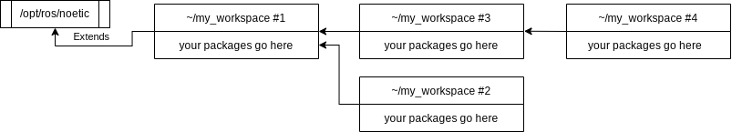

# Managing Workspaces

This guide is an important and mandatory reading for all MRS members.
Please, make a coffee and take your time to carefully study it, because it will make your (and Tomas's) life easier and it will help you avoid some compilation difficulties.

## TL;DR & Tips

* Learn to configure the workspaces by hand, learn to setup and verify dependencies between the workspaces.
* Do not `source` more than one workspace in your `~/.bashrc` or `~/.zshrc`.
* Be mindful about the workspace hierarchy It will allow you to work more efficiently.
* It is possible to maintain multiple copies of a workspace, each with a different build type or particular version of the software.
* Symlink packages from `~/git` to your workspaces, instead of directly cloning them into the `src` folder.

## What is a Catkin Workspace?

A Catkin workspace (_workspace_ from now on) is a dedicated build space for Catkin packages, which is a package system used by ROS.
A workspace is supposed to cluster together related packages, for which it manages a set of build profiles, each with a custom set of CMake arguments.

### Workspace folder structure

Each maintained workspace should have the following top-level structure of folders:

```
workspace
├── build
├── devel
├── logs
└── src
```

where the **build**, **devel** and **logs** folders are generated by the build system, and the **src** contains the user's packages.

## The tools to manage a workspace

**Beware!** Common folk on the internet will guide you towards using the _catkin_make_ command.
Don't listen to everything you hear on the internet.
We use the [**catkin_tools**](https://catkin-tools.readthedocs.io/en/latest/) package that extends the function of the original _catkin_make_.

### Creating a workspace

1. create a directory for the workspace
```bash
mkdir -p ~/my_workspace/src
```
2. move to the root of the workspace
```bash
cd ~/my_workspace
```
3. call ```catkin_tools```'s init command
```bash
catkin init
```

**Note:** The newly created workspace will extend the workspace, that is currently [sourced](#sourcing-the-workspace).
If you're not sure which workspace you've extended, [verify it with `catkin config`](#verifying-the-state-of-a-workspace).

### Building a workspace

1. put at least one Catkin package somewhere into `~/my_workspace/src`
2. call ```catkin_tools```'s build command
```bash
catkin build
```

### Building a particular package

1. if you are in a subdirectory of the package, do
```bash
catkin build --this
```
or using our alias
```bash
catkin bt
```
2. you can invoke build using the package name form anywhere form the workspace
```bash
catkin build <package_name>
```

### Cleaning the workspace

Cleaning can be performed in two ways:

1. manually, by deleting the generated folder
```bash
cd ~/my_workspace
rm -rf build devel logs
```
2. automatically using the `catkin`'s clean command
```bash
cd ~/my_workspace
catkin clean
```

### Sourcing the workspace

Specify to `catkin` which workspace shall be loaded by sourcing the bottom-most workspace in the hierarchy in your `~/.bashrc`:
```bash
source $HOME/my_workspace/devel/setup.bash
```
or in `~/.zshrc` if you're using zshell:
```bash
source $HOME/my_workspace/devel/setup.zsh
```
This will setup the respective environment variables to enable lookup of packages (such as for using the `roscd` command) contained in the sourced workspace and the workspaces it's extending.
You can verify which workspace is currently sourced by printing out the `$CMAKE_PREFIX_PATH` environment variable using the command
```bash
echo $CMAKE_PREFIX_PATH
```
The first path printed is the currently sourced workspace and the following are the ones it's extending.

**BEWARE!** Unless you are 100% sure that your workspaces are correctly set and do not contain identical packages, do not source more than one workspace in your `.bashrc` or `.zshrc`.
Source only the bottom-most workspace that you're using in the workspace tree.
That is typically the user workspace that you're currently working with (see the [recommended workspace hierarchy](#recommended-workspace-hierarchy)).
The extending hierarchy will handle the rest.

## Recommended workspace hierarchy

Workspaces can be linked together such that dependencies between the workspaces can be satisfied.
Linking of workspaces is an integral mechanism for separating logical packages into groups.
Workspaces can be linked in an arbitrary way, e.g.:



To extend a workspace, it either has to be sourced when creating the new workspace (see [creating a workspace](#creating-a-workspace)) or extended manually using the `catkin config` command (see below).

### Extending ROS

The top-most workspace in the hierarchy should extend the installed ROS ecosystem:

```bash
catkin config --extend /opt/ros/noetic
```

### Extending particular workspace

Any other workspace should extend the workspace hier in the hierarchy:

```bash
catkin config --extend ~/particular_workspace/devel
```

## Build profiles

Workspace can maintain a set of pre-configured build profiles.
A build profile provides custom compilation flags for all packages.
This is typically used to specify the workspace-wide optimization level.

### Setting build profiles

We typically use three build profiles that correspond to CMake build profiles:

| name         |         | description                                     | optimization |
|--------------|---------|-------------------------------------------------|--------------|
| `debug`      |         | corresponds to CMake's `Debug` profile          | `-Og -g`     |
| **`reldeb`** | default | corresponds to CMake's `RelWithDebInfo` profile | `-O2 -g`     |
| `release`    |         | corresponds to CMake's `Release` profile        | `-O3`        |

Use the following commands to set the profiles in your workspace:
```bash
catkin config --profile debug --cmake-args -DCMAKE_BUILD_TYPE=Debug -DCMAKE_EXPORT_COMPILE_COMMANDS=ON -DCMAKE_CXX_FLAGS='-Og' -DCMAKE_C_FLAGS='-Og'
catkin config --profile release --cmake-args -DCMAKE_BUILD_TYPE=Release -DCMAKE_EXPORT_COMPILE_COMMANDS=ON
catkin config --profile reldeb --cmake-args -DCMAKE_BUILD_TYPE=RelWithDebInfo -DCMAKE_EXPORT_COMPILE_COMMANDS=ON
```

The profiles can be switched by calling `catkin profile set <profile name>`.
After the profile is switched, the whole workspace needs to be [cleaned](#cleaning-the-workspace) and [recompiled](#building-a-workspace).
See [GCC optimization](https://gcc.gnu.org/onlinedocs/gcc/Optimize-Options.html) for info about the optimization flags.

**Note:** For the standard development cycle of programming-compilation-debugging, it's recommended to use the `debug` profile as it provides the best compromise of fast compilation, code optimization and debugging experience.
You can set the `debug` profile in your current workspace and leave the others at the default for performance.

**Note2**: Pre-built deb packages are typically build with the `reldeb` profile.

### Overriding build profiles on per-package level

**Note**: Take care not to override the workspace's compilation flags (unless you know what you're doing) with a CMake statement in your `CMakeLists.txt` file such as
```cmake
set(CMAKE_CXX_FLAGS_DEBUG "-fsanitize=address,undefined")
```
The correct command is
```cmake
set(CMAKE_CXX_FLAGS_DEBUG "${CMAKE_CXX_FLAGS_DEBUG} -fsanitize=address,undefined")
```
or better yet
```cmake
add_definitions(-fsanitize=address,undefined)
```
so that your flags are *added* after the workspace flags and *don't replace* them.


## Package blacklisting

A package can be excluded from the build by:

1. creating the `CATKIN_IGNORE` file in the package root, or
2. by blacklisting it in a workspace using `catkin config --blacklist <package_name>`.

## Verifying the state of a workspace

Use the command `catkin config` to obtain the current configuration for your workspace.
