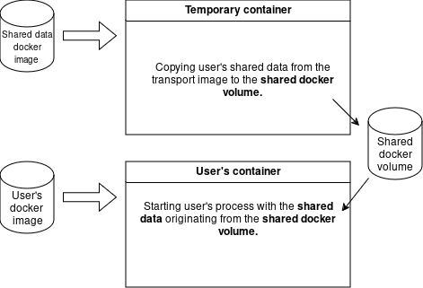

# Custom configs for containers

## Problem definition

A users has a **docker image** from which his software can be started.
The image contains pre-compiled binaries with a **default configuration**.
However, in many cases (robotics applications), the user's software needs to be started with **different configuration** each time.
Configuration can be facilited by several mechanisms:

* config files,
* ROS launch files,
* shell scripts,
* additional files loaded in runtime.

These **custom configuration files**, which are handed to the software in runtime, need to be exposed to the **container** runing from the **user's docker image**.

## Our solution

We pack the configurations (**shared data**) in a dedicated transport image which is easily delivered to the robot.
Then, **during runtime**, this image spawns a container in which the data is coppied to a **shared docker volume**.
Then, the user's containers are started, all mounting the same **shared docker volume** and accessing the configuration data.



## Packing shared data to a transport image

The following minimalistic dockerfile coppies the `shared_data` subfolder in the **transport docker image**:

```dockerfile
FROM alpine

COPY shared_data/ /etc/docker/shared_data/

CMD ["sh"]
```

Build the image using the following command.
Select the appropriate `tag` and `platform`.

```bash
docker build build . --file Dockerfile --tag <shared_data_image_tag> --platform=linux/<my_platform>
```

## Unloading the shared data from the transport image

The following compose session shows the process of unloading the shared data.
The `user_program` can then access the files in the shared docker volume.

```yaml
volumes:

  shared_data:

services:

  # will copy session-specific data shared between containers from the shared_data container to a shared volume
  copy_shared_data:
    image: <shared_data_image_tag>
    volumes:
      - shared_data:/tmp/docker/shared_data:consistent
    tty: true
    command: sh -c "rm -rvf /tmp/docker/shared_data/*; mkdir -pv /tmp/docker/shared_data; cp -rv /etc/docker/shared_data/* /tmp/docker/shared_data/"

  user_program:
    image: <users_base_image>
    depends_on:
      - copy_shared_data
    volumes:
      - shared_data:/etc/docker/shared_data:consistent
    command: my_process /etc/docker/shared_data/config_file.txt
```
