# Motor tests

All motor tests are done with a Turnigy MultiStar BLheli_32 51A ESC, with the 32.7 BLheli firmware. [ESC config](https://github.com/ctu-mrs/uav_core/blob/master/miscellaneous/blheli32_esc_config/T650/T650_M1.ini) is available in our repository.
Current and voltage measurements are done by the ESC and thrust is measured with a 5 kg load cell, coupled with a HX711 amplifier.
Tests are done with fully charged lithium batteries, as we do not have a powerful enough adjustable power supply.
Tables starts at 50% throttle and continue to 100% throttle in 10% increments.

## Motor: Readytosky 2312 920KV

Cheap chinese motor, clone of the original DJI motors for F450/F550 and Phantom drones.

[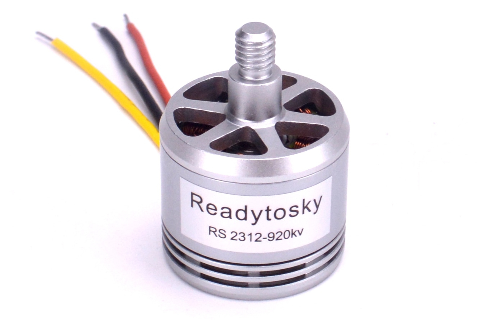](fig/motor_tests/2312_920KV_readytosky.jpg)

### Propeller: DJI plastic 9450 self-tightening propeller

| Thrust (g) | RPM   | Voltage (V) | Current (A) | Power (W) | Efficiency (g/W) |
| :---:      | :---: | :---:       | :---:       | :---:     | :---:            |
| 401        | 5688  | 16.66       | 3.09        | 51.48     | 7.79             |
| 529        | 6508  | 16.61       | 4.80        | 79.73     | 6.64             |
| 656        | 7213  | 16.54       | 6.72        | 111.15    | 5.90             |
| 787        | 7788  | 16.48       | 9.05        | 149.14    | 5.28             |
| 911        | 8608  | 16.40       | 11.48       | 188.27    | 4.84             |
| 1024       | 9068  | 16.32       | 14.26       | 232.72    | 4.40             |

### Propeller: Aliexpress plastic 9450 self-tightening propeller

This is a copy of the DJI propeller, it is much more flexible

[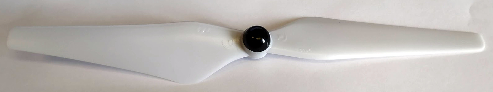](fig/motor_tests/9450Fake.jpg)

| Thrust (g) | RPM   | Voltage (V) | Current (A) | Power (W) | Efficiency (g/W) |
| :---:      | :---: | :---:       | :---:       | :---:     | :---:            |
| 395        | 5628  | 16.75       | 3.19        | 53.43     | 7.39             |
| 509        | 6542  | 16.71       | 4.82        | 80.54     | 6.32             |
| 634        | 7282  | 16.64       | 6.74        | 112.15    | 5.65             |
| 745        | 7853  | 16.57       | 9.10        | 150.79    | 4.94             |
| 893        | 8525  | 16.49       | 11.58       | 190.95    | 4.68             |
| 997        | 8956  | 16.41       | 14.37       | 235.81    | 4.23             |

### Propeller: Carbon fiber 9450 self-tightening propeller

[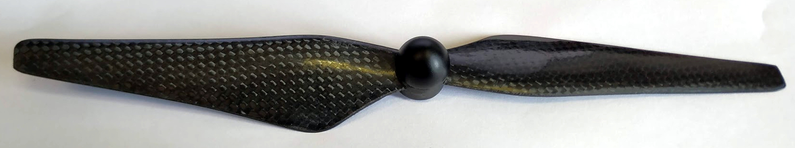](fig/motor_tests/9450CF.jpg)

| Thrust (g) | RPM   | Voltage (V) | Current (A) | Power (W) | Efficiency (g/W) |
| :---:      | :---: | :---:       | :---:       | :---:     | :---:            |
| 363        | 5899  | 16.66       | 2.80        | 46.65     | 7.78             |
| 486        | 6842  | 16.62       | 4.27        | 70.97     | 6.85             |
| 599        | 7639  | 16.56       | 6.09        | 100.85    | 5.94             |
| 734        | 8448  | 16.51       | 8.14        | 134.39    | 5.46             |
| 867        | 9125  | 16.43       | 10.46       | 171.86    | 5.04             |
| 989        | 9708  | 16.35       | 13.19       | 215.66    | 4.59             |

### Propeller: Plastic 8045 propeller

| Thrust (g) | RPM   | Voltage (V) | Current (A) | Power (W) | Efficiency (g/W) |
| :---:      | :---: | :---:       | :---:       | :---:     | :---:            |
| 323        | 5939  | 16.70       | 2.73        | 45.59     | 7.08             |
| 429        | 6902  | 16.66       | 4.17        | 69.47     | 6.18             |
| 542        | 7648  | 16.59       | 6.06        | 100.54    | 5.39             |
| 663        | 8499  | 16.52       | 8.22        | 135.79    | 4.88             |
| 781        | 9076  | 16.45       | 10.50       | 172.73    | 4.52             |
| 891        | 9722  | 16.37       | 13.27       | 217.23    | 4.10             |

## Motor: Tarot 4114 320KV

[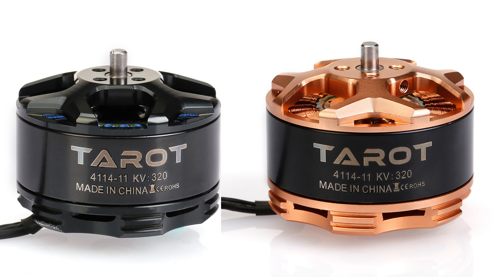](fig/motor_tests/4114Tarot.jpg)

### Propeller: Tarot 1555 carbon fiber propeller

[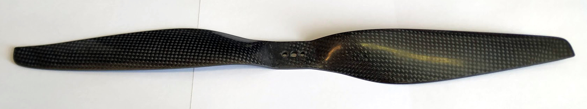](fig/motor_tests/1555Tarot.jpg)

| Thrust (g) | RPM   | Voltage (V) | Current (A) | Power (W) | Efficiency (g/W) |
| :---:      | :---: | :---:       | :---:       | :---:     | :---:            |
| 791        | 3448  | 25.12       | 3.60        | 90.43     | 8.75             |
| 1077       | 4013  | 25.03       | 5.77        | 144.42    | 7.46             |
| 1420       | 4528  | 24.92       | 8.53        | 212.57    | 6.68             |
| 1773       | 4975  | 24.78       | 12.23       | 303.06    | 5.85             |
| 2116       | 5468  | 24.60       | 16.67       | 410.08    | 5.16             |
| 2545       | 5832  | 24.41       | 21.62       | 527.74    | 4.82             |

### Propeller: Tarot 1575 carbon fiber propeller

[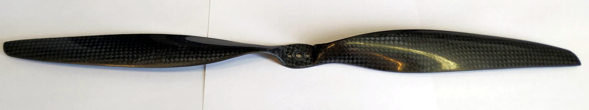](fig/motor_tests/1575Tarot.jpg)

| Thrust (g) | RPM   | Voltage (V) | Current (A) | Power (W) | Efficiency (g/W) |
| :---:      | :---: | :---:       | :---:       | :---:     | :---:            |
| 614        | 3624  | 25.08       | 2.42        | 60.69     | 10.12            |
| 867        | 4277  | 25.01       | 3.88        | 97.04     | 8.93             |
| 1217       | 4836  | 24.93       | 5.78        | 144.10    | 8.45             |
| 1568       | 5346  | 24.82       | 8.35        | 207.25    | 7.57             |
| 1996       | 5957  | 24.69       | 11.73       | 289.61    | 6.89             |
| 2373       | 6376  | 24.52       | 15.49       | 379.81    | 6.25             |

## Motor: T-Motor 3110 780KV

[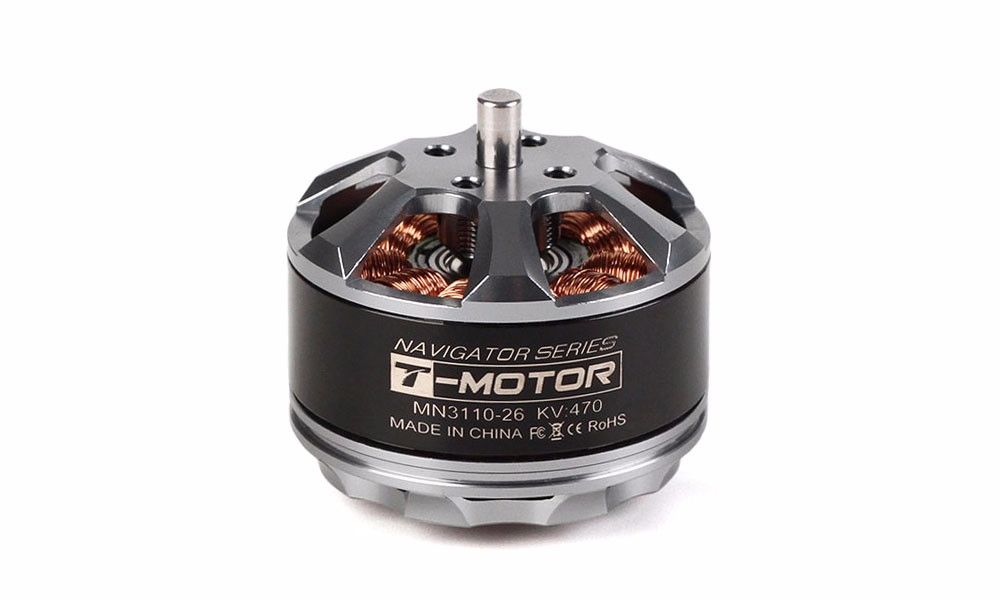](fig/motor_tests/MN3110.jpg)

### Propeller: 1147 carbon fiber propeller

[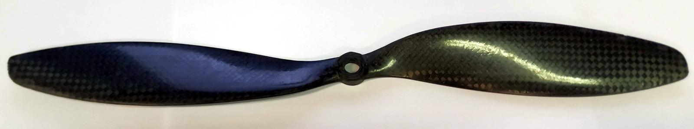](fig/motor_tests/1147CF.jpg)

| Thrust (g) | RPM         | Voltage (V) | Current (A) | Power (w)        | Efficiency (g/W) |
| :---:      | :---:       | :---:       | :---:       | :---:            | :---:            |
| 621        | 5313        | 16.61       | 4.19        | 69.60            | 8.92             |
| 868        | 6156        | 16.53       | 6.79        | 112.24           | 7.73             |
| 1112       | 6971        | 16.42       | 10.11       | 166.01           | 6.70             |
| 1288       | 7913        | 16.29       | 13.93       | 226.92           | 5.68             |
| 1625       | 8348        | 16.13       | 18.83       | 303.73           | 5.35             |
| 1876       | 8951        | 15.95       | 24.17       | 385.51           | 4.87             |

### Propeller: Tarot 1155 carbon fiber propeller

[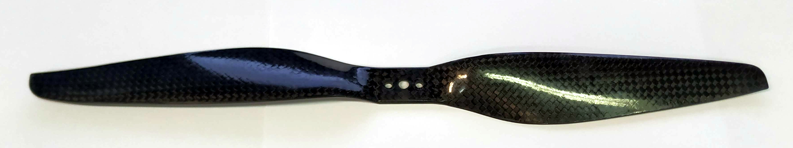](fig/motor_tests/1155Tarot.jpg)

| Thrust (g) | RPM   | Voltage (V) | Current (A) | Power (w) | Efficiency (g/W) |
| :---:      | :---: | :---:       | :---:       | :---:     | :---:            |
| 494        | 5422  | 16.53       | 3.72        | 61.49     | 8.03             |
| 687        | 6336  | 16.45       | 6.03        | 99.19     | 6.93             |
| 897        | 7051  | 16.36       | 9.10        | 148.88    | 6.03             |
| 1135       | 7716  | 16.22       | 12.96       | 210.21    | 5.40             |
| 1345       | 8616  | 16.07       | 17.42       | 279.94    | 4.80             |
| 1576       | 9168  | 15.91       | 22.97       | 365.45    | 4.31             |

### Propeller: Quantum 1150 carbon fiber propeller

[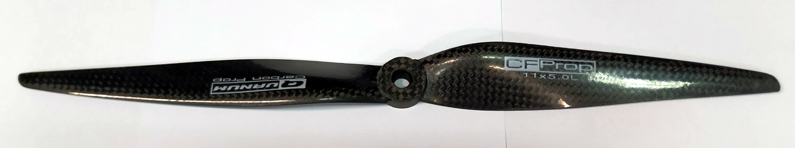](fig/motor_tests/1150QuantumCF.jpg)

| Thrust (g) | RPM   | Voltage (V) | Current (A) | Power (w) | Efficiency (g/W) |
| :---:      | :---: | :---:       | :---:       | :---:     | :---:            |
| 543        | 5325  | 16.69       | 4.39        | 73.27     | 7.41             |
| 732        | 6145  | 16.59       | 6.92        | 114.80    | 6.38             |
| 903        | 7031  | 16.47       | 10.33       | 170.14    | 5.31             |
| 1113       | 7691  | 16.35       | 13.93       | 227.76    | 4.89             |
| 1357       | 8476  | 16.19       | 18.85       | 305.18    | 4.45             |
| 1538       | 9159  | 16.02       | 23.53       | 376.95    | 4.08             |

### Propeller: Multistar 1045 plastic propeller

[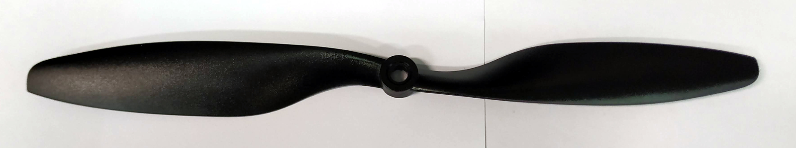](fig/motor_tests/1045Multistar.jpg)

| Thrust (g) | RPM   | Voltage (V) | Current (A) | Power (w) | Efficiency (g/W) |
| :---:      | :---: | :---:       | :---:       | :---:     | :---:            |
| 482        | 5568  | 16.82       | 3.41        | 57.36     | 8.40             |
| 669        | 6522  | 16.74       | 5.47        | 91.57     | 7.31             |
| 871        | 7368  | 16.66       | 7.98        | 132.95    | 6.55             |
| 1055       | 8345  | 16.55       | 11.37       | 188.17    | 5.61             |
| 1321       | 9136  | 16.42       | 15.19       | 249.42    | 5.30             |
| 1546       | 9836  | 16.26       | 19.88       | 323.25    | 4.78             |

