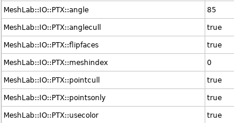
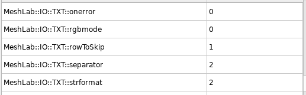

# Meshlab

Software for general work with meshes and texturing. Also allows to simply process pointclouds.

## General tips

* Use the **Linux AppImage** from [Meshlab official website](https://www.meshlab.net/#download).
* Faster Real-Time Rendering
    * `Tools -> Options`
    * Scroll down to `maxGPUMemDedicatedTechnology`
    * Set it according to our GPU memory, e.g., for 4000 MB RAM, set slightly lower to 3500 MB
    * Restart MeshLab and open some large model. On left down panel, there is information about FPS and rendering mode:
        - **BO_RENDERING** (Buffer Object Rendering): everything is running on the GPU - fast
        - **IMMEDIATE_MODE_RENDERING**: only CPU, much slower
* **DO NOT FORGET TO SAVE REGULARLY YOUR WORK! MESHLAB LIKES TO CRASH**
* Run the Meshlab from the commandline to be able to watch the events.

### Useful links

* [Recommended YouTube Meshlab tutorials](https://www.youtube.com/channel/UC70CKZQPj_ZAJ0Osrm6TyTg)
* [Another PDF Meshlab tutorial](http://www.heritagedoc.pt/doc/Meshlab_Tutorial_iitd.pdf)
* [Basic texturing guide](https://github.com/gsilano/CrazyS/wiki/Working-With-Meshes-in-Gazebo)

## Import and merge

Describe steps to import `.ptx` and `.pts` files into MeshLab.

### `.ptx`
* Meshlab has a new setting in the `Settings->Tools` for each file format. Please set it as shown in the image

    

- At the end, merge all imported layers into one. Click on the one of the layer with `Right mouse button -> Flatten Visible Layers`. Check **Keep unreferenced vertices** and click **Apply**.
- Use the tool **Select Faces/Vertices inside polyline area** to clean the pointcloud.
- Make sure to have the layer you want to clean active (in blue color)!
- **IMPORTANT: Adjust the PointCloud coordinate system.** It is useful to do ASAP at the beginning of the process.
    - The best option is to align the coordinate system before exporting the data from Leica as explained [here](https://ctu-mrs.github.io/docs/software/3d_model_processing/leica.html#defining-own-cooridnate-system).
    - Show the coordinate system with the `Draw XYZ axes in world coordinates` icon
    - Click the `Manipulators tool` icon
    - Follow the instruction to adjust the position of the pointcloud
    - If you are satisfied with the adjustment, firstly **save the Meshlab project**. It keeps the transformation from the original position in the readable XML format simple savefile.
    - Run `Matrix: Freeze Current Matrix` function to apply the transformation on current file.
- Save the final `.ply` file

### `.pts`
* Please set it as shown in the image

  

* Imported `.pts` file has to be renamed to `.txt`.
* `Point format` as `X Y Z Reflectance R G B`
* `Separator` as `SPACE`
* Click `OK`


## Mesh computing

We are using mainly two methods to create a mesh from a pointcloud. <b>Screened Poisson</b> and <b>VGC</b>.

* Mesh computing requires a huge amount of RAM! It is recommended to have at least 32 GB RAM with some backup swap. If you can provide 64 GB RAM, even better!
* The input pointcloud has to be simplified to be able to mesh it. The ideal number of vertices is 6--10 millions.
* The general rule: Better to create a huge model and simplify it than create a small model right away.
* **AMD processors are much faster on Ubuntu to create the mesh**: It takes much longer time for Intel to do the same task.
    - **Surface Reconstruction: Screened Poission**: this method is useful for most cases. It usually works well for closed environments as buildings. Various parameters are possible to set. I have found useful to increase the **Reconstruction Depth**. The "optimal" number is between 12--16. The higher the number, the more detailed is the model. The RAM demands increases faster than linear. Example of the set values is in the image below.\
    
    - **Surface Reconstruction: Ball Pivoting**: Single thread, slow. Creates loose pointcloud with bunch of holes.
    - **Surface Reconstruction: VGC**: Single thread in the most part, slower. Suitable for smaller "open" models as electrical tower. It crashes a lot (Segmentation fault). Check **Vertex Splatting** box before executing. Most useful parameter is the **Voxel side**. The smaller the value, the more detailed and precised is the model. Recommend to set the value to **0.01** which corresponds to `1 cm` voxel side. **Geodesic Weightening** value increase makes the mesh smoother in general. **Volume Laplacian iter** will inflate the volume of the model. **Widening** makes the model wider, even decrease the value might be more useful.
* The mesh processing can take a long time, check the commandline for further details.
* Simplify the model with **Simplification: Quadric Edge Collapse Decimation** functionality.
    - I recommend to use the checkboxes as shown in the image. Most of those preserve the original shape and the planarity as well. Other parameters in the image are just an example. The higher the default mesh, the longer the processing time. At the beginning, it could be around 30 minutes for 1GB mesh. Meshlab show the percentage done for this method.

    

* Save the model into `.ply` and check the file size.
  * Recommend `.ply` file size in between **10--150MB**, depending on the application. For texture processing, the lower the better. The texture will cover imperfections. For model with no texture, the quality is visible more. If you would like to use the model in the simulation, assume **2.5x** times larger final exported file, so shrink the file accordingly. If exported with texture later on, the size will be about **2.5x** times bigger. These numbers depends on the amount of saved information in the *.ply* file.


## Texturing

We use two types of texturing. <b>Pointcloud vertex color</b> texturing and <b>Raster image texturing</b>. Both will be described below.

**A good quality texture can significantly improve the low quality mesh model**

### Pointcloud vertex color

These methods using pointcloud vertex color to create a full texture.

#### Simple (primitive) texture: FAST AND EASY

* `Filters → Sampling → Vertex Attribute Transfer` Make sure the `Transfer Color` option is checked and press `Apply` to transfer the colour of the points onto the mesh.
* `Filters → Texture → Parametrization: Trivial Per-Triangle` Set `Inter-Triangle border` to 5 for smoother transition between triangles. The higher the number, the bigger the texture will be. Press `Apply` to generate the faces from which the mesh texture will be created. If you receive an error about the inter-triangle border being too much, try increasing the `Texture dimension`.
* `Filters → Texture → Vertex Color to Texture` Specify the texture file name and resolution for the mesh. The resolution should give the `Texture dimension` parameter from the previous step, e.g., `Texture width * Texture height = Texture Dimension`. Then press `Apply` to create it.

#### Good quality texture: SLOW BUT NICE
* Recommend to use low quality `.ply` file about 10MB ~ 250k faces. If double the amount of faces (500k) the next processing step in Blender will take a long time. However, this might be different for various models, rather check by yourself.
* Process the `.ply` file with [mesh parametrization](https://ctu-mrs.github.io/docs/software/3d_model_processing/blender.html#mesh-parametrization) guide.
* Import the Blender processed `.ply` file.
* Run `Convert PerVertex UV to PerWedge UV` to convert `Blender` parametrization into `Meshlab` convention.
* Import the original `.ply` pointcloud with coloured vertices.
  * I have tried to use the high resolution mesh to transfer the color, but it has lower number of points giving worse texture quality.
  * `Recommend`: Hide the both models if running on PC with low graphic memory before further steps. Usually crash the `Meshlab` if not.
* Open `Transfer: Vertex Attributes to Texture (1 or 2 meshes)` tool.
  * Set the `Source Mesh` as the high quality pointcloud file.
  * Set the `Target Mesh` as the parametrized texture file.
  * Name the `Texture file` with `.png` extension and no path in the name. Aftewards, it is possible **and recommended** to convert the texture to `.jpg` as shown in next steps.
  * Define the texture dimension in preferably multiplications of 2.
    * The higher the texture dimension, the better will be the final result. However, the larger will be the final file. Recommend to start with *8192x8192* res - *50MB* file. Most useful is the **16384x16384** res - *200MB* file. The quality depends on the input pointcloud. The more detailed, the better.
    * *16384x16384* gives *500MB* `.png` texture and takes ~ 30 minutes.
    * *32768x32768* gives *1GB* `.png` texture and takes ~ 1 hour.
    * *65536x65536* gives *2GB* `.png` texture and takes ~ 3 hours.
  * The `Max Dist Search` parameter does not change the quality of the mesh. Keep it default.
  * Check `Fill Texture` checkbox. If you leave it unchecked, the final texture may contain visible fractures.
  * Click `Apply`.
    * The process takes usually a lot of time. The cmd line might show `QImage::pixel: coordinate (number,number) out of range` messages. It means it cannot fit the point from the pointcloud into the desired texture. However, this is not a problem. The texture from `Blender` is not predefined for specific dimension, hence arbitrary resolution will result in this message.
* Convert the texture to `.jpg` as shown in the [texture simplification](https://ctu-mrs.github.io/docs/software/3d_model_processing/meshlab.html#texture-simplification) guide.
* Save the final result in `.ply` format.


### Texturing with raster images

The pointcloud vertex color might not be detailed enough for the whole model or it might help to improve part of the model with raster images.

  * There is a nice <a href="https://www.youtube.com/playlist?list=PL60mCsep96Je1bzGrWnK-nL9pi95r7UqI">video guide</a> showing all features and steps. **Recommend to check the videos first. It will help you to understand the program layout and functionalities before next steps!**
  * Also, if you like to read, there is a text <a href="https://wikis.utexas.edu/display/specify6/Texture+overlay+in+MeshLab">guide</a> describing the whole process.

#### Improving part of the model

  * Recommend to check videos about **image texturing**. First is a [image alignment tool](https://www.youtube.com/watch?v=T7gAuI-LQ2w&ab_channel=MisterP.MeshLabTutorials) to visually align the image on the mesh. The second is [image parametrization and texturing](https://www.youtube.com/watch?v=OJZRuIzHcVw&ab_channel=MisterP.MeshLabTutorials) showing the final texture creation process and the result.
  * **IMPORTANT NOTICE**. It is necessary to cut out the parts of the mesh model, where images are missing. Then color the part of the model with images and the rest of the model with the pointcloud. Finally, join them into the final model having several texture files. Meshlab allows to merge several texture files in one `.ply` file.
  * It might be useful to uncheck **Use distance weight** parameter. Otherwise, there will be dark color on some triangles.

#### Create whole model

  * **This method is not automatized, only proof of concept.** The method assume having precise position of the images w.r.t. the model. The files for this project are available [here](https://nasmrs.felk.cvut.cz/index.php/apps/files/?dir=/shared/3D_models/raster_texture_example).
  * Use either [CloudCompare](https://ctu-mrs.github.io/docs/software/3d_model_processing/cloudcompare.html#extracting-images) or [VoxelizeE57Files](https://mrs.felk.cvut.cz/gitlab/NAKI/naki_postprocessing/tree/master) package to extract images.
  * Open the MeshLab and import the mesh model, you would like to texture with `File->Import Mesh...`. The model do not need parametrization.
  * Import all raster images `File->Import Raster...`
  * **Recommend to save the MeshLab project `.mlp` as much as you can. MeshLab likes to crash.**
  * Correct the camera settings and sensor position and orientation for all raster images as described in [camera settings](https://ctu-mrs.github.io/docs/software/3d_model_processing/meshlab.html#raster-camera) guide.
  * Check the image alignment with toggle the `Show Current Raster Mode` button. If you zoom in and out, the alignment of the images and mesh model behind should be precise.
    * *Note: We have noticed, that some of the images are not perfectly aligned. Usually the images are from the same scan position. Just to remind, every scanning position has 6 images. The calibration should be same for all images and scanning position. Do not know, where the problem is.*
    * If the images are not aligned well, you might tune it up with the `Raster alignment` tool from MeshLab. Try to simply press `Apply mutual information registration` button without any setting up the algorithm since the image and the model are almost aligned, it could easily help. If did not help, check the [Raster Alignment Tool video](https://youtu.be/T7gAuI-LQ2w) how to use the tool.
    * These alignment will change the camera FOV, position and orientation.
  * Run the `Parametrization + texturing from registered textures` function. Choose the parameters according to the [video](https://youtu.be/OJZRuIzHcVw) guide.
    * *Note: It might be possible to combine good texture from pointcloud with texture from raster images. Parametrization and texturing could be done separately. Check!*
  * Save the final textured mesh in required format described in the [export](https://ctu-mrs.github.io/docs/software/3d_model_processing/export.html) section.


## Texture simplification

It is recommended to convert the texture to `.jpg` format. Recommend to use either <a href="https://www.gimp.org/">Gimp</a> or <a href="https://linux.die.net/man/1/convert">tool</a> tool. Next steps will be described using `convert` tool.

    * `convert input.png -quality 30 output.jpg`
    * The 30% jpeg quality is sufficient. The `imagemagick` tool might have some RAM/disk limitations set in default config file `/etc/ImageMagick-version/policy.xml`. Check it if you have errors. If yes comment that limitations.
  * Do not forget to update the texture for current mesh. **READ THIS CAREFULLY, OTHERWISE YOU MIGHT ACCIDENTALLY REWRITE THE TEXTURE FILE.**
    * Press `Export Mesh` icon.
    * You should see the original `.png` file name on the right side of the popup window.
    * Double click the texture name and type the name of the new updated texture file. **Make sure that there is no texture located in the same folder with such a name**.
    * Keep `Save Texture Files(s)` checkbox.
    * Save the `.ply` file.
    * Replace the newly created texture with the one that you simplified to `.jpg` and keep the same name.
    * Open the `.ply` file again and validate, if the correct `.jpg` texture is applied. It can be checked in the `Export Mesh` option window.

## Camera settings
This guide shows how to setup the MeshLab raster or general MeshLab camera.

### MeshLab Main Camera
* Backup the original MeshLab camera settings before changing anything with `Windows->Save cammera settings to file` option. MeshLab will always reset the main camera setting when a new program instance is launched, but rather to make sure.
* Copy the current value of the camera with `Windows->Copy camera settings to clipboard`. If you have just launched MeshLab, the values should look like following snippet

```xml
<!DOCTYPE ViewState>
<project>
 <VCGCamera LensDistortion="0 0" RotationMatrix="1 0 0 0 0 1 0 0 0 0 1 0 0 0 0 1 " CameraType="0" BinaryData="0" TranslationVector="0 0 -3.03109 1" PixelSizeMm="0.0369161 0.0369161" CenterPx="468 465" ViewportPx="936 931" FocalMm="29.764309"/>
 <ViewSettings NearPlane="0.30310887" TrackScale="1" FarPlane="4.7810888"/>
</project>
```

* Modify the `PixelSizeMm`, `CenterPx`, `ViewportPx` and `FocalMm` with your values. For our Leica BLK Scanner, the values are following

```
PixelSizeMm="0.006 0.006"
CenterPx="1023.5 1023.5"
ViewportPx="2048 2048"
FocalMm="6.141"
```

* Values are obtained from both CloudCompare `Camera Sensor` output and [VoxelizeE57Files](https://mrs.felk.cvut.cz/gitlab/NAKI/naki_postprocessing/tree/master) package running with `--only-export-images` option.
* Copy the whole `.xml` snippet and select `Windows->Paste clipboard to camera setting`.
* You should be able to see the change in the camera perspective.
* If you copy again the current value of the camera with `Windows->Copy camera settings to clipboard`, the values are different since MeshLab recalculates the imported values. Values are correct. Here is the example of such a snippet

```xml
<!DOCTYPE ViewState>
<project>
 <VCGCamera BinaryData="0" LensDistortion="0 0" PixelSizeMm="0.0369161 0.0369161" ViewportPx="936 931" CenterPx="468 465" TranslationVector="0 0 -3.03109 1" CameraType="0" RotationMatrix="1 0 0 0 0 1 0 0 0 0 1 0 0 0 0 1 " FocalMm="17.176043"/>
 <ViewSettings FarPlane="3.4991455" NearPlane="0.30310887" TrackScale="1"/>
</project>
```

### Raster Camera
* Select one of the raster images in the bottom down window and right click `Export active raster cameras to file`. Output format `Agisoft xml` and click `Apply`.
* Open the `cameras.xml` configuration file in some text editor and modify the `sensor` tag for each image as below.

```xml
<sensor id="keep the original" label="keep the original" type="frame">
  <resolution width="2048" height="2048"/>
  <property name="pixel_width" value="0.01"/>
  <property name="pixel_height" value="0.01"/>
  <property name="focal_length" value="10.235"/>
  <property name="fixed" value="false"/>
  <calibration type="frame" class="adjusted">
    <resolution width="2048" height="2048"/>
    <fx>1023.5</fx>
    <fy>1023.5</fy>
    <cx>1024</cx>
    <cy>1024</cy>
    <k1>0</k1>
    <k2>0</k2>
    <p1>0</p1>
    <p2>0</p2>
  </calibration>
</sensor>
```

* These values represent the Leica BLK 360 camera sensor as described in the previous chapter even the values do not match. MeshLab recalculates the values for its own projection.
* To correct the camera sensor position and orientation, check the [extract sensor position](https://ctu-mrs.github.io/docs/software/3d_model_processing/cloudcompare.html#extracting-sensor-positions) guide or [VoxelizeE57Files](https://mrs.felk.cvut.cz/gitlab/NAKI/naki_postprocessing/tree/master) package. *Note: Not sure if VoxelizeE57Files gives the same transformation.*
* Correct the values in `cameras.xml` configuration file for the `cameras` tag for each image as below:

```xml
<camera id="keep the original" label="keep the original" sensor_id="keep the original" enabled="true">
  <transform>0.93981 -1.49012e-08 -0.341699 -10.4113 0.341699 9.31323e-09 0.939809 17.8044 1.49012e-08 -1 9.31323e-09 0.00407573 0 0 0 1</transform>
</camera>
```

* The `transform` contains the line representation of the 4x4 matrix from previous step. **Do not forget to use the transformed value as mention in the guide**!
* Import values with right click on the right-down raster image file and selecting `Import cameras for active rasters from file`

## Cleaning

I did not find any that useful filters to clean the pointcloud in the Meshlab. I recommend to perform filtering in <a href="https://ctu-mrs.github.io/docs/software/3d_model_processing/cloudcompare">CloudCompare</a> software.

* CloudCompare gives two options:
    1. **[Noise filter](http://www.cloudcompare.org/doc/wiki/index.php?title=Noise_filter)**
    2. **[SOR Filter](https://www.cloudcompare.org/doc/wiki/index.php?title=SOR_filter)**: recommend to use. Try to adjust the values according to the particular example.
* Export the file in the binary **.PLY** format for further use in Meshlab.

## Pointcloud simplification

Recommend to use simplification from <a href="https://ctu-mrs.github.io/docs/software/3d_model_processing/cloudcompare.html#command-line-mode">CloudCompare</a> software. However, if you want to use the Meshlab for it, here is the guide.

* If you would like to use only the pointcloud, you can keep it as large as it is, but usually it is more practical to decrease the amount of vertices.
    - **Poisson-disk Sampling**: You can define exact number of samples or explicit radius (distance) between samples. I would recommend to use the *world unit* explicit radius. Generally, Meshlab does not scale everything to meters, but if you used pointcloud from Leica scanning, you can assume metric units. Hence set about 0.01 *world unit* should be about one vertex per 1 cm. Reasonable value is around 0.02--0.05. Personally, I would go for 0.02/0.03 to make the whole process faster for large models. Make sure to check **Base Mesh Subsampling**.
    - **Point Cloud Simplification**: Define number of samples or world units you would like to have and click **Apply**. It uses some "heuristic" to keep the most of points. Usually, set the number of samples lower than you want. It will always give you more.
        - If you use the world size, it will have similar result as the *Poisson-disk Sampling* method.
* I have not studied the difference between both methods, but the **Poisson-disk Sampling** is used more.
