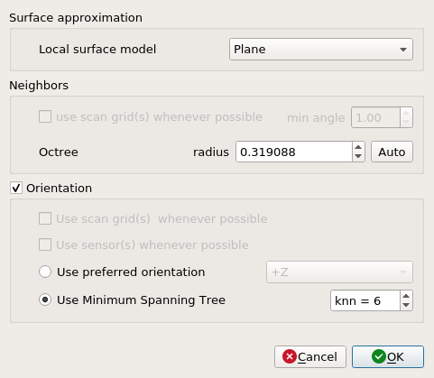
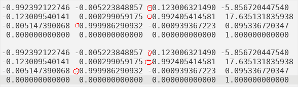
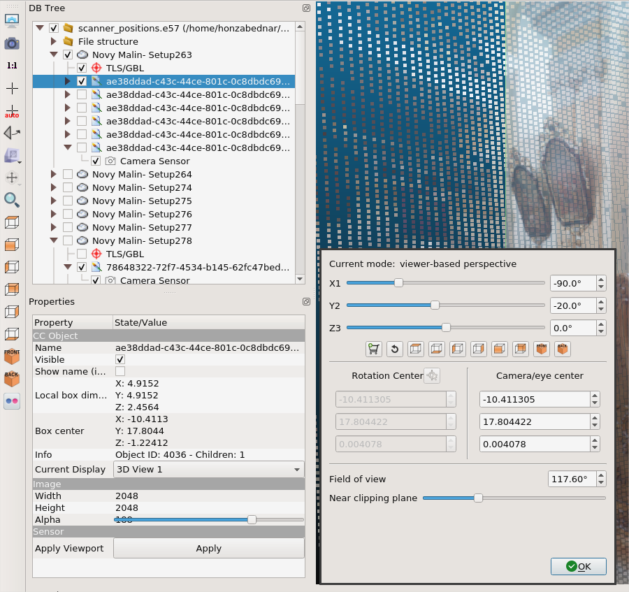

# CloudCompare (CC)

Tool for general work with pointclouds (including cartesian, color, and normal operations).
Used for data processing before meshing and texturing.

## Normals computing
- Recommend to use with *.e57* or *.ptx* data.
- `Edit -> Normals -> Compute`
- The options below are description from the official documentation.
- Local surface model
  - (best fit) Plane - robust to noise but very bad with sharp edges and corners
  - Triangulation - weak to noise but good with sharp edges
  - Quadric - very good for curvy surfaces
- Neighbors
  - Structured clouds can be associated to a grid structure. This grid structure can be used to determine the neighbors around each point. **However this is generally not better nor faster. This structure is however very useful to orient the normals properly.**
- Orientation
  - Use sensor(s) whenever possible - **recommend to use for .e57**
  - If the cloud is associated to a grid structure, then this structure can be used to very guess the right normal orientation quickly and in a very robust way - **probably good to use with .ptx, but check**
- If sensor position not available, recommend to use the default parameters set. Example as image below. The `octree` value depends on the model.

  

- Some parts might have inverted normals orientation. I did not find the way how to check this in the `CloudCompare`. I recommend to export the data and check it in the `Meshlab`. `CloudCompare` allows to invert normals with `Edit->Normals->Invert`. **The function inverts all normals**. Cut the model in pieces with `Meshlab` before inverting to invert only the required parts.

## Smoothing colors
- `Edit -> Colors -> Convert to Scalar field`
- For each scalar field `{R, G, B}`
  - select scalar field in cloud properties
  - `Edit -> Scalar fields -> Gaussian filter`
    - lower kernel size: less smoothing (keeps more detail but filters less noise)
    - higher kernel size: more smoothing (keeps less detail but filters more noise)
- `Edit -> Colors -> From Scalar fields`
  - be sure to select the correct R, G, B channels
  - the dynamic range is clipped by default: move the color arrows to reverse this
  - set alpha to 255

## Command line mode
[CC command line mode](https://www.cloudcompare.org/doc/wiki/index.php?title=Command_line_mode) opens a way for scripting of most of the functions available within CC GUI.
**Scripting is faster than GUI and provides repeatability: prefer scripting over GUI.**
Example script is available [here](https://mrs.felk.cvut.cz/gitlab/NAKI/naki_postprocessing/blob/master/scripts/pointclouds/processPtxFiles.sh).
Example command merging two `.ptx` files, exporting them to `.ply`, sampling the data to resolution of 2 cm and exporting the sampled data to `.ply`:
```bash
CloudCompare -AUTO_SAVE OFF -O Setup249.ptx -O Setup250.ptx -MERGE_CLOUDS -C_EXPORT_FMT PLY -SAVE_CLOUDS FILE "merge_raw.ply" -SS SPATIAL 0.02 -SAVE_CLOUDS FILE "merge_raw_sampled_2cm.ply"
```

## Manual compilation
Get latest release version from [CC Github](https://github.com/CloudCompare/CloudCompare/releases).
Latest release on April 6, 2022: `v2.12.0`.

```bash
cd $GIT_PATH
git clone git@github.com:CloudCompare/CloudCompare.git
cd CloudCompare
git checkout v2.12.0

mkdir -p build
cd build

cmake \
  -DEIGEN_ROOT_DIR="$EIGEN_ROOT_DIR" \
  -DPLUGIN_GL_QEDL=ON \
  -DPLUGIN_GL_QSSAO=ON \
  -DPLUGIN_IO_QADDITIONAL=ON \
  -DPLUGIN_IO_QCORE=ON \
  -DPLUGIN_IO_QE57=ON \
  -DPLUGIN_IO_QPHOTOSCAN=ON \
  -DPLUGIN_IO_QPDAL=OFF \
  -DPLUGIN_IO_QRDB=ON \
  -DPLUGIN_IO_QRDB_FETCH_DEPENDENCY=ON \
  -DPLUGIN_IO_QRDB_INSTALL_DEPENDENCY=ON \
  -DPLUGIN_STANDARD_QANIMATION=ON \
  -DQANIMATION_WITH_FFMPEG_SUPPORT=OFF \
  -DPLUGIN_STANDARD_QBROOM=ON \
  -DPLUGIN_STANDARD_QCANUPO=OFF \
  -DPLUGIN_STANDARD_QCOMPASS=ON \
  -DPLUGIN_STANDARD_QCSF=ON \
  -DPLUGIN_STANDARD_QFACETS=ON \
  -DPLUGIN_STANDARD_QHOUGH_NORMALS=OFF \
  -DPLUGIN_STANDARD_QHPR=ON \
  -DPLUGIN_STANDARD_QM3C2=ON \
  -DPLUGIN_STANDARD_QPCV=ON \
  -DPLUGIN_STANDARD_QPOISSON_RECON=ON \
  -DPLUGIN_STANDARD_QSRA=ON \
  -DPLUGIN_STANDARD_QRANSAC_SD=OFF \
  -DPLUGIN_STANDARD_QPCL=ON\
  ..

cmake --build . --parallel
sudo cmake --install .
```

## Extracting images
* Import [`.e57`](https://ctu-mrs.github.io/docs/software/3d_model_processing/leica.html#e57) file in **separate setups (structured)** variant.
* Select appropriate scan and expand the structure tree to see the content of the scan. You should see a `TLS\GBL` and a 6 image files.
* Select the image you would like to export and save it with the `Save` button.

## Extracting sensor positions
* Import [`.e57`](https://ctu-mrs.github.io/docs/software/3d_model_processing/leica.html#e57) file in **separate setups (structured)** variant.
* Select appropriate scan and expand the structure tree to see the content of the scan. You should see a `TLS\GBL` and a 6 image files.
* Every image contains a `Camera Sensor` with exact position of the picture w.r.t. to the model.
* Select the `Camera Sensor` and scroll in the `Properties` window down to `Position/Orientation` section. Change it to `Export` tab and save with `ASCII` option to the file.
* CloudCompare and MeshLab uses different rotation matrix system, so the `Camera Sensor` output has to be transformed before use as shown in the image below or the appropriate transformation :)

  

* *Note: To check the image alignment in the CloudCompare, change the FOV of the camera in `Camera settings` of the image view to `117.60°`. This will allow you to visually compare the alignment sensor position and the pointcloud behind.*

  
