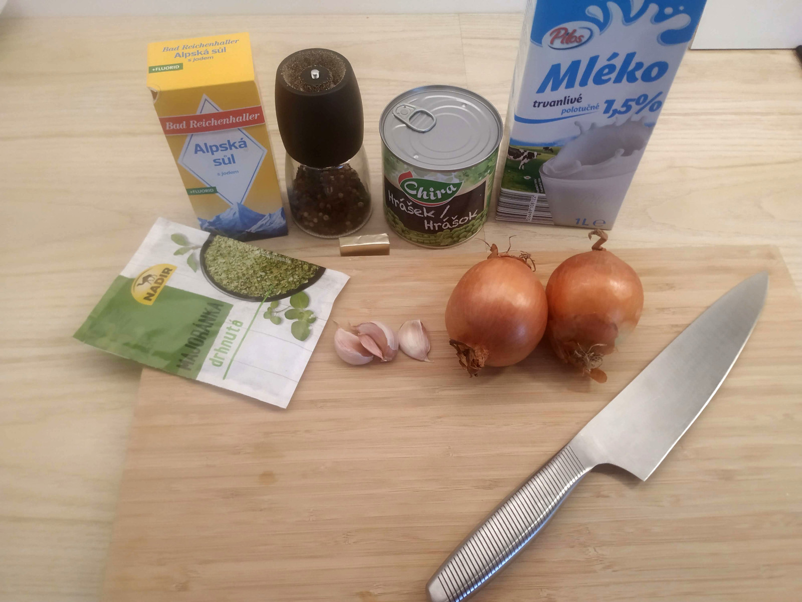
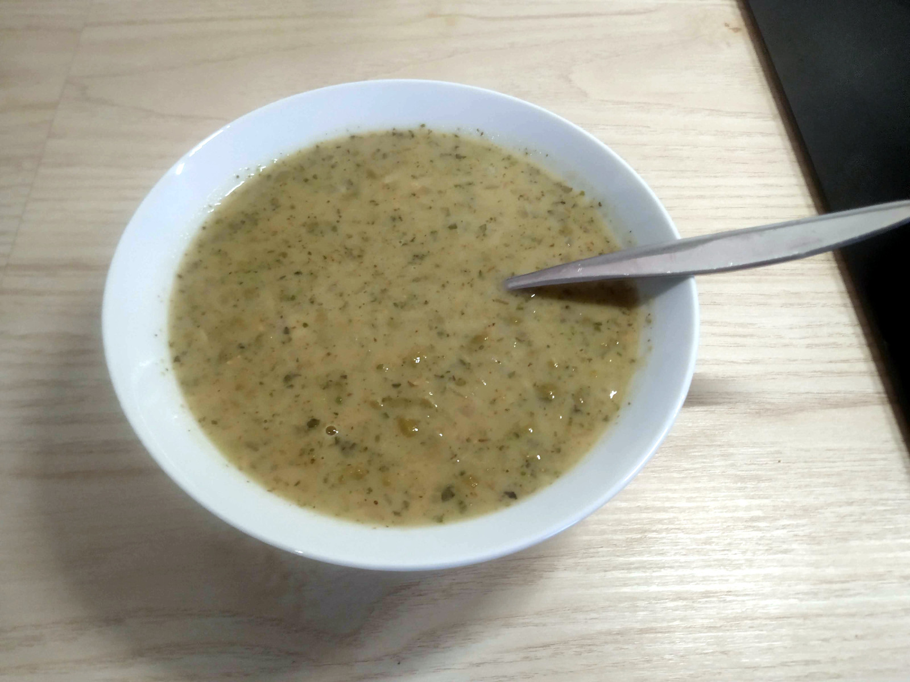
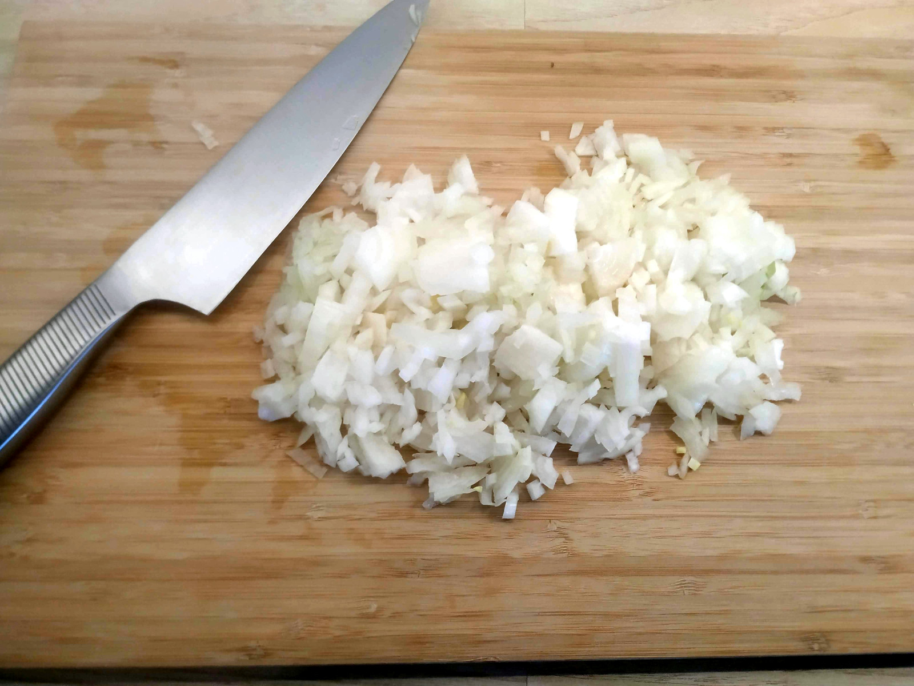
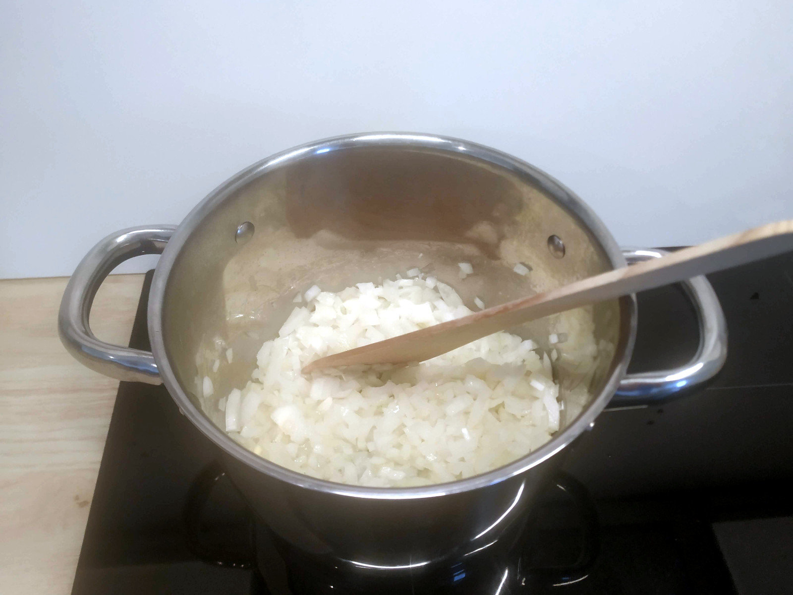
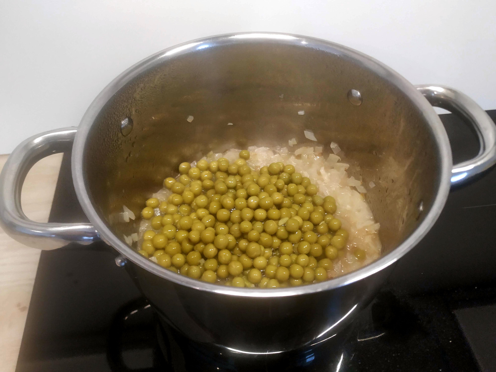
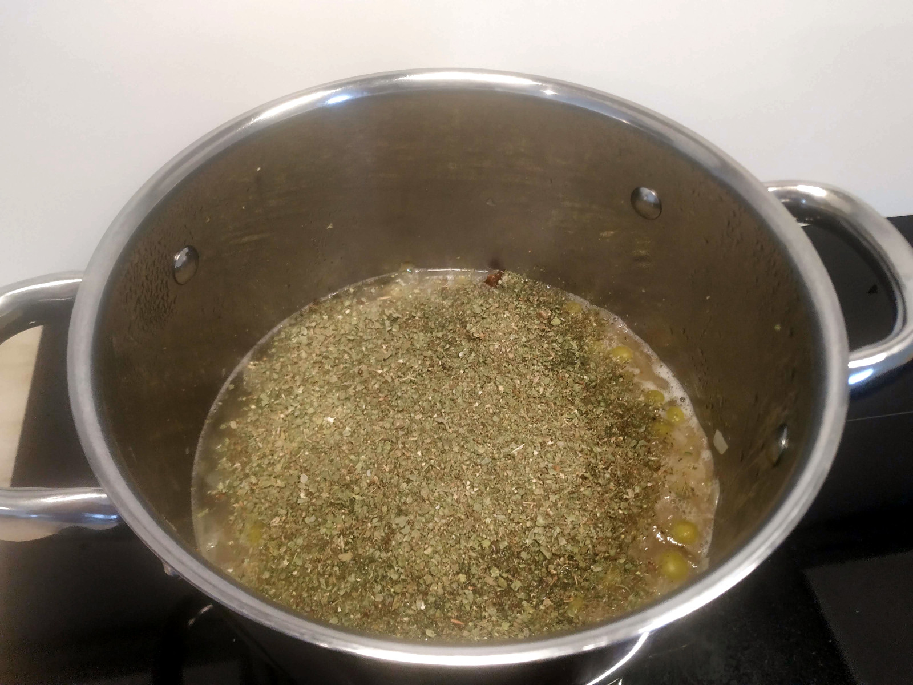
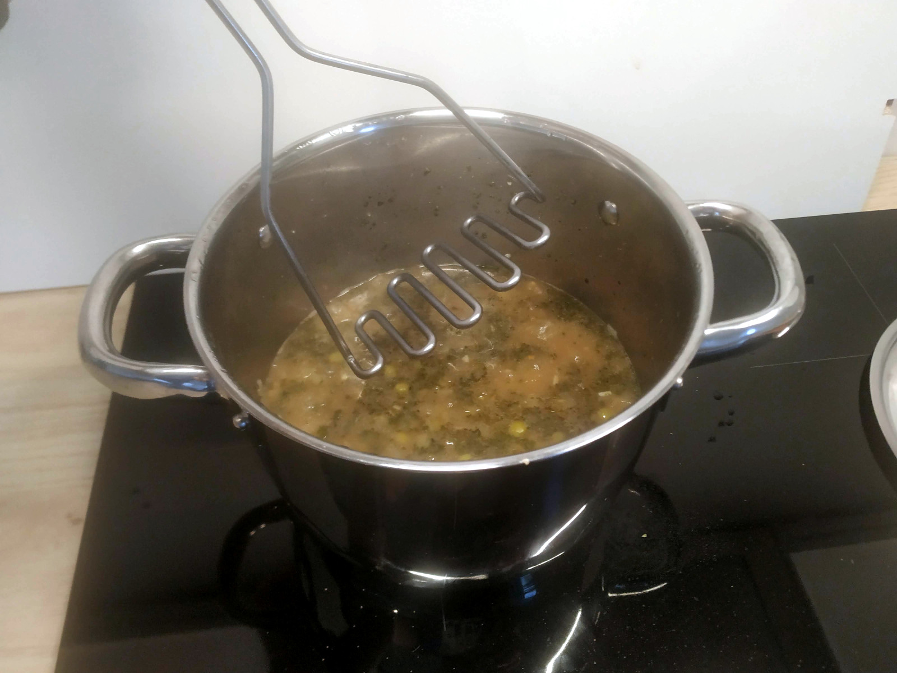
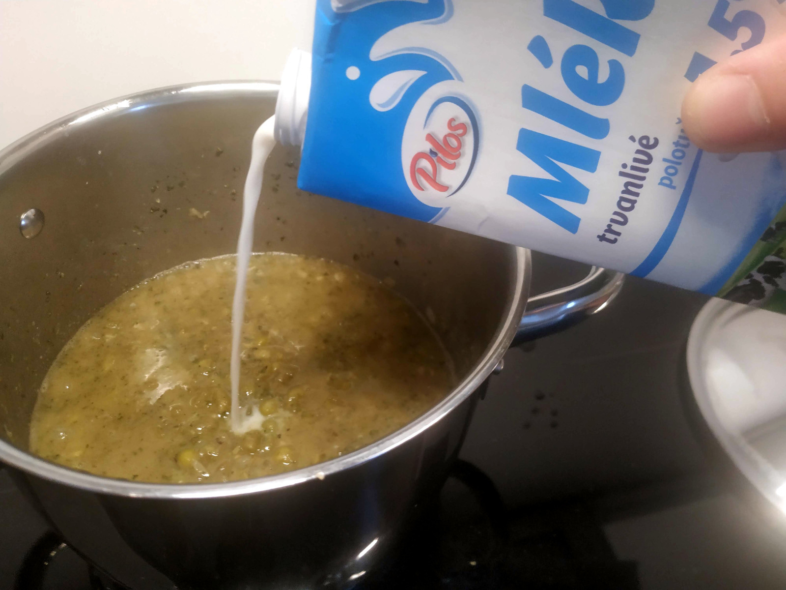

# Dan's Pea Soup

This is a very simple recipe. You only need a few ingredients, the soup is ready under 30 minutes and it is almost impossible for the cooking to go wrong.

 | 

## Ingredients

These quantities are roughly for 3 servings, scale them up as needed..

* 400 g of peas, canned or frozen
* 200 g of onions
* vegetable oil, butter or other kind of fat
* ~3 cloves of garlic
* dried marjoram
* salt and pepper
* bouillon cube
* milk or cream (optional)

## Preparation

- Dice the onions into fine pieces.
- Put some oil/butter into a pot and set it to high heat.
- Fry the onions on high heat for a few minutes until they turn glassy, they can even go a tiny bit brown.

 | 

- Add in all your peas.
- Add water until all the peas are submerged.
- Add salt, pepper, diced (or pressed) garlic and a bouillon cube.
- Add the marjoram, use a lot and cover the entire surface of the soup with it.

 | 

- Mix everything and keep the heat on high until the soup starts boiling.
- Turn the heat down, add a lid and boil for 15 minutes.
- Use a masher or a hand-held mixer and mash the peas to your preferred consistency.
- Dilute the soup. You can use water if you prefer a watery soup, but I would recommend using milk for a creamier result. You can even use cream for an extra creamy soup.

 | 

- Boil for additional 2 minutes after diluting.
- Enjoy!

