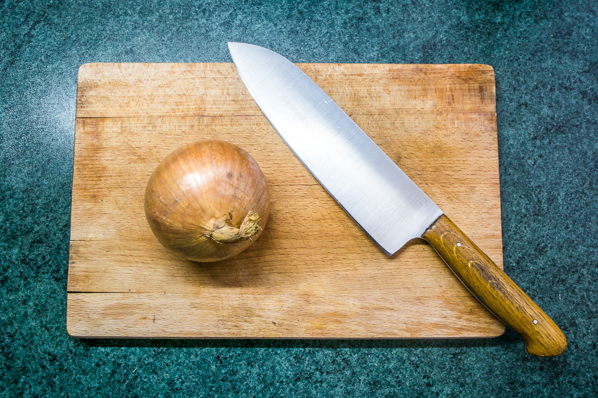
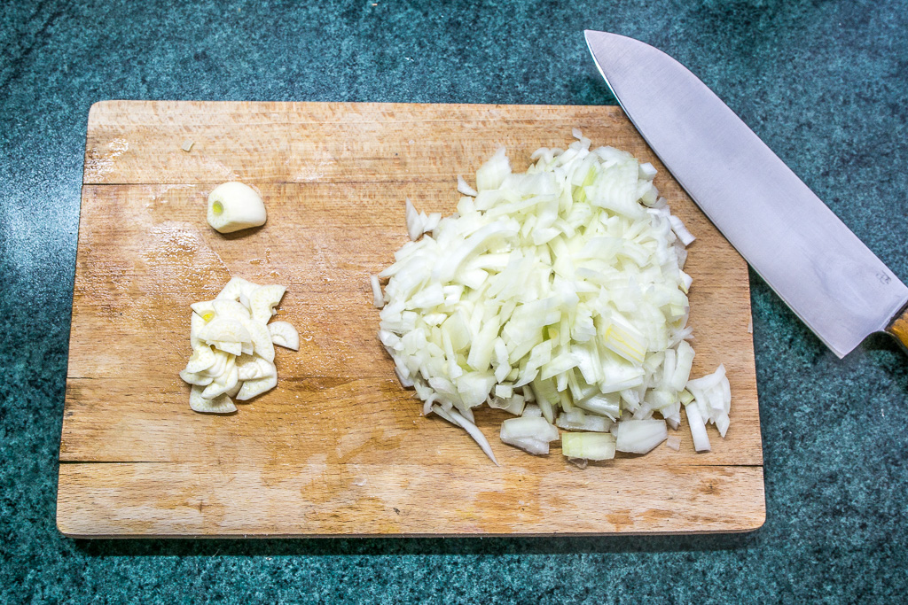
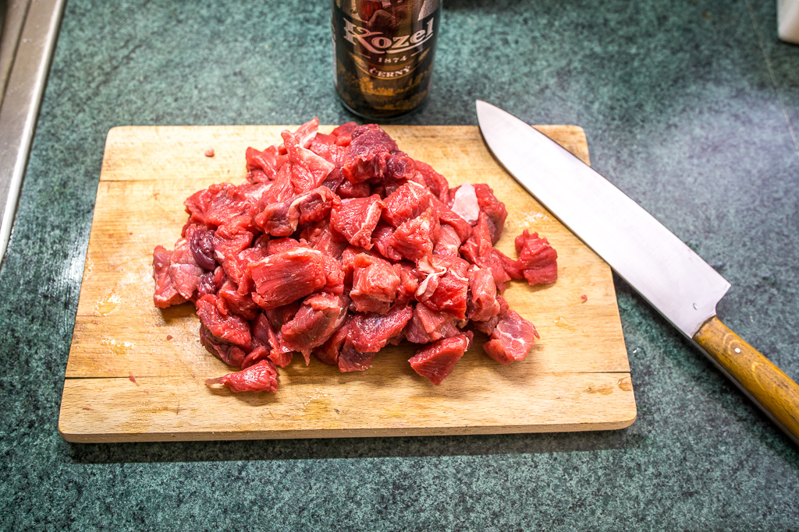
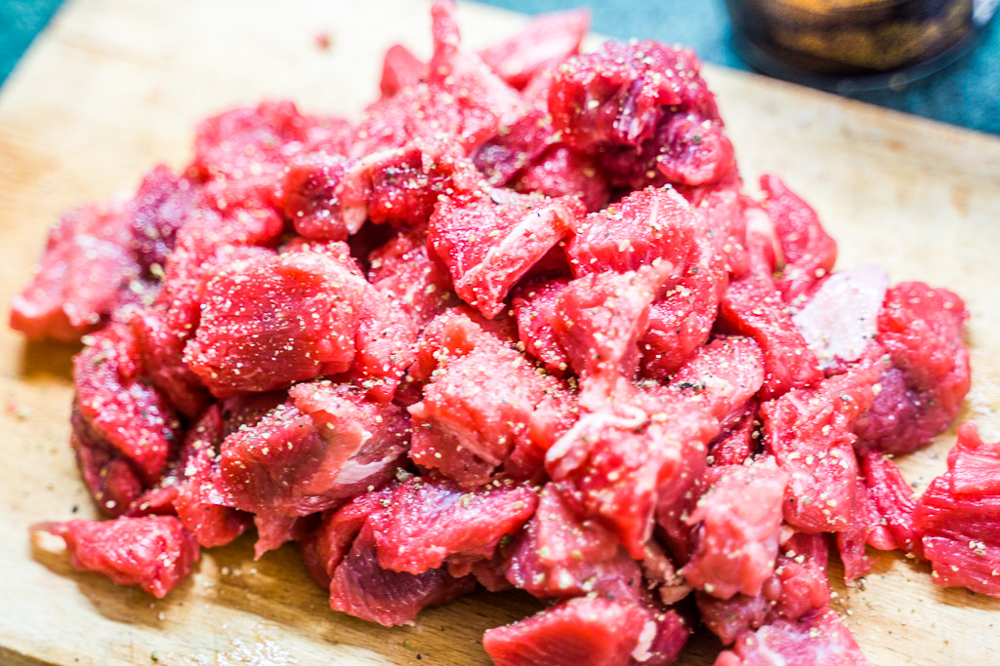
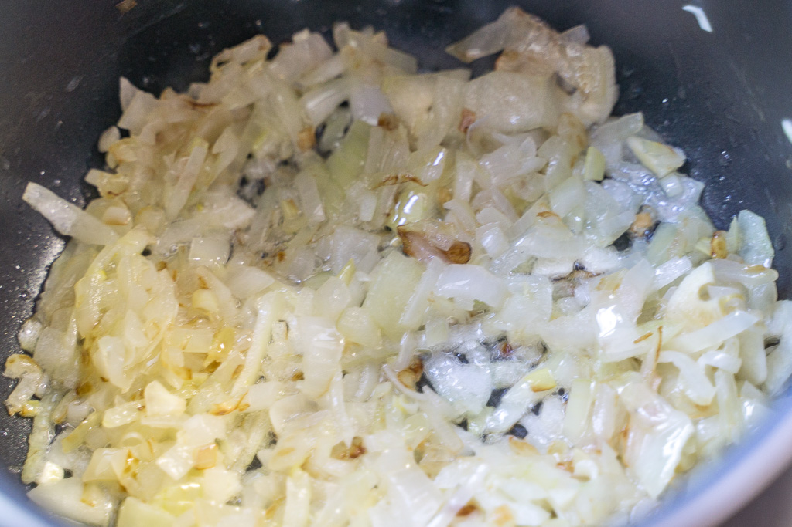
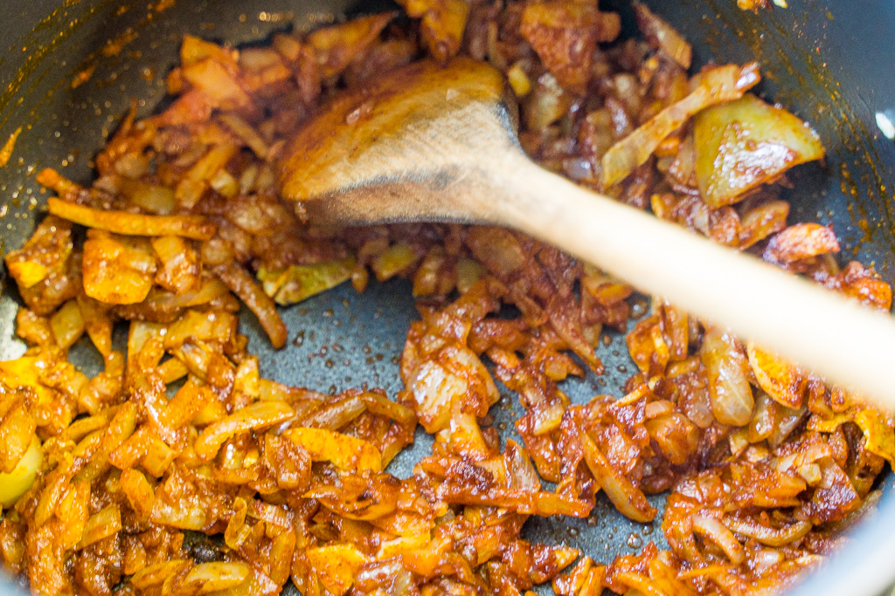
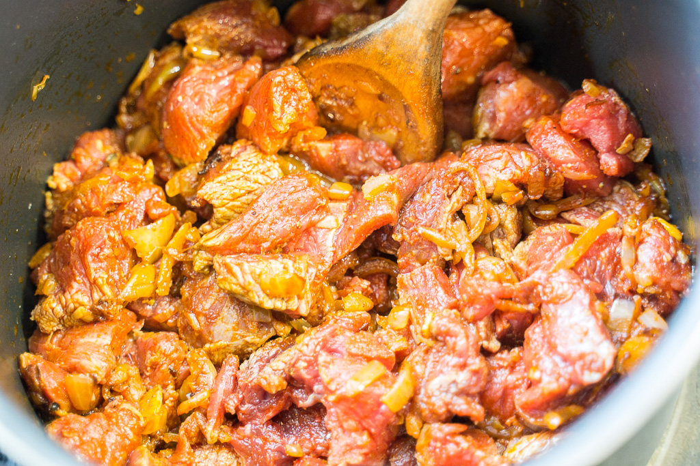
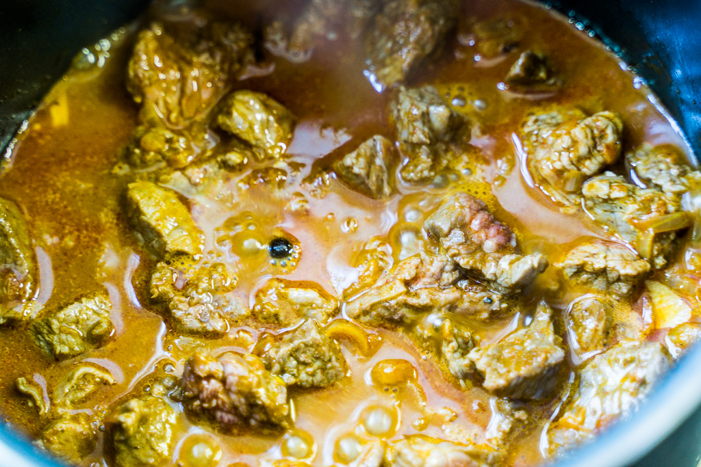
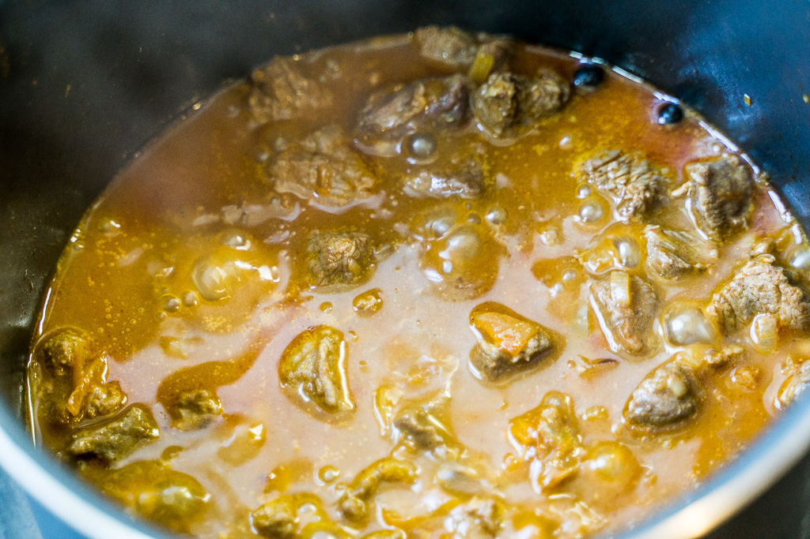
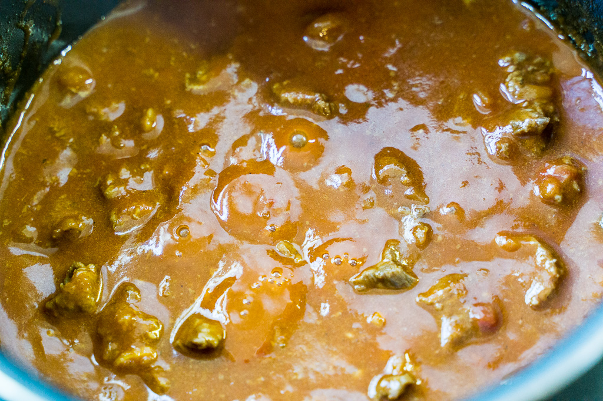

# Tomas's Gulas

## Heat definitions

* low heat: boiling occurs, but it does not boil much without a lid
* medium heat: boiling occurs even without a lid
* high heat: boiling is too fast with a cover, frying is possible

## Ingredients

All the quantities are for 4 servings.

* ~ 800 g of **meat**
  * Beef preferably
  * Choose a cheaper but more textured meat for a better flavor. However, it takes longer to cook it (4 hours+), and it can take a significant time to prepare the meat.
  * Choose more expensive but cleaner/nicer meat (steak-type). It cooks faster (< 2 hrs), and its much simple to chop. However, the gulas might not be that full of splendor.
  * Pork is also an alternative
* ~ 400 - 600 g of **onions**
  * white onion
* 4+ cloves of **garlic**
  * At least one clove per serving
  * There cannot be too much garlic
* ~ 100 g of **tomato puree**
  * better than fresh tomatoes, which are usually unripe and can be much sourer
  * this ingredience is optional, some people make gulas without it
* **beef broth**
  * is not vital, but makes the Gulas much richer
* paprika spice, salt, pepper (whole and/or powdered), 1 bay leaf, 4 allspice seeds
* vegetable oil/animal fat, butter
* flour
* 1 big pot

## Preparation

1. Chop the meat to small pieces. The smaller they are, the shorter the cooking time is gonna be.
2. Chop the onions to tiny pieces. You do not need to be thorough, any size will do ;-).
3. Slice the garlic cloves to thin slices.

## Making the base (Gulasovy zaklad)

4. fire up your pot on high heat and wait for it to become hot
5. add oil/animal fat, approx 2 tablespoons
6. add butter, approx 1 tablespoon (the butter should start melting instantly if you had the temperature right)
7. add the onions and 1/2 of the sliced cloves of garlic
8. stirfry the onion with the garlic till the onion becomes caramelized
9. add paprika spice: moderately cover the onions, so they disappear under the red powder, can't go much wrong with too much paprika
10. -> medium heat
11. stirfry for ~ 3 minutes

## Adding the meat

12. add the meat, + 1/2 teaspoon of salt and pepper per person, + 1 bay leaf, + 4 allspice seeds
13. if possible, try to fry the meat a little, but when it starts to release a juice:
14. add the broth if you have it (any amount is welcomed)
15. cover the pot with a lid and let it boil
16. the meat will release a "juice", if your pot is of appropriate dimensions, the meat should be all submerged in approx 1/2 hour
17. add the tomato puree
18. -> low heat

## Boiling the Gulas

20. boil for 2 to 6 hours depending on the meat type, your time, patience, and hunger
21. **add broth/water to keep the proto-Gulash gravy level such the meat is submerged**
22. add the remaining garlic approx. 1 hour before finishing
23. finishing: add salt and pepper according to your taste, add sugar if the Gulash seems to be too sour (due to the tomato puree), add water/broth if you feel you need more gravy
24. If the gravy is too runny, use any method to thicken it up. The n.1 suggestion is to add a cup of cold water with approx 2+ tablespoons of flour (thoroughly mixed in). Boil for at least 5 minutes.

## Tomas's tips and tricks

* Ideally, the consistency should end up perfect without any artificial thickening. So be careful how much water you add.
* If you have some meat cutoffs which look like white pieces of fat, use them for frying the onions instead of the oil / added fat.
* If you store the meat and the onions in the fridge, take them out in advance and let them warm up, it will make the initial frying faster and easier.
* You can add the paprika spice anytime during the cooking if you feel like its not red enough.
* Leave the Gulash in the fridge (or out) till the next day, it will be much better later.
* You can leave out most of the ingredients, the most important is the meat, the onions, the garlic, and the paprika.
* You can add beer to you gulas. I suggest a dark beer, e.g., Kozel.

## Photos

<!-- add {width=50%} after each image before exporting to pdf -->

<!-- \begin{figure}[!h]
\caption{Left: The onion before chopping, right: the onion after chopping with some garlic.}
\end{figure} -->

<!-- \begin{figure}[!h]
\caption{The meat is chopped to small pieces (left). It can be pre-seasoned (salt + pepper) beforehand, it can make it easier to judge the amount of seasoning if you are experimenting.}
\end{figure} -->

<!-- \begin{figure}[!h]
\caption{When the onion is caramelized (left) add the paprika spice (right) and stir for ~3 minutes.}
\end{figure} -->

<!-- \begin{figure}[!h]
\caption{Add the meat and stir it for a minute (left) and cover it with a lid. After ~5 minutes (right) the meat is almost submerge in a juice.}
\end{figure} -->

<!-- \begin{figure}[!h]
\caption{After another 10 minutes (left) the meat is fully submerged in proto-gulas. From now, boil it while you add water/broth/beer. Do not let the gravy drop below this level. This is the right time to add the tomato puree (right).}
\end{figure} -->
