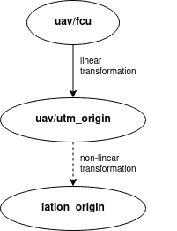

:::warning
This page is describing the upcomming ROS2 version of the MRS UAV System (however, it may be still outdated). If you are looking for ROS1 version of the docs, follow to https://ctu-mrs.github.io/docs/1.5.0/introduction/.
:::

# Frames of Reference

As described in the [Transformations](/docs/api/transformations) manual, the MRS control system enables to send commands to the UAV in all coordinate frames that are part of the same TF Tree as the `<uav_name>/fcu` frame.
The `<uav_name>/fcu` frame is the _body frame_ of the UAV.
The coordinate frames that are used within MRS system are listed below.

The graphical illustration of relations among particular frames can be displayed with rqt utility `tf_tree` by executing command:
```bash
rosrun rqt_tf_tree rqt_tf_tree
```
or using the main RQT application:
```bash
rqt
```

## Multi-frame Localization Problem

Coordinate systems for mobile robots follow hierarchical convention (check coordinate frames convention [REP-105](https://www.ros.org/reps/rep-0105.html) used with ROS):
```bash
world -> map -> odometry -> fcu -> sensors
```
The [transformations](/docs/api/transformations) (`->`) among coordination frames are maintained by [tf2 ROS library](http://wiki.ros.org/tf2).
The `tf2` library requires the mutual transformations to be stored in a **tree structure**, where each node has a single *parent* and there exists only a single **root** node with no *parent*.

But, maintaining the **tree structure** is impossible for multiple *world*/*map*/*odometry* coordinate frames.

The MRS system solves this by having the `<uav_name>/fcu` coordinate frame as the **root** node of the tree.
A *frame* following the hierarchical order `<uav_name>/fcu -> frame` is kept untouched.
However, a *frame* following the order `frame -> <uav_name>/fcu` is stored as a *children* of `<uav_name>/fcu` by inverting the order and the transformation.


## Connecting multiple TF trees

To connect transform trees of two or more UAVs, you can use the [`tf_connector`](https://github.com/ctu-mrs/mrs_utils/tree/ros2/mrs_tf_connector) node within the [`mrs_utils`](https://github.com/ctu-mrs/mrs_utils/tree/ros2) package.
The node creates a new common connecting frame and defines transforms from root frames of the separate trees to this common frame that are recalculated so that the specified frames in the subtrees remain equal.
See the corresponding [Readme](https://github.com/ctu-mrs/mrs_utils/blob/ros2/mrs_tf_connector/README.md) for usage hints and parameter documentation.

*Note:* The `tf_connector` node can connect only trees containing a common (equal) frame --- e.g., a local GNSS coordinate frame of the world `<uav_name>/world_origin`.


## Elementary frames

The most important frames, that are used in MRS system and are automatically created for each UAV, are:

* **\<uav_name\>/fcu**
  * Flight Controller Unit coordinate frame, a.k.a., the **body frame** of the UAV
  * z-axis is parallel to the thrust force produced by the propellers
* **\<uav_name\>/fcu_untilted**
  * coordinate frame with coincident center and orientation with the `<uav_name>/fcu` frame, but xy-plane parallel to xy-plane of of the world.
  * enables commanding UAV in the `<uav_name>/fcu` frame without being affected by the UAV tilt
* **\<uav_name\>/local_origin**
  * coordinate frame with center and orientation cooincident with the starting point and orientation of the UAV
* **\<uav_name\>/fixed_origin**
  * coordinate frame with center and orientation cooincident with the starting estimator
* **\<uav_name\>/stable_origin**
  * coordinate frame used for stable odometry, which does not jump when a state estimator is switched
* **\<uav_name\>/world_origin**
  * coordinate frame representing the GNSS-based frame with origin defined in the world file
  * enables commanding multiple UAVs in a common locally-defined coordinate frame
* **\<uav_name\>/utm_origin**
  * coordinate frame representing the UTM coordinates with UTM zone derived from the current GNSS data
  * enables commanding multiple UAVs in a Earth-based coordinate frame
  * allows use of software that might expect UTM coordinates
  * points with `header.frame_id` as **\<uav_name\>/utm_origin** have the following meaning
    * `x`: easting
    * `y`: northing
    * `z`: height above mean sea level (AMSL)

where the `<uav_name>` is the unique name of a UAV.

## Sensor frames

In addition to elementary frames, that are automatically created for each UAV, coordinate frames of sensors are created according to configuration of particular UAVs specified in a spawn command.
The sensor frames includes

* **\<uav_name\>/garmin**
* **\<uav_name\>/rplidar**
* **\<uav_name\>/os1_sensor**
* **\<uav_name\>/bluefox_front**
* ...

## Additional frames

Last group of frames used in MRS system is formed by coordinate frames created by [TransformManager](https://github.com/ctu-mrs/mrs_uav_managers/tree/ros2#TransformManager) from `nav_msgs/Odometry` messages or by addditional sotware (e.g., systems for localization).
This group incorporates

* **\<uav_name\>/mapping_origin**
* **\<uav_name\>/ground_truth**
* **\<uav_name\>/vio_origin**
* ...

## Special LATLON frame

The geographical location of object and robots is often represented using latitude, longitude and altitude (above mean sea level). Due to the curved nature of the Earth's surface, the transformation between the latitude-longitude coordinates and a Cartesian coordinate system (all the above frames) is non-linear in nature. These non-linear transformations are not part of the tf tree maintianed by the `tf2` library. However, the MRS system includes methods to perform transformations and can work with msgs/commands containing latitude-longitude information. Any msg/command having the following structure is accepted by the MRS system.
* `frame_id`: **latlon_origin**
* `x`: latitude in degrees
* `y`: longitude in degrees
* `z`: height above mean sea level (AMSL)


