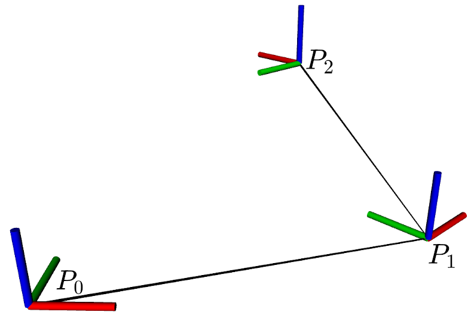
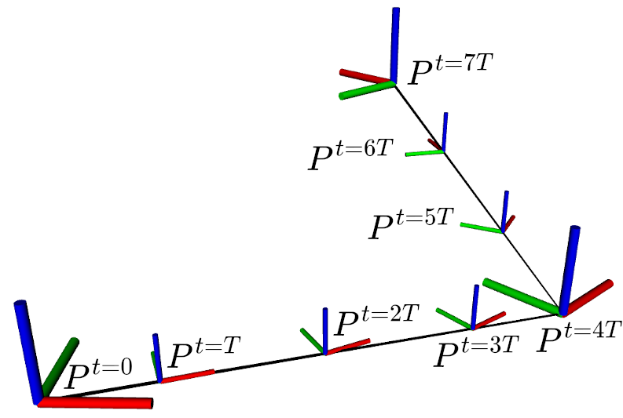

:::warning
This page is describing the upcoming ROS2 version of the MRS UAV System (however, it may be still outdated). If you are looking for ROS1 version of the docs, follow to https://ctu-mrs.github.io/docs/1.5.0/introduction/.
:::

## Definitions

**Path** ([mrs_msgs/Path.msg](https://ctu-mrs.github.io/mrs_msgs/msg/Path.html))

- An ordered sequence of geometric poses without any notion of time.
- Specifies what poses should the UAV fly through: no control over dynamics.
- Has to be sampled first by sampling period `T`.
- See [below](https://ctu-mrs.github.io/docs/system/trajectories.html#generating-trajectories-from-paths) on how to generate dynamically feasible trajectories from paths.

**Trajectory** ([mrs_msgs/TrajectoryReference.msg](https://ctu-mrs.github.io/mrs_msgs/msg/TrajectoryReference.html))

- An ordered time-parametrized sequence of geometric poses.
- Specifies what pose should the UAV be in at given time: more control over dynamics.
- Can be input to the reference tracker.

| Path                           | Trajectory                           |
|--------------------------------|--------------------------------------|
|  |  |

## Loading trajectories

The [`mrs-ctu/trajectory_loader`](https://github.com/ctu-mrs/trajectory_loader) package contains all information you need for loading a trajectory from a file: [documentation](https://github.com/ctu-mrs/trajectory_loader), [example trajectories](https://github.com/ctu-mrs/trajectory_loader/tree/master/sample_trajectories), and [launch files](https://github.com/ctu-mrs/trajectory_loader/tree/master/launch).
It expects trajectory sampled with period of T = 0.2 s (can be modified in the message), in line-format `x,y,z,heading`, e.g.,:
```bash
0.0,0.0,1.0,0.0
0.2,0.2,1.2,0.1
0.3,0.1,1.4,0.15
```
The trajectory loaded with `mrs-ctu/trajectory_loader` will be input to the current [reference tracker](https://ctu-mrs.github.io/docs/software/uav_core/mrs_uav_trackers/), which will generate all-state and feasible reference for the [controller](https://ctu-mrs.github.io/docs/software/uav_core/mrs_uav_controllers/).

## Generating trajectories from paths

You can generate your own trajectories and publish them to `control_manager/trajectory_reference` to fly them (see [UAV-ROS interface](https://ctu-mrs.github.io/docs/system/uav_ros_interface.html#selected-services-for-program-to-machine-interaction)).
This pipeline follows the same scheme `trajectory->tracker->controller` as if the trajectory was loaded with `mrs-ctu/trajectory_loader`.
If a trajectory is **not feasible under dynamic constraints for the UAV, the resulting trajectory may be degraded**.

To convert a desired waypoint path to a **trajectory feasible under dynamic constraints of the UAV**, you can use the [`mrs_uav_trajectory_generation`](https://github.com/ctu-mrs/mrs_uav_trajectory_generation) package.
See the package documentation for more information about generating trajectories under dynamic constraints and [list of topics/services](https://ctu-mrs.github.io/docs/system/uav_ros_interface.html#trajectory-generation) for using the `mrs_uav_trajectory_generation` package.
