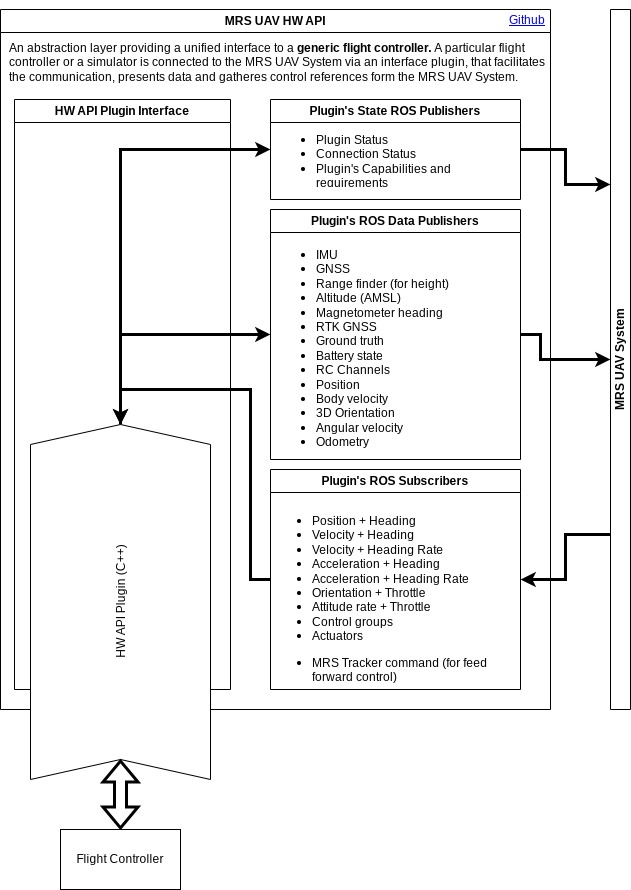

:::warning
This page is describing the upcoming ROS2 version of the MRS UAV System (however, it may be still outdated). If you are looking for ROS1 version of the docs, follow to https://ctu-mrs.github.io/docs/1.5.0/introduction/.
:::

# The MRS Hardware API interface

The HW API provides an abstraction layer between the [MRS UAV System](https://github.com/ctu-mrs/mrs_uav_system) and a UAV flight controller.
On one side, the HW API provides a unified ROS interfaces for the [core](https://github.com/ctu-mrs/mrs_uav_core) as if it was a **generic flight controller**.
On the other side, the communication with a particular hardware (or simulator) can be orchestrated using whatever is required.
The HW API is defined by the package [mrs_uav_hw_api](https://github.com/ctu-mrs/mrs_uav_hw_api/), which is part of the [mrs_uav_core](https://github.com/ctu-mrs/mrs_uav_core).

## Doxygen documentation for the C++ API

<Button label="🔗 mrs_uav_hw_api C++ API" link="https://ctu-mrs.github.io/mrs_uav_hw_api/" block /> 

### Control output from the MRS UAV System

The control output can be any of the following:

* 3D **Position** + **Heading**
* 3D body-frame **Velocity** + **Heading**
* 3D body-frame **Velocity** + **Heading rate**
* 3D body-frame **Acceleration** + **Heading**
* 3D body-frame **Acceleration** + **Heading rate**
* 3D world-frame **Attitude** + **Throttle**
* body-frame **Attitude rate** + **Throttle**
* **Control groups**
* individual **Actuators'** throttle

The following services command the state changes in the flight controller:

* Arming toggle service
* Offboard trigger service

### Data provided to the MRS UAV System

The following data **can be** provided by the API plugin

* GNSS
  * GNSS data
  * GNSS status
* RTK
* IMU
* Barometer
* Magnetometer heading
* Magnetometer's magnetic field
* Downwards-pointed rangefinder (height)
* AMSL altitude
* Position
* Velocity
* Orientation
* Angular velocity
* Ground truth
* RC Channels
* Battery state
* 3D odometry

## Example HW API Plugins

* [PX4 Plugin](https://github.com/ctu-mrs/mrs_uav_px4_api)
* [DJI Tello](https://github.com/ctu-mrs/mrs_uav_dji_tello_api)
* [MRS Simulator Plugin](https://github.com/ctu-mrs/mrs_multirotor_simulator)
* [Unreal Simulator Plugin](https://github.com/ctu-mrs/mrs_uav_unreal_simulation)
* [CoppeliaSim Plugin](https://github.com/ctu-mrs/mrs_uav_coppelia_simulation)
