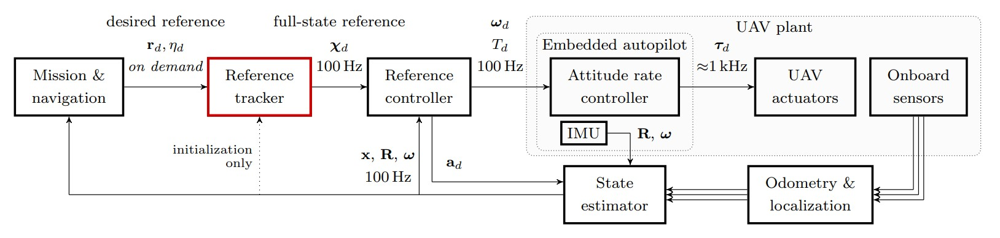

:::warning
This page is describing the upcoming ROS2 version of the MRS UAV System (however, it may be still outdated). If you are looking for ROS1 version of the docs, follow to https://ctu-mrs.github.io/docs/1.5.0/introduction/.
:::

# The Tracker plugin interface


The Tracker plugin receives the high-level references from a Mission \& navigation software and provides the UAV state reference to the [Feedback controller](../../50-features/10-controllers/index.md) that ensure the UAV follows the reference.
In general, the high-level reference received from the Mission \& navigation software can be

* a single position and heading reference,
* a trajectory, consisting of several position and heading references separated by a fixed time constant.
 
Diagram below shows the data architecture of the MRS system where the block containing the Tracker plugin is marked in red.

The tracker plugin is compiled as [ROS plugins](http://wiki.ros.org/pluginlib) with the [interface](https://github.com/ctu-mrs/mrs_uav_managers/blob/master/include/mrs_uav_managers/tracker.h) defined by the [control manager](https://github.com/ctu-mrs/mrs_uav_managers).
A tracker plugin from any ROS package can be loaded dynamically by the [control manager](https://github.com/ctu-mrs/mrs_uav_managers) without it being present during [control manager](https://github.com/ctu-mrs/mrs_uav_managers)'s compile time.
Loaded trackers can be switched by the [control manager](https://github.com/ctu-mrs/mrs_uav_managers) in mid-flight, which allows safe testing of new trackers and adds flexibility the [MRS UAV system](https://github.com/ctu-mrs/mrs_uav_system).


## Tracker plugin - outputs 
The tracker plugin can output the combination following references:

  * Acceleration 
  * Jerk 
  * Snap 
  * Attitude rate
  * Heading 
  * Heading rate
  * Heading acceleration
  * Heading jerk
  * Orientation 
  * Throttle 
  * Full state prediction 
  
In the tracker plugin source code, you can decide which references should be considered by the [Feedback controller](../../50-features/10-controllers/index.md). If you develop your own [controller plugin](../02-controllers/02-controllers.md), ensure that your controller supports the required tracker references.

## Example tracker plugin 

An example of a custom tracker plugin can be found at [this link](https://github.com/ctu-mrs/mrs_core_examples/tree/master/cpp/tracker_plugin).
It is highly recommended to base your tracker plugin on this example.
In the example, there is also a [tmux folder](https://github.com/ctu-mrs/mrs_core_examples/tree/master/cpp/tracker_plugin/tmux) containing a script that starts the simulation of a UAV in the [MRS multirotor simulator](https://github.com/ctu-mrs/mrs_multirotor_simulator), where the UAV uses the [example tracker plugin](https://github.com/ctu-mrs/mrs_core_examples/tree/master/cpp/tracker_plugin).
You have to install [MRS UAV system](https://github.com/ctu-mrs/mrs_uav_system) first to run the example.
To load the tracker plugin into the [MRS UAV system](https://github.com/ctu-mrs/mrs_uav_system), you need to provide a custom config file to the [MRS UAV Core](https://github.com/ctu-mrs/mrs_uav_core) containing the parameters for the tracker plugin.
The custom config file should contain the following lines (taken from [custom config file of example tracker plugin](https://github.com/ctu-mrs/mrs_core_examples/blob/master/cpp/tracker_plugin/tmux/config/custom_config.yaml)):
```yaml 
mrs_uav_managers:

  control_manager:

    ExampleTracker:
      address: "example_tracker_plugin/ExampleTracker"
      namespace: "example_tracker"
      human_switchable: true

    # list of names of dynamically loaded trackers
    trackers : [
      "ExampleTracker",
    ]
```

### Parameter description for tracker plugin

```address: "example_tracker_plugin/ExampleTracker``` : Specifies the address of the plugin to be loaded into the interface as a tracker.  
```namespace: "example_tracker"``` : Specifies the namespace of the tracker as per the package description in the plugin.  
```human_switchable: true``` : Specifies whether the tracker can be switched by the user during flight.  

