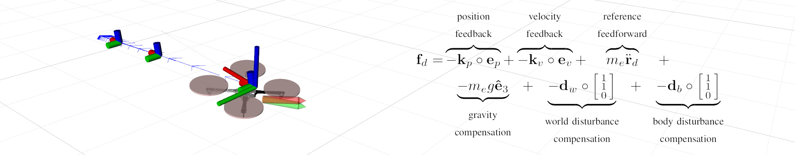

:::warning
This page is describing the upcoming ROS2 version of the MRS UAV System (however, it may be still outdated). If you are looking for ROS1 version of the docs, follow to https://ctu-mrs.github.io/docs/1.5.0/introduction/.
:::

# Feedback controllers within the MRS



## Purpose of a controller

* receiving an all-state reference from [reference trackers](https://github.com/ctu-mrs/mrs_uav_trackers)
* outputs control command to the [HW Api](https://github.com/ctu-mrs/mrs_uav_hw_api).

## Available controllers

* "SE(3) controller"
  * geometric state feedback in SE(3) capable of precise reference tracking and fast maneuvers
  * **pros**: precise control, fast response, fast convergence
  * **cons**: sensitive to measurement noise, requires a feasible and smooth reference, needs to be tuned
  * originally published in: `Lee, et al., "Geometric tracking control of a quadrotor UAV on SE(3)", CDC 2010`, [link](https://ieeexplore.ieee.org/abstract/document/5717652)
* "MPC controller"
  * SO(3) force tracking + Linear MPC for acceleration feedforward
  * **pros**: robust control, immune to measurement noise and reference infeasibilities
  * **cons**: larger control error than with SE(3)
  * briefly described in: `Petrlik, et al., "A Robust UAV System for Operations in a Constrained Environment", RA-L 2020`, [link](https://ieeexplore.ieee.org/abstract/document/8979150)
* "Failsafe controller"
  * feedforward controller for landing without a state estimator
  * is triggered in case of emergency

## Controller interface

The controllers are compiled as *ROS plugins* ([http://wiki.ros.org/pluginlib](http://wiki.ros.org/pluginlib)) with the [interface](https://github.com/ctu-mrs/mrs_uav_managers/blob/master/include/mrs_uav_managers/controller.h) defined by the [control manager](https://github.com/ctu-mrs/mrs_uav_managers).
A controller from any ROS package can be loaded dynamically by the [control manager](https://github.com/ctu-mrs/mrs_uav_managers) without it being present during [control manager](https://github.com/ctu-mrs/mrs_uav_managers)'s compile time.
Loaded controllers can be switched by the [control manager](https://github.com/ctu-mrs/mrs_uav_managers) in mid-flight, which allows safe testing of new controllers and adds flexibility to the [MRS UAV system](https://github.com/ctu-mrs/mrs_uav_system).

## Loading controllers to the [Control manager](https://github.com/ctu-mrs/mrs_uav_managers)

An example controller plugin is located [here](https://github.com/ctu-mrs/mrs_core_examples).


## Parameter description for control manager

```address: "example_controller_plugin/ExampleController``` : Specifies the address of the plugin to be loaded into the interface as a controller.  
```namespace: "example_controller"``` : Specifies the namespace of the controller as per the package description in the plugin.  
```eland_threshold: 20.0 # [m]``` :  Specifies the position error in the controller which would trigger the eland, but this doesn't attempt a failsafe landing.  
```failsafe_threshold: 30.0 # [m]``` :  Usually set to a higher value than the eland_threshold, this triggers the failsafe landing where thrust is reduced below expected hover to allow descend while maintaining level flight.  
```odometry_innovation_threshold: 1.5 # [m]``` : Odometry innovation threshold varies between controllers depending on whether they are able to supplement the state estimators such that the internal Kalman innovation of the estimators doesn't exceed a certain value and cause the vehicle to emergency land.  
