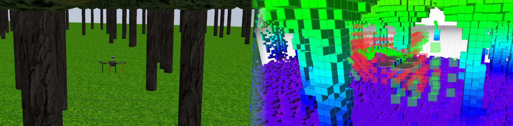

:::warning
This page is describing the upcomming ROS2 version of the MRS UAV System (however, it may be still outdated). If you are looking for ROS1 version of the docs, follow to https://ctu-mrs.github.io/docs/1.5.0/introduction/.
:::

# Octomap mapping \& planning



import DocCardList from '@theme/DocCardList';

<DocCardList />

3D volumetric mapping based on Octomap + A*-based planning

<Button label="🔗 mrs_octomap_mapping_planning repository" link="https://github.com/ctu-mrs/mrs_octomap_mapping_planning/tree/master" block /><br />

## Dependencies

* [mrs_uav_core](http://github.com/ctu-mrs/mrs_uav_core)
* [mrs_uav_modules](http://github.com/ctu-mrs/mrs_uav_modules)

## Packages

* [mrs_octomap_mapping_planning](https://github.com/ctu-mrs/mrs_octomap_mapping_planning) - launch files, example tmux session
* [mrs_octomap_server](https://github.com/ctu-mrs/mrs_octomap_server) - Uses Octomap to build global & local map
* [mrs_octomap_planner](https://github.com/ctu-mrs/mrs_octomap_planner) - 3D planner for UAVs
* [mrs_octomap_tools](https://github.com/ctu-mrs/mrs_octomap_tools) - MRS Tools and libraries for Octomap
* [mrs_subt_planning_lib](https://github.com/ctu-mrs/mrs_subt_planning_lib) - 3D A*-based planner utilized by mrs_octomap_planner

## Example simulation session

Example tmuxinator session is provided in the [tmux subfolder](https://github.com/ctu-mrs/mrs_octomap_mapping_planning/tree/master/ros_packages/mrs_octomap_mapping_planning/tmux/simulation_example).

## Main launch file

The [launch file](https://github.com/ctu-mrs/mrs_octomap_mapping_planning/blob/master/ros_packages/mrs_octomap_mapping_planning/launch/mapplan.launch)
```
roslaunch mrs_octomap_mapping_planning mapplan.launch
```
was prepared to utilize 3D LiDAR and depth camera data and to launch

* PointCloud filter ([mrs_pcl_tools](https://github.com/ctu-mrs/mrs_pcl_tools)),
* Octomap Server,
* Octomap Planner,
* Octomap RVIZ Visualizer,
* Nodelet manager.

To use the launch file for your specific usecase, you might need to:
- Specify reference frame of the map in the **world_frame_id** argument.
- Provide **custom configs** customizing the behavior of the PCL filters, octomap server, octomap planner, and octomap visualizer.
- Remap ROS **topics** expected by the launch file to correspond to your sensor configuration.

Example usage of the launch file with custom configs provided:
```
roslaunch mrs_octomap_mapping_planning mapplan.launch config_octomap_server:="./config/octomap.yaml" world_frame_id:="$UAV_NAME/mapping_origin" config_octomap_visualizer:="./config/octomap_rviz_visualizer.yaml" config_octomap_planner:="./config/pathfinder.yaml" config_pcl_filter_ouster:="./config/pcl_filter_mapping.yaml"
```
