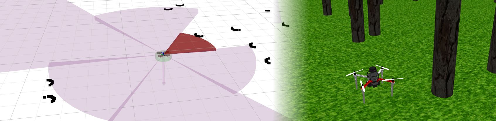

:::warning
This page is describing the upcoming ROS2 version of the MRS UAV System (however, it may be still outdated). If you are looking for ROS1 version of the docs, follow to https://ctu-mrs.github.io/docs/1.5.0/introduction/.
:::

# Obstacle bumper



## Data aggregation

The [MRS bumper](https://github.com/ctu-mrs/mrs_bumper) aggregates data from 1-D, 2-D lidars, and depth-camera images and creates a sector-based representation of the surroundings of a robot.
The advertised *obstacle sectors* message can be visualized in Rviz using our [Rviz plugins](/docs/features/rviz_plugins/) and can be used by other ROS nodes in real-time.
The data is used in the [control manager](/docs/features/managers/), for its obstacle avoidance feature.

The data aggregation does not run automatically, but it needs to be launched on-demand by the user:
```bash
ros2 launch mrs_bumper bumper.launch.py
```

A custom config can be passed to the launch file as:
```bash
ros2 launch mrs_bumper bumper.launch.py custom_config:=<path to your file>
```

## Behavior of the avoidance

The bumper's mechanism takes control of the vehicle if distance to the nearest obstacle crosses a **threshold**.
The threshold has the two following components:

1. A static component defined by the user,
2. A dynamic component equal to the maximum stopping distance given the allowed system dynamics.

The two components are added together in real time.
When a distance to the obstacle is lower than the sum of both components, the system takes control of the vehicle and moves it away from the obstacle until the safety distance is no longer violated.

## Configuration

The reactive-based behavior can be enabled in the `custom_config` for the MRS System's core:

```yaml
mrs_uav_managers:

  control_manager:

    obstacle_bumper:

      enabled: true
```

```yaml
mrs_uav_managers:

  control_manager:

    obstacle_bumper:

      enabled: true

      # should a tracker be switch for the avoidance maneuver?
      switch_tracker: true
      tracker: "MpcTracker"

      # should a controller be switch for the avoidance maneuver?
      switch_controller: true
      controller: "Se3Controller"

      horizontal:

        # user-defined component of the minimum distance
        min_distance_to_obstacle: 1.2 # [m]

        # when enabled, the min_distance_to_obstacle will increased by the distances
        # needed for stopping given the current system constraints
        derived_from_dynamics: true

      vertical:

        # user-defined component of the minimum distance
        min_distance_to_obstacle: 1.2 # [m]

        # when enabled, the min_distance_to_obstacle will increased by the distances
        # needed for stopping given the current system constraints
        derived_from_dynamics: true
```
