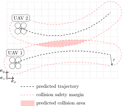

# Inter-UAV collision avoidance

*Warning:* The collision avoidance system is a **last-resort safety feature**, not something to be heavily relied on!
Always strive to design your experiments to be collision-free by default and have a sufficient number of skilled safety pilots to take over if somethings goes wrong.
**Do not rely on collision avoidance to save you!**

The mutual collision avoidance of the UAVs is implemented by the [MPC tracker](/docs/features/trackers/).
In short, each UAV shares its **predicted trajectory** with the other UAVs, and checks whether its own predicted trajectory does not collide with the trajectories of the others (with a specified **safety margin**).
This is illustrated in the figure below ($r$ is the safety margin radius).



If a future collision is detected, a collision avoidance maneuver is executed by the UAVs:

* Both UAVs slow down.
* The **lower-priority** UAV (or several UAVs if multiple collisions are predicted) increases its altitude to avoid the collision.

The UAV priority is selected based on the UAV name: the UAV with the higher number has a lower priority (i.e. in the example in the figure above, UAV2 would climb up to avoid UAV1).
If a UAV has only passive collision avoidance (see below), then it has the highest priority (all other UAVs with enabled collision avoidance will try to avoid it).

*Note:* This system relies on communication between the UAVs.
Therefore, for collision avoidance to work, **the UAVs must be on the same WiFi**, and sharing of the required messages over the LAN must be configured (see below).
Everything should be set up correctly by default except for the UAV names list, which you typically **have to set up by yourself** depending on the specific UAVs that you use!
It is good practice to double-check before any experiments.

## Configuring the collision avoidance

The parameters of the collision avoidance subsystem are configured in the standard custom config file (called simply `custom_config.yaml`) passed to `mrs_uav_core core.launch`.
A tutorial on how to use custom configs is [here](/docs/api/custom_configs/).
The relevant parameters are:
```yaml
mrs_uav_trackers:

  mpc_tracker:

    collision_avoidance:

      enabled:            true  # disabling this will stop this UAV to react to others, but it will still transmit data to others
      enabled_passively:  true  # disabling this will stop this uav to even transmit its data to others (only if enabled: false)
      radius:             5.0   # the collision safety margin - radius used to inflate the predicted trajectories when detecting collisions [m]
      correction:         3.0   # the altitude increase step when avoiding collision [m]
```

*Note:* In case the names or the structure of these paremeters change in the future, you can always find the most up-to-date information using the `get_public_params.py` script (see [here](/docs/api/custom_configs/)).

Furthermore, as mentioned above, the UAVs need to communicate with each other and share their predicted trajectories.
Configuration of the inter-UAV communication has three parts:

1. Specifying the list of UAVs in the group that should avoid collisions.
2. Configuring ROS topics to be shared between the UAVs (the trajectories).
3. Setting up the hostnames in `/etc/hosts`.

The UAV names list is specified in a special custom config called `network_config.yaml`, that is passed to `mrs_uav_core core.launch` and to `mrs_uav_deployment run_nimbro.py`.

In real-world deployments, the sharing of ROS topics between UAVs is implemented using the NimbRo system (see our documentation [here](/docs/features/nimbro-network/)).
In simulation, all topics are available for all UAVs by default, so NimbRo is not required, but the UAV names list still has to be provided in the `network_config.yaml`.

The `/etc/hosts` file should be set up by default, unless you are using some custom-made UAV with special names.
Check that the IP addresses and the corresponding hostnames of all UAVs are present in the file.

## Things to double-check for collision avoidance

For all UAVs, check the following conditions to ensure that collision avoidance will work:

1. The MPC tracker is active.
2. All relevant UAV names are specified in the UAV names list in the network config file (see above).
3. The predicted MPC trajectory topic and the control manager diagnostics topic are specified in the nimbro config file with a sufficient rate (at least 1Hz).
4. The collision avoidance is enabled in the custom config file (see above) and has a sufficient radius and correction.
5. The `/etc/hosts` file is correctly set up with hostnames of all relevant UAVs and their respective IP addresses.
6. The relevant messages from the other UAVs can be "heard" (i.e. you can print them out using e.g. `rostopic echo`) when they are turned on and the MRS system is running.
7. You can see the other UAVs listed as "heard" in the MRS status.

## Further reading

The collision avoidance system is described in detail from a more theoretical point of view in the paper

* T Báča, D Heřt, G Loianno, M Saska and V Kumar, **Model Predictive Trajectory Tracking and Collision Avoidance for Reliable Outdoor Deployment of Unmanned Aerial Vehicles**, IROS, 2018 ([pdf](https://mrs.fel.cvut.cz/data/papers/iros_2018_mpc.pdf)).
