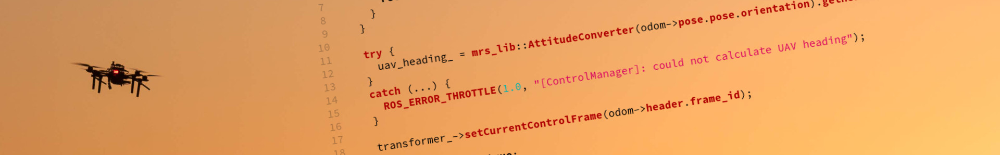

# MRS Libraries

The `mrs_lib` is a set of various utility libraries that are designed to make your life easier when working with ROS and contains implementations of common robotic algorithms, such as the Kalman Filter and its variants.
For a more comprehensive list of what is offered and how to use it, see the documentation.

<Button label="🔗 mrs_lib repository" link="https://github.com/ctu-mrs/mrs_lib" block /> 

<Button label="🔗 mrs_lib documentation" link="https://ctu-mrs.github.io/mrs_lib/" block /> 

## Notable libraries:

* **ParamLoader** - wrapper around ROS's param loading for C++ ([documentation](https://ctu-mrs.github.io/mrs_lib/classmrs__lib_1_1ParamLoader.html))
* **Transformer** - wrapper around ROS's transfomation library ([documentation](https://ctu-mrs.github.io/mrs_lib/classmrs__lib_1_1Transformer.html))
* **SubscribeHandler** - wrapper around ROS's subscriber ([documentation](https://ctu-mrs.github.io/mrs_lib/classmrs__lib_1_1SubscribeHandler.html))
* **AttitudeConverter** - a proxy class for converting representations of 3D orientation ([documentation](https://ctu-mrs.github.io/mrs_lib/classmrs__lib_1_1AttitudeConverter.html))
* **LKF** - Linear Kalman Filter ([documentation](https://ctu-mrs.github.io/mrs_lib/classmrs__lib_1_1LKF.html))
* **UKF** - Unscented Kalman Filter ([documentation](https://ctu-mrs.github.io/mrs_lib/classmrs__lib_1_1UKF.html))
* **Repredictor** - algorithm for fusing variably time-delayed measurements ([documentation](https://ctu-mrs.github.io/mrs_lib/classmrs__lib_1_1Repredictor.html))
* **Profiler** - scoped profiling routine ([documentation](https://ctu-mrs.github.io/mrs_lib/classmrs__lib_1_1Profiler.html))
