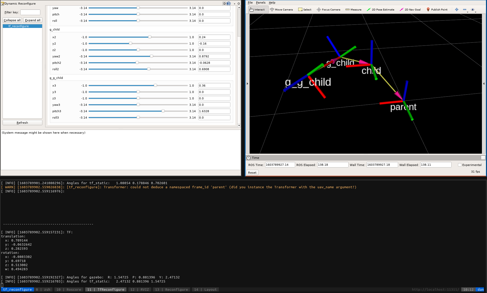

# MRS Utilities

MRS Utilities contains various useful tools for development and testing.

<Button label="🔗 mrs_utils repository" link="https://github.com/ctu-mrs/mrs_utils" block /> 

## tf_reconfigure

This tool will help you to construct transformations, which are needed to e.g. introduce a new sensor to your drone. These transformations can be hard to work out only by hand, especially if the sensor is tilted in multiple axes.
To further confuse you, Gazebo and ros tfs use different angle conventions, so you need different values for each of them.

Tf_reconfigure makes this process much easier, it will allow you to construct the final transformation by chaining multiple simpler transformations, and it will output the final translation and angles for gazebo and for ros tfs.

### running tf_reconfigure

Navigate to the start folder and run the tf_reconfigure.sh script. This will start a new tmux session, run rviz, and rqt_reconfigure. You can see your current transformation in rviz, and adjust the values for up to three chained simple transformations in the rqt_reconfigure window. At first, only the first chained transformation is visible, others will appear once you modify their values. Once you have configured your transformation, you can read out the final transformation in the terminal. Tf_reconfigure will output the final translation, quaternion, and angles for Gazebo and ros tfs.

