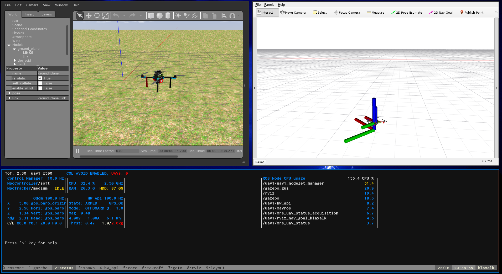

:::warning
This page is describing the upcoming ROS2 version of the MRS UAV System (however, it may be still outdated). If you are looking for ROS1 version of the docs, follow to https://ctu-mrs.github.io/docs/1.5.0/introduction/.
:::

# Prerequsities

1. The [ROS Jazzy](https://docs.ros.org/en/jazzy/Installation/Ubuntu-Install-Debs.html) installed.
2. The [MRS UAV System](https://github.com/ctu-mrs/mrs_uav_system/tree/ros2) installed.
3. The [MRS UAV Gazebo Simulator](https://github.com/ctu-mrs/mrs_uav_gazebo_simulator/tree/ros2) installed.

# Starting the simulation

Running the simulation consists of several steps, which are **automated** using a **tmuxinator** script.
Examples of tmuxinator files can be found in the **tmux** folder within the `mrs_uav_gazebo_simulator` package. With the system installed, you can find them (and then copy them elsewhere) by running

```bash
cd /opt/ros/jazzy/share/mrs_uav_gazebo_simulator/tmux
```

If `roscd` isn't available, the full path should be `/opt/ros/jazzy/share/mrs_uav_gazebo_simulator/tmux`. Each folder contains a different simulation scenario.

The simulation scenario will be started by calling the `start.sh` script within its folder.
This will call the `tmuxinator` utility that uses the prescription in the `session.yml` file to spawn a `tmux` session.

```bash
cd /opt/ros/jazzy/share/mrs_uav_gazebo_simulator/tmux/one_drone
./start.sh
```

You should be presented with the windows of the "Gazebo simulator" and the "Rviz" upon starting the session.


# Stopping the simulation

You have two options:

a) Run the `./kill.sh` script.
b) Hit the _killing shortcut_: `ctrl+a k` (`ctrl+a` and then `k`). A menu will appear in which you confirm the selection.

# Configuring the UAV

The UAVs are **not** part of the simulation world, but are _spawned_ dynamically after the world has started.
The _spawning_ is handler by a ROS node `mrs_drone_spawner` that can introduce new UAVs into the world based on user's command.
The properties of the drones are defined within the `session.yml` on the line

```yaml
waitForGazebo; sleep 5; ros2 service call /mrs_drone_spawner/spawn mrs_msgs/srv/String "{value: '1 --$UAV_TYPE --enable-rangefinder'}"
```

See the [drone spawner documentation page](./04-drone_spawner.md) for details on how to modify the drone configurations.
