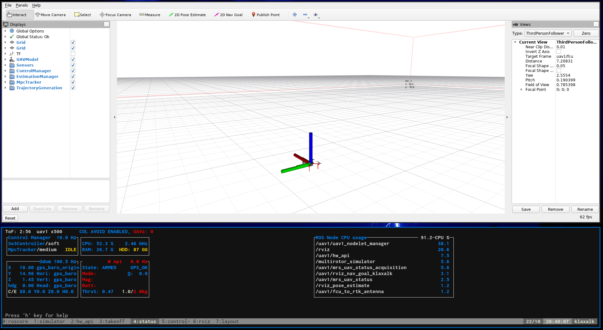

:::warning
This page is describing the upcoming ROS2 version of the MRS UAV System (however, it may be still outdated). If you are looking for ROS1 version of the docs, follow to https://ctu-mrs.github.io/docs/1.5.0/introduction/.
:::

# Prerequsities

1. The [ROS Jazzy](https://docs.ros.org/en/jazzy/Installation/Ubuntu-Install-Debs.html) installed.
2. The [MRS UAV System](https://github.com/ctu-mrs/mrs_uav_flightforge_simulator/tree/ros2) installed.

# Starting the simulation

Running the simulation consists of several steps, which are **automated** using a **tmuxinator** script.
Examples of tmuxinator files can be found in the **tmux** folder within the [mrs_multirotor_simulator](https://github.com/ctu-mrs/mrs_multirotor_simulator/tree/ros2) package.
With the system installed, you can find them (and then copy them elsewhere) by running
```bash
cd /opt/ros/jazzy/share/mrs_multirotor_simulator/tmux
```
Each folder contains a different simulation scenario.

The simulation scenario will be started by calling the `start.sh` script within its folder.
This will call the `tmuxinator` utility that uses the prescription in the `session.yml` file to spawn a `tmux` session.
```bash
cd /opt/ros/jazzy/share/mrs_multirotor_simulator/tmux/mrs_one_drone
./start.sh
```

You should be presented with the "Rviz" window upon starting the session.



# Stopping the simulation

You have two options:

a) Run the `./kill.sh` script.
b) Hit the _killing shortcut_: `ctrl+a k` (`ctrl+a` and then `k`). A menu will appear in which you confirm the selection.

# Configuring the simulator

The simulator is configured through a _custom config_ file [here](https://github.com/ctu-mrs/mrs_multirotor_simulator/blob/ros2/tmux/mrs_one_drone/config/simulator.yaml) which contains the differences form the [default simulator config file](https://github.com/ctu-mrs/mrs_multirotor_simulator/blob/ros2/config/multirotor_simulator.yaml).
You can configure how many drones should be spawned, of which type and where.
The particular drone models are configure [here](https://github.com/ctu-mrs/mrs_multirotor_simulator/tree/ros2/config/uavs).
