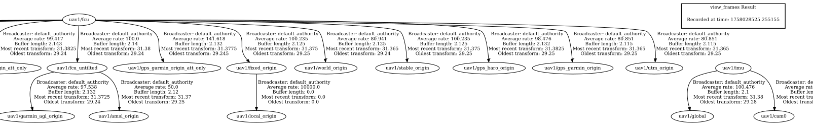
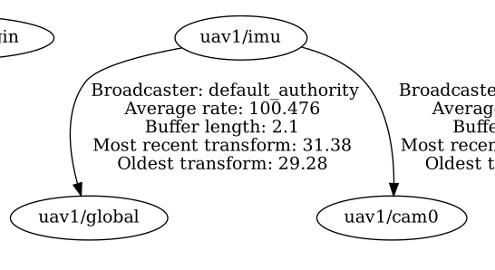
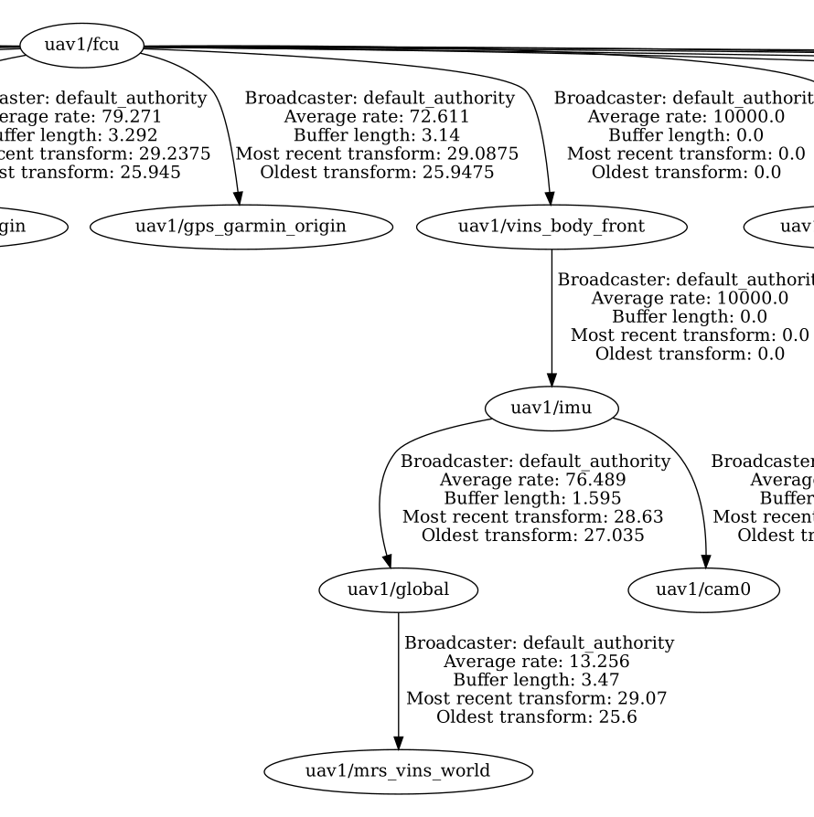

# MRS VINS republisher

Transformes the VIO odometry to the reference frame expected by the [EstimationManager](https://github.com/ctu-mrs/mrs_uav_managers).

## Usage

Use one of the launch files in the `launch/` folder, for example:
```
ros2 launch mrs_vins_republisher vins_republisher.launch.py
```
or create your own by copying an existing launch file and modifying the transformations.

## How it works

When we have multiple sources of the localization (GPS, VIO, SLAM...), each source's node publishes its own TF tree representing position (and possibly other state variables) of the drone in the world frame according to that particular localization source. Thus we should have TF tree with multiple root nodes. However, in ROS, we cannot have multiple roots. We solve this by appending the TF tree of each localization source under the main TF tree.

If we run the OpenVINS VIO node, it publishes its own tf tree, which is separated from the "main" tf tree:

<div style={{textAlign: 'center'}} className="separated_tf_trees-image-wrapper">
  
</div>

<style>
{`
  .separated_tf_trees-image-wrapper img {
    width: 100%;
    height: auto;
  }
`}
</style>

The "main" TF tree has the `uav1/fcu` frame at its root. The root of the TF tree output by OpenVINS is `uav1/imu`. Here is the detail of the TF tree produced by OpenVINS:

<div style={{textAlign: 'center'}} className="vio_tf_tree-image-wrapper">
  
</div>

<style>
{`
  .vio_tf_tree-image-wrapper img {
    width: 45%;
    height: auto;
  }
`}
</style>

We have to connect those two TF trees together. Here is the complete, connected TF tree:

<div style={{textAlign: 'center'}} className="combined_tf_tree-image-wrapper">
  
</div>

<style>
{`
  .combined_tf_tree-image-wrapper img {
    width: 70%;
    height: auto;
  }
`}
</style>

We added static TF frame `uav1/vins_body_front` under the `uav1/fcu`. This transform represents position of the camera relative to the FCU frame, a.k.a. camera mounting position/orientation. Another static TF frame is `uav1/imu` (connected to the `uav1/vins_body_front`), which OpenVINS is using as its UAV body frame. OpenVINS is publishing the transform between `uav1/imu` and `uav1/global`, which is the actual localization.

Node `mrs_vins_republisher` is publishing transform from `uav1/global` to `uav1/mrs_vins_world`. Those two frames have identical position but different orientation.

### Description of the TF frames

    - `vins_body_front`: Represents the pose of the mounting point of the camera. This is static frame.
    - `imu`: OpenVINS uses this frame as its "fcu" frame.
    - `global`: This the pose of the `imu` frame estimated by the OpenVINS.
    - `cam0`: This frame represents image frame of the camera.
    - `mrs_vins_world`: This frame is created by the MRS Vins Republisher. It is used as the actual localization according to the OpenVINS. When the system is started, this frame should be identical to the world frame. As the UAV is moving and OpenVINS is doing its job, it starts to slowly deviate from the world frame, expressing the drift of the VIO algorithm (if the ground truth world frame is available, like in the simulaton).
