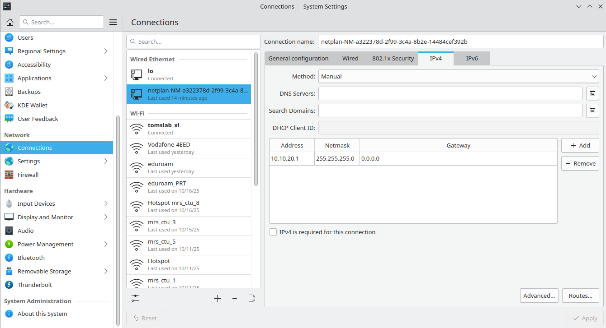

:::warning
This page is describing the upcoming ROS2 version of the MRS UAV System (however, it may be still outdated). If you are looking for ROS1 version of the docs, follow to https://ctu-mrs.github.io/docs/1.5.0/introduction/.
:::

# Ouster

## Installation

The Ouster driver is part of the full installation of the MRS UAV System.
If you are still missing it, run
```bash
sudo apt install ros-jazzy-livox-ros-driver2
```

## Finding out IP address of the sensor

You have to first find out what is the IP address of your Livox lidar, so you can use it later as the parameter to the driver's launchfile. Livox lidars used by MRS and F4F have their IP addresses set statically in the network `192.168.1.1/24`. First, to see the sensor on your network, you have to set the static IP address of your ethernet interface. Here is the example:



Now you can run the `nmap` command, to search the network for sensor device:

```bash
$ nmap -sn 192.168.1.1/24
```

You should get the output similar to this:

```bash
Starting Nmap 7.94SVN ( https://nmap.org ) at 2025-10-24 14:59 CEST
Nmap scan report for hermiodth (192.168.1.20)
Host is up (0.00028s latency).
Nmap scan report for 192.168.1.121
Host is up (0.0010s latency).
Nmap done: 256 IP addresses (2 hosts up) scanned in 2.61 seconds
```

Here, we can see our sensor has IP address `192.168.1.121`.

## Startup

```bash
ros2 launch livox_ros_driver2 livox.launch.py custom_config:=./config/livox.yaml json_config:=./config/mid360_1.json
```

- the **custom_config** specifies a custom configuration file
- the **json_config** specifies the proprietary json config file

Example config file can be found within the [sources](https://github.com/ctu-mrs/livox_ros_driver2/tree/ros2/config) or in
```bash
/opt/ros/jazzy/share/livox_ros_driver2/config
```
