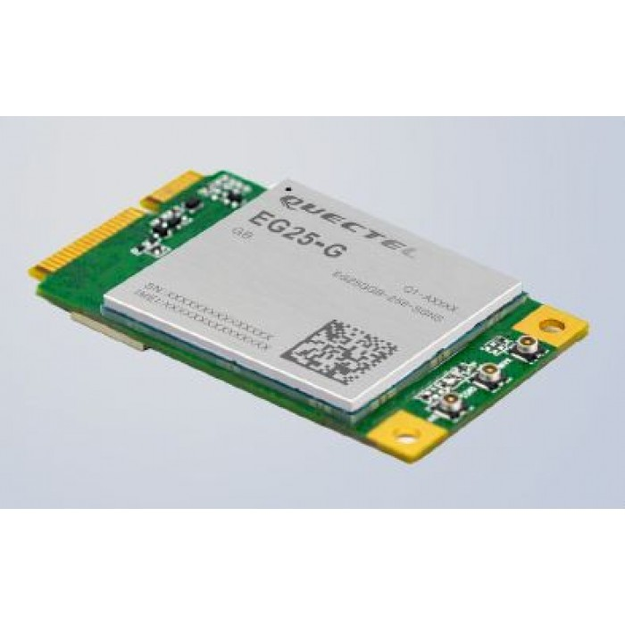

# Guide to enable LTE connection on the drone

Follow this guide to setup an LTE connection on a drone with the MRS UAV System.

## HW setup

This guide is described for device [LTE EG25-G Mini PCIe](https://www.quectel.com/product/lte-eg25-g-mpci://www.quectel.com/product/lte-eg25-g-mpcie).

</img>

However, there are several types of devices and ways to connect them. The devices mainly differ in setup requirements (e.g. need for special drivers) and reliability. It can be summarized like this:

- The easiest option is to directly have a computer with a SIM card slot. However, this is not the case for most mini computers that are used on the drones.

- Using an LTE module (as we did) with Mini PCIe. There are computers with free Mini PCIe slots, but NUCs used in MRS don't have them. Therefore you can Mini PCIe to USB converter, such as [this one](https://www.amazon.com/Mini-PCI-Adapter-Module-Industrial-Grade/dp/B07HNTB4XG) and connect the LTE module through it.

- There are also other devices that use different connection options, such as USB modules with SIM card slots. The Mini PCIe to USB converter we used also included a SIM card slot, but the device was not recognized automatically.

> **⚠ WARNING:** If you are connecting the LTE module through the USB, be careful about the quality of the cables and loose USB ports. We experienced serious issues when connected like that. It caused not only a loss of the internet connection but also a restart of the computer’s USB hub, which affected the Pixhawk (jumped out of offboard control to RC). It could have a different explanation (faulty converter’s driver), but quality cables should be used anyway (we used an old USB 2.0 extender). The exact reason of our issues was not found.

## SW setup

The MRS UAV system uses systemd-newtorkd to control network connections. networkd doesn't support the modems option. Therefore NetworkManager needs to be used. It is disabled by default. Use the following command to start it:
```bash
sudo systemctl start NetworkManager  -- to start program in current session
sudo systemctl enable NetworkManager -- to start automatically on boot
```
It also requires a `modem-manager` to be installed, but this should already be done.

### Netplan config

Before updating the control, you have to find the device name. To do that, call:
```bash
nmcli device
```
this will output all available devices for NetworkManager. In our case, it was called **cdc-wdm0**.
Once you have the device name, you can update the `/etc/netplan/01-netcfg.yaml`.
First, replace the `renderer`, which selects a program that manages the connections, with NetworkManager.
```bash
  renderer: NetworkManager
```
Then, add the following to the end of the config, such that `modems` is aligned with `ethernets` and `wifis`:
```bash
  modems:
    cdc-wdm0:
      apn: internet
      dhcp4: yes
```
This code is a configuration that we used. It was used with a SIM card that doesn't require a PIN code. For more complex configuration, please refer, for example, [here](https://discourse.ubuntu.com/t/properties-for-device-type-modems/29035). Or google a bit.


### Remote access
To enable remote access to the device, use a program like [Tailscale](https://tailscale.com/). The configuration is straightforward and ssh configuration between devices can be enabled. Once you have an account, both devices (yours and drone) need to be signed into and automatically should see each other.
