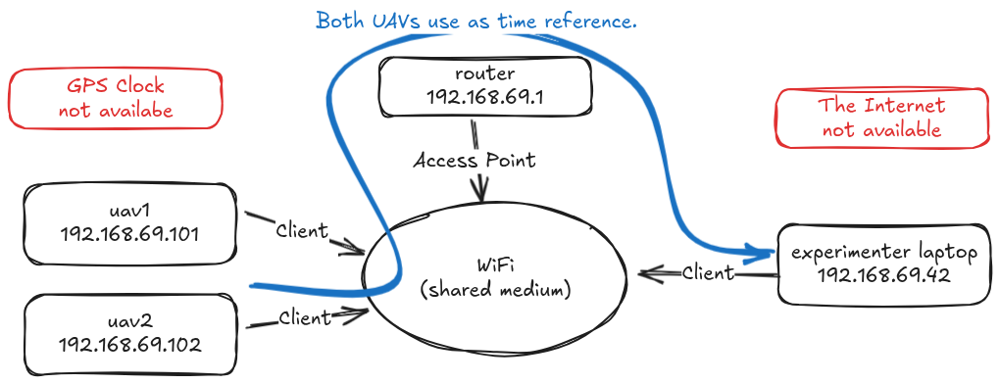
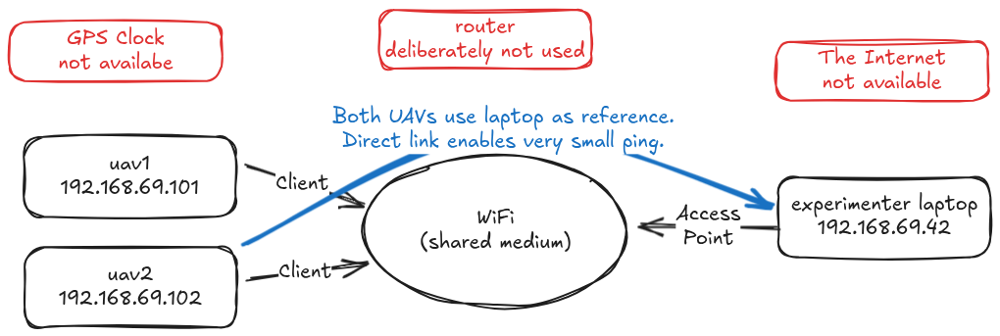

# Why to synchronize
Executing any multi-robot mission typically requires some degree of synchronization. For example, imagine

- two robots need to rendezvous at given location in given time. (The mission itself, trajectories, relies on correct synchronization to fulfill the objective.)
- A researcher needs to inspect true trajectories of a swarming experiment. (The experiment itself does not rely on synchronization, but to evaluate the experiment ex-post, correct timestamps are necessary.)

However, in field deployments, correct synchronization is not always guaranteed. E.g.,

- GPS clock can be denied.
- Battery of internal motherboard clock can deplete.
- Internal motherboard clock can drift significantly even shortly after powering off the main computer.

Therefore, a method to rectify possible clock offsets in the robot team is necessary. Currently, we use the tool [chrony](https://chrony-project.org/). Below, you may find practical tips and remarks on how to use chrony in robotic applications.

[Chrony](https://chrony-project.org/) is an implementation of the [Network Time Protocol (NTP)](https://www.rfc-editor.org/rfc/rfc5905).
NTP is a higher-level network protocol utilizing the IP and UDP protocols.
Therefore, a standard full Ethernet-like (Ethernet, Wi-Fi) network is typically necessary.
In chrony (or NTP in general), computers (robots) are arranged in a directed acyclic graph.
Each computer may synchronize to a reference (a higher quality) clock, or can provide its local clock as a reference to other computers.
In a NTP network, roots of the graph are called as `stratum 1`, their immediate dependents are `stratum 2`, etc...

Our robotic scenarios often cannot presume access to a ground truth clock, such as atomic, GPS, or even internet.
Therefore, we are left with _some_ local estimate of the current time and we just need to make sure all our devices have the same estimate locally, albeit the true UTC time might be different.
Let's consider a typical example from a field experiment. Two UAVs are connected to a laptop via a WiFi access point.

On the physical layer, all devices are mutually reachable.
On the link layer, client devices can talk only to the WiFi router.
The WiFi router behaves similar to an ordinary Ethernet switch.
On the network layer, all nodes have statically pre-assigned addresses which form a single local independent sub-network; all devices are mutually reachable.
In this setup, communication will always include the access point which can raise the ping (communication delay) up to around 100ms.
Nevertheless, Chrony can handle that.

The laptop is configured to serve as a chrony time server and uavs use it as a reference clock. Whatever the laptop deems is the correct time is assumed by the uavs.
To install and configure the network, see [mrs_uav_deployment](https://github.com/ctu-mrs/mrs_uav_deployment/tree/3386b97d7faa873a82c6ed79d7e91a2141bd0325/miscellaneous/chrony).
Following these instructions will define the chrony network dependencies and will enable the system services implementing the protocol.
But beware, you still need to bear in mind that:

- It can take some time before chrony discovers other configured computers, even if they are on the same link. We observed roughly 1-2 minutes delay after system boot with default configuration.
- Even when chrony finds other computers correctly and starts "tracking" them, the reported system time can still be off. This is because some programs are sensitive to rapid changes in the system clock. Chrony therefore, by default, gradually adjusts the system clock by small increments.

Once the chrony is set up, you can verify everything is working, and enforce correct system time with the following commands. (See `man chronyc` for more details.)

- `chronyc sources` lists all configured sources and their current status, as seen from the local computer. After a while after boot you should se a `*` symbol with one of the sources.
- `chronyc burst 10/20` sends at least 10 and and most 20 one-off measurement packets to establish the tracking. May be useful at the start, before the tracking is established.
- `chronyc waitsync 0 0.01 50 1` runs as long as a good-enough tracking is established.
- `sudo chronyc makestep` forces the system clock to assume the current best estimate of chrony, regardless of how big the difference is. Not recommended to execute while experiment is running.
- `chronyc tracking` provides statistics about current tracking (synchronization) quality.

Besides, adding these options to the config may help you achieve better results:

- For client, adding `minpoll -4 maxpoll -4` makes the synchronization instantaneous. I.e. `server <IP> offline iburst minpoll -4 maxpoll -4`.
- For client, removing unused sources may help with configuration clarity.

It is definitely a good idea to [log the output of your `chronyc tracking`](https://mrs.fel.cvut.cz/gitlab/vpritzl/mrs_chrony_ros_monitor) or `chronyc` sources.

The common network topology, as described in the diagram above, proved sufficient.
In some cases, however, it might be useful to consider a laptop as an access point (e.g. via `hostapd`).
This setup has benefits of one less device in the experiments (the router) and, more importantly, direct link between the UAVs and the time source (the laptop). I.e., the ping, even over off-the-shelf WiFi, can be as low as 2ms.

Finally, for several experiments, we needed the drones to be mutually connected during flight, but the laptop could have been disconnected. Here one of the UAVs assumed the role of the WiFi Access Point (via `hostapd`) and laptop and the other UAV connected as clients. In this scenario, one of the UAVs was declared a time reference, the other UAV used it as a reference, and the laptop did not synchronize at all, because it was not relevant for the experiment nor for ex-post evaluation.
After all, it always depends on what exactly you want to do...

