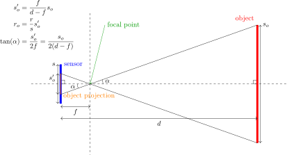

# A quickstart guide to camera and lens selection for computer vision

This guide will shortly explain how to select a camera + lens for a computer vision application.
*This guide assumes that the optical system may be modelled as a [pinhole camera](https://en.wikipedia.org/wiki/Pinhole_camera_model) and the process and the equations get a tad more complicated if this model cannot be used* (ie. when you intend to use special wide-FOV/fisheye/omnidirectional optics - more on this in a later section).
Still, it should give you a good overview of the problem.

## Preliminaries

In most cases, you want to select an optical imaging system (camera + lens in other words) to comply with one of the following combinations of parameters:

 A) image resolution, field of view (FOV),
 B) pixel size of an object with a defined size at a specific distance,
 C) image resolution, maximal distortion of the image (how far is the resulting optical system from an ideal pinhole camera).

Additionally, you usually want to ensure a minimal frame rate, the application dictates if an RGB or monochrome camera is preferred and sometimes a specific connection option is required (USB2, USB3, Ethernet etc.).
Two useful conversion equations are:

 1) ,

where  is pixel size of an object with size  at distance ,  is size of the sensor, and  is focal distance of the camera.

 2) ,

where  is an angular field of view of the optical imaging system.

Equations 1) and 2) can be used to convert between cases A) and B).
How these equations are obtained from the geometrical layout of the optical imaging system is illustrated in the following image.

## The selection process

Typically, the first step is selecting the camera you'll be using and then you select the lens accordingly.

## Camera sensor selection

The camera sensor selection is usually primarily dictated by the desired image resolution, frame rate and connection option.
Other parameters to pay attention to when selecting a camera are:

 * [Shutter type](https://www.flir.com/support-center/iis/machine-vision/knowledge-base/key-differences-between-rolling-shutter-and-frame-global-shutter/) (rolling/global):
   If the camera is intended to be used onboard an MAV or any other moving platform with a source of mechanical vibrations, choose global shutter whenever possible to avoid the [various distortions, caused by a rolling shutter](https://en.wikipedia.org/wiki/Rolling_shutter).
   However, global shutter cameras are more complex than "rolling shutter" cameras, which leads to them typically having lower resolution and other adverse properties.
   Note: "global reset" rolling shutter does not remove these problems.
 * RGB/monotone:
   This is probably dictated by the intended application.
   In general, monotone cameras have better noise properties than their RGB equivalents, but in many cases you need RGB image.
 * [Dynamic range](https://en.wikipedia.org/wiki/Dynamic_range):
   The larger the better will the camera be able to distinguish similar colors. 
   This parameter is dictated by the resolution of the camera's ADC and noise parameters.
   Note: if you intend to use only 8-bit images, then a dynamic range over 50dB will probably not bring much improvement (8 bits correspond to ~48.2dB dynamic range), but you will be throwing away a significant part of the useful information.
 * [Quantum Efficiency](https://www.flir.com/discover/iis/machine-vision/how-to-evaluate-camera-sensitivity/):
   Determines how much of the light hitting the sensor gets converted to a useful electronic signal.
   This parameter is important if you intend to use the camera in low-light conditions.

For the actual selection of a specific camera, I recommend using a camera selector such as:

 * [Flir camera selector](https://www.flir.com/browse/industrial/machine-vision-cameras/modelselector/)
 * [Basler vision system configurator](https://www.baslerweb.com/en/products/tools/vision-system-configurator/#/selection/camera)
 * [Matrix-Vision camera selector](https://www.matrix-vision.com/camera-selector.html) (manufacturer of BlueFox cameras)

Note that different physical camera configurations are usually available with the same sensor model.
Since the sensor dictates most of the important parameters of the camera (resolution, RGB/monotone, noise and sensitivity parameters etc.), you can oftentimes select a camera with the same parameters, but eg. different connection or lens mount options. 

## Lens selection

After you've selected the camera you want to use, it's time for the last step - select the appropriate lens for it.
The selected camera dictates the following parameters to which attention has to be paid when selecting the lens:

 * [Lens mount type](https://www.flir.com/support-center/iis/machine-vision/application-note/selecting-a-lens-for-your-camera/):
   Limits what lens may be mounted to the camera.
   There are three common types:
   
    A) The **C** mount. A **C**-type lens can easily be used with a **CS**-type camera lens mount using a simple reduction ring.
    B) The **CS** mount. **CS**-type lenses are only compatible with **CS**-type camera lens mounts and cannot be used with a camera that has a **C** or **M12** lens mount.
    C) The **M12** mount. There are adapters to use a **M12** lens with a camera that has a **C** or **CS** lens mount, but this combination can cause problems and is better avoided.
 * Resolution:
   Quality of the lens should correspond with the sensor resolution.
   Using a lens, intended for a 1 mega pixel sensor with a 10 mega pixel sensor may result in blurring of the image in which case a lot of the information that your fancy 10 mega pixel camera could obtain will be useless.
   The lens vendor should always indicate the intended maximal sensor resolution.
   Note, however, that this rating is about what the manufacturer guarantees - you may get lucky and get lower rated lens that works fine, but don't rely on this.
 * Sensor format (size):
   It is easiest and usually best to simply select a lens, which is intended for the specific sensor format and be done with it.
   It's possible to use a lens intended for a larger or smaller sensor and get away with it, but this will result in cropping of the image or not all of the projected light being used, and the listed parameters of the lens will have to be recalculated accordingly.
   Manufacturers sometimes show in their datasheets what portion of what size of sensor will the image cover.

## On wide FoV and other "non-pinhole-like" setups
*Note: May contain contoversial information*

Very often, especially for applications of vision onboard of UAVs, you will need cameras with wide FoV to get an overview of the surroundings without the need for actively rotating the camera or the whole UAV.
There is now a wide selection of affordable lenses that accomplish this, including [fisheye lenses](https://en.wikipedia.org/wiki/Fisheye_lens) with more than 180 degrees FoV.
Alternatively, such wide overview can be obtained by using a curved reflective surface in front of a camera sensor.
For these cases, the pinhole camera model is not appropriate.

The pinhole model of cameras is very popular due to its simplicity and presumed computational efficiency.
It is used frequently in computer vision and in computer graphics this model is used almost exlusively.
However, it does practically never perfectly correspond to the projection of real cameras that have lenses, because of which most calibration systems based on the pinhole model compute additional "lens distortion" parameters used to first correct the projection to better correspond to the calculated model.
This means that additional computation has to be performed anyway and any gains one has from exploiting the math of the pinhole-based perspective projection are rendered pretty much moot.
I (ViktorWalter) therefore recommend that you consider using a different model than the popular pinhole for better precision in 3D position estimation.
Definitely do so for wide FoV optics, but also consider doing this for narrower lenses.
There are numerous options of software - one oxample is the [OCamCalib](https://sites.google.com/site/scarabotix/ocamcalib-toolbox) system.

When selecting a fisheye lens, refer to [this](https://en.wikipedia.org/wiki/Fisheye_lens#Mapping_function) - the mapping function implemented in the optics defines which properties of objects are preserved when they move in the image and which are not. For example, the Equidistant projection preserves angular distances, making it suitable for bearing-based systems.
