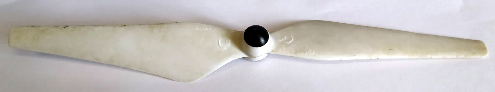
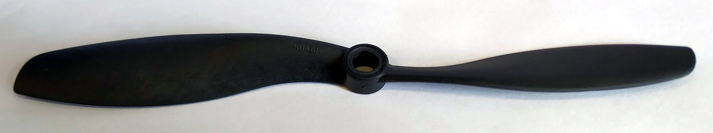

# Motor tests
All motor tests are done with a Turnigy MultiStar BLheli_32 51A ESC, with the 32.7 BLheli firmware. [ESC config](https://github.com/ctu-mrs/uav_core/blob/master/miscellaneous/blheli32_esc_config/T650/T650_M1.ini) is available in our repository. 
Current and voltage measurements are done by the ESC and thrust is measured with a 5 kg load cell, coupled with a HX711 amplifier.
Tests are done with fully charged lithium batteries, as we do not have a powerful enough adjustable power supply.
Tables starts at 50% throttle and continue to 100% throttle in 10% increments.

## Motor: Readytosky 2312 920KV

### Propeller: DJI plastic 9450 self-tightening propeller

| Thrust (g) | RPM   | Voltage (V) | Current (A) | Power (w) | Efficiency (g/W) |
| :---:      | :---: | :---:       | :---:       | :---:     | :---:            |
| 401        | 5688  | 16.66       | 3.09        | 51.48     | 7.79             |
| 529        | 6508  | 16.61       | 4.80        | 79.73     | 6.64             |
| 656        | 7213  | 16.54       | 6.72        | 111.15    | 5.90             |
| 787        | 7788  | 16.48       | 9.05        | 149.14    | 5.28             |
| 911        | 8608  | 16.40       | 11.48       | 188.27    | 4.84             |
| 1024       | 9068  | 16.32       | 14.26       | 232.72    | 4.40             |

### Propeller: Aliexpress plastic 9450 self-tightening propeller
This is a copy of the DJI propeller, it is much more flexible

| Thrust (g) | RPM   | Voltage (V) | Current (A) | Power (w) | Efficiency (g/W) |
| :---:      | :---: | :---:       | :---:       | :---:     | :---:            |
| 395        | 5628  | 16.75       | 3.19        | 53.43     | 7.39             |
| 509        | 6542  | 16.71       | 4.82        | 80.54     | 6.32             |
| 634        | 7282  | 16.64       | 6.74        | 112.15    | 5.65             |
| 745        | 7853  | 16.57       | 9.10        | 150.79    | 4.94             |
| 893        | 8525  | 16.49       | 11.58       | 190.95    | 4.68             |
| 997        | 8956  | 16.41       | 14.37       | 235.81    | 4.23             |

### Propeller: Carbon fiber 9450 self-tightening propeller

| Thrust (g) | RPM   | Voltage (V) | Current (A) | Power (w) | Efficiency (g/W) |
| :---:      | :---: | :---:       | :---:       | :---:     | :---:            |
| 363        | 5899  | 16.66       | 2.80        | 46.65     | 7.78             |
| 486        | 6842  | 16.62       | 4.27        | 70.97     | 6.85             |
| 599        | 7639  | 16.56       | 6.09        | 100.85    | 5.94             |
| 734        | 8448  | 16.51       | 8.14        | 134.39    | 5.46             |
| 867        | 9125  | 16.43       | 10.46       | 171.86    | 5.04             |
| 989        | 9708  | 16.35       | 13.19       | 215.66    | 4.59             |

### Propeller: Plastic 8045 propeller

| Thrust (g) | RPM   | Voltage (V) | Current (A) | Power (w) | Efficiency (g/W) |
| :---:      | :---: | :---:       | :---:       | :---:     | :---:            |
| 323        | 5939  | 16.70       | 2.73        | 45.59     | 7.08             |
| 429        | 6902  | 16.66       | 4.17        | 69.47     | 6.18             |
| 542        | 7648  | 16.59       | 6.06        | 100.54    | 5.39             |
| 663        | 8499  | 16.52       | 8.22        | 135.79    | 4.88             |
| 781        | 9076  | 16.45       | 10.50       | 172.73    | 4.52             |
| 891        | 9722  | 16.37       | 13.27       | 217.23    | 4.10             |

