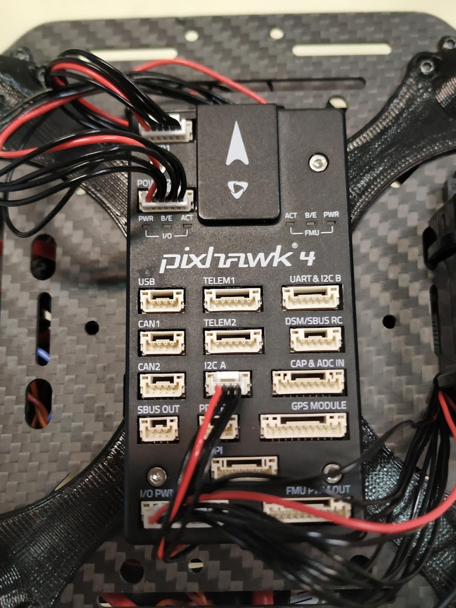

## UNDER CONSTRUCTION
## UNDER CONSTRUCTION
## UNDER CONSTRUCTION
## UNDER CONSTRUCTION

# Pixhawk setup on a new drone
Follow this guide to setup a new drone with pixhawk for the MRS UAV system.

## HW setup
This guide is written for Pixhawk 4, because it is used on most of the MRS aerial platforms. But it is applicable for other versions of Pixhawk, with minor differences.

1. Pixhawk 4 comes with a power distribution/supply board. This board provides power distribution for motors (ESCs), connections for ESC signals, two redundant 5V power supplies for Pixhawk and current and voltage monitoring .

[](fig/power_board.jpg) | [](fig/pixhawk4.jpg)
2. Install the power board into the frame, solder the motor connections and connect the ESC signal cables.
3. You can either solder the ESC signal cables to the M1-M8 ports, or connect them with standard servo cable connectors (servo cable solution is recommended by MRS).
4. Connect cables to both power outputs labeled as `PWR1` and `PWR2`.
5. Connect a cable for the ESC signals to the `IO-PWM-in` port (if you soldered the ESC signal cables) or the `FMU-PWM-in` port (if you used the servo connectors).

[](fig/PB_no_cables.jpg) | [](fig/PB_with_cables.jpg)
6. Install Pixhawk into the drone frame and connect the power cables from the distribution board to the `POWER1` and `POWER2` slots.
7. Connect the ESC signal cable to the `I/O PWM OUT` port.
8. Connect the RC receiver. At MRS we use an OPTIMA SL reciver with SBUS output, so it is connected to the `DSM/SBUS RC` port.
9. Connect the onboard computer to the `TELEM2` port. This is a UART port which ensures communication between the Pixhawk and the onboard computer. We use an FTDI serial to USB converter to connect the Pixhawk with the onboard computer.
10. Optionally, you can connect other sensors, like a GPS module, rangefinder, etc. Note that the arming button and the buzzer are integrated into the GPS receiver, so if you want to use them either connect the GPS receiver or your own arming button and buzzer to the `GPS MODULE` port. The arming button has to be disabled in SW if it is not used (this is unsafe).

[](fig/Pixhawk_no_cables.jpg) | [](fig/Pixhawk_with_cables.jpg)

## SD card setup
Pixawk has an SD card for flight logs and for additional configuration.
If you want to use the MRS system, you have to use our PX4 sd card configuration. You can find it in the [uav_core/miscellaneous](https://github.com/ctu-mrs/uav_core/tree/master/miscellaneous/pixhawk_sdcard_config) repository.
Create a folder called `etc` in the root of the SD card and copy the `extras.txt` file into this folder.
Install the SD card back into the Pixhawk.

##  SW setup
1. Download [QGroundControl](http://qgroundcontrol.com/)
2. Connect the Pixhawk to your computer with a USB cable and run QGroundControl
3. Update the Pixhawk firmware to the latest stable version. Optionally, you can use our [tweaked firmware](https://ctu-mrs.github.io/docs/hardware/px4_firmware.html) or your custom firmware.
4. Set the airframe type according to your drone (most common options are Generic Quadcopter, Generic Hexarotor and Genereic Octocopter)
5. Calibrate all the sensors according to the instructions in QGroundControl. Pixhawk has to be installed in the drone frame during calibration.

[](fig/Qground1.png) | [](fig/Qground2.png)
6. Setup your radio. Pair your RC transmitter and your receiver and connect the receiver to Pixhawk. You should see the RC channel values in QGroundControl. If you do not see the RC channels, check the connection of the receiver.
8. Setup the channels on your Transmitter. Proper channel setup is critical for the functionality of the MRS UAV system. 8 RC channels are used:

| Channel     | Function             | Description                                                                                                |
| :---------- | :----------          | :------                                                                                                    |
| 1           | Roll                 | manual control input                                                                                       |
| 2           | Throttle             | manual control input                                                                                       |
| 3           | Pitch                | manual control input                                                                                       |
| 4           | Yaw                  | manual control input                                                                                       |
| 5           | Offboard switch      | Used to switch the drone in and out of Offboard mode                                                       |
| 6           | Flight mode switch   | Changes the PX4 flight mode when you fly manually                                                          |
| 7           | MRS system switch    | Switch used to trigger some functionality of the MRS UAV system, like the "remote" mode                    |
| 8           | MRS emergency switch | Triggers an emergency behaviour (e-hover, e-land, failsafe land) according to MRS UAV system configuration |

9. Calibrate your transmitter with the `Calibrate` button in QGroundControl and follow the instruction.
10. Setup the flight modes. Select Channel 5 as Offboard switch channel and channel 6 as Position Control switch channel and Mode Channel. Set Flight Mode 1 as Manual, Flight Mode 4 as Altitude and Flight Mode 6 as position (3 position switch is used at channel 6 to switch between those three modes).

[](fig/Qground3.png) | [](fig/Qground4.png)
11. Calibrate your ESCs in the `Power` section. You can also configure your battery here (not needed for the MRS UAV system). Note that the `Power` icon may stay red, you can ignore this.
12. In the `Safety` section, configure failsafe actions. Standard MRS configuration is Warning for Low Battery Failsafe Trigger, Land mode for RC Loss Failsafe Trigger and Land imediately in the Return To Launch Settings. No other triggers are activated (Object detection, data link loss etc.).
13. Setup the RC loss failsafe. This failsafe is activated when the drone is flying manually (not in offboard mode) and the RC signal is lost. The RC receiver on the drone is configured to output abnormally low throttle signal when RC is lost, which is detected by Pixhawk. This guide is for the Hitec Optima receivers, if you are using a different receiver the configuration steps may be different. To configure RC loss failsafe, follow these steps:
  * Turn on your RC transmitter and receiver.
  * Push you RC transmitter's throttle stick to the lowest level, then trim the throttle channel all the way down and use sub-trims to trim it even lower (we want to achieve the lowest possible value at the throttle CH2 channel).
  * Do not move the other sticks, leave them in centered positions.
  * Press the button on the RC receiver until the red LED turns off. Then release the button. The red and blue LEDs will start flashing for a while. This saves the current RC configuration as the output which the RC receiver produces when RC signal is lost.
  * In QGroundControl go to the `Parameters` section and set parameter `RC_MAP_FAILSAFE` to `Channel 2` and `RC_FAILS_THR` to `950 us`.
  * Restart Pixhawk.
  * Now when you turn off your RC transmitter, QGroundControl should report `manual control lost` and when you turn your RC back on, it should report `manual control regained`.

# ROS setup

## Additional Pixhawk configuration

# Garmin rangefinder throught Pixhawk

1. The Pixhawk's sd-card config should contain:
```
mavlink stream -d /dev/ttyS2 -s DISTANCE_SENSOR -r 100
```
2. Set parameter `SENS_EN_LL40LS` to i2c

More info: [https://dev.px4.io/master/en/middleware/modules_driver_distance_sensor.html](https://dev.px4.io/master/en/middleware/modules_driver_distance_sensor.html)

# Configuration

## Disabling/Enabling internal magnetometer

Disable: `EKF2_MAG_TYPE := None`

Enable: `EKF2_MAG_TYPE := Automatic`
