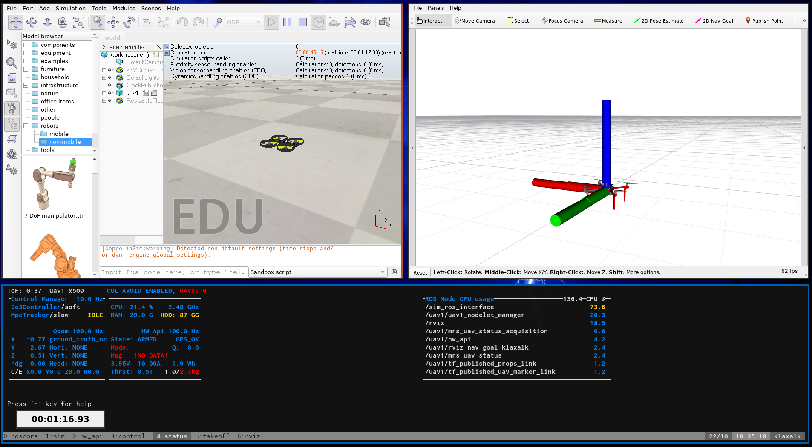

| :warning: **Attention please: This page needs work.**                                                                                             |
| :---                                                                                                                                              |
| The MRS UAV System 1.5 is being released and this page needs updating. Please, keep in mind that the information on this page might not be valid. |

# Prerequsities

1. The [ROS Noetic](http://wiki.ros.org/noetic/Installation/Ubuntu) installed.
2. The [MRS UAV System](https://github.com/ctu-mrs/mrs_uav_system) installed.
3. The [MRS UAV Coppelia Simulation](https://github.com/ctu-mrs/mrs_uav_coppelia_simulation) installed.

# Starting the simulation

Running the simulation consists of several steps, which are **automated** using a **tmuxinator** script.
Examples of tmuxinator files can be found in the **tmux** folder within the [mrs_uav_coppelia_simulation](https://github.com/ctu-mrs/mrs_uav_coppelia_simulation) package.
With the system installed, you can find it (and then copy it elsewhere) by running
```bash
roscd mrs_uav_coppelia_simulation/tmux
```

The simlation scenario will be started by calling the `start.sh` script within its folder.
This will call the `tmuxinator` utility that uses the prescription in the `session.yml` file to spawn a `tmux` session.
```bash
roscd mrs_uav_coppelia_simulation/tmux
./start.sh
```

When the CoppeliaSim window appears, click on the "play" button to start/resume the simulation.
Then, the MRS UAV System will start and RViz window will appear.


# Stopping the simulation

You have two options:

a) Run the `./kill.sh` script.
b) Hit the _killing shortcut_: `ctrl+a k` (`ctrl+a` and then `k`). A menu will appear in which you confirm the selection.

# How does it work?

For more details, see the (mrs_uav_coppelia_simulation)[https://github.com/ctu-mrs/mrs_uav_coppelia_simulation] repository.
