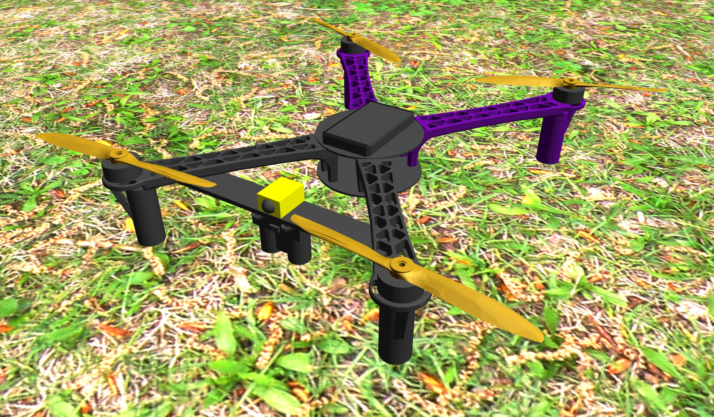

# Adding a custom drone to the simulation (tutorial)



In this tutorial, we will go through the process of adding a new vehicle to the MRS Gazebo simulation.
The tutorial covers the following steps:
* Custom directory setup
* Model template creation in Jinja
* Configuring a custom airframe for PX4
* Adding the custom drone to the MRS drone spawner
* Running the simulation with the MRS UAV System
* Adding a custom optional sensor (configurable by the MRS drone spawner)
The complete example drone is available in the [example_custom_drone](https://github.com/ctu-mrs/example_custom_drone) repository.

## Custom directory setup
We highly recommend using a separate directory for your custom drones. The directory should be set up as a ROS package, which can be added into a ROS workspace and built with catkin.
The directory should follow this structure:
```yaml
example_custom_drone
  - package.xml
  - CMakeLists.txt
  - models
  - ROMFS
```

We use the `gazebo_ros_paths_plugin` which automatically updates the `GAZEBO_PLUGIN_PATH` and `GAZEBO_MODEL_PATH` when the package is built by catkin.

Make sure that your `package.xml` contains:
```xml
  <export>
    <gazebo_ros gazebo_model_path="${prefix}/models"/>
    <gazebo_ros gazebo_media_path="${prefix}"/>
  </export>
```

A minimalistic example of the full `package.xml` could be:
```xml
<?xml version="1.0"?>
<package format="2">

  <name>example_custom_drone</name>
  <version>0.0.1</version>
  <description>An example drone extending the MRS simulation</description>

  <maintainer email="todo@my.email">MY_NAME</maintainer>
  <license>BSD 3-Clause</license>

  <buildtool_depend>catkin</buildtool_depend>

  <depend>cmake_modules</depend>
  <depend>mrs_uav_gazebo_simulation</depend>
  <depend>gazebo_ros</depend>

  <export>
    <gazebo_ros gazebo_model_path="${prefix}/models"/>
    <gazebo_ros gazebo_media_path="${prefix}"/>
  </export>

</package>
```

A corresponding minimalistic `CMakeLists.txt` has to be added for the package:
```cmake
cmake_minimum_required(VERSION 3.5)
project(example_custom_drone)

set(CATKIN_DEPENDENCIES
  cmake_modules
  mrs_uav_gazebo_simulation
  gazebo_ros
  )

find_package(catkin REQUIRED COMPONENTS
  ${CATKIN_DEPENDENCIES}
  )

catkin_package(
  CATKIN_DEPENDS ${CATKIN_DEPENDENCIES}
  )

install(DIRECTORY models/
  DESTINATION ${CATKIN_PACKAGE_SHARE_DESTINATION}/models
  )
```

The `models` directory should contain separate directories for all custom drones. Let's create a directory called `my_drone`, which will serve as the root for our model. To setup a model root, change directory to `models/my_drone` and create a file called `model.config` with the following content:
```xml
<?xml version="1.0"?>
<model>
  <name>my_drone</name>
  <version>1.0</version>
</model>
```

The remaining directory with the name `ROMFS` must be placed in the root of our ROS package. This directory will hold all configs for PX4.

The package should be placed in a ROS [workspace](https://ctu-mrs.github.io/docs/software/catkin/managing_workspaces/managing_workspaces.html) and built at least once with catkin. The workspace does not have to be rebuilt after editing a `.sdf.jinja` file.


## Model template creation in Jinja
Jinja is a templating engine, which allows us to define SDF models with dynamically assigned variables that only become defined in runtime.
In essence the model for Gazebo is always created just at the time we need to place it into the world.

Let's create a jinja template for the `my_drone` model. The SDF Jinja template will be placed in `/models/my_drone/sdf/` and use the name `my_drone.sdf.jinja`. Make sure that the file **suffix** matches your suffix param from the [drone spawner config](https://github.com/ctu-mrs/mrs_uav_gazebo_simulation/blob/master/ros_packages/mrs_uav_gazebo_simulation/config/spawner_params.yaml).

The basic model skeleton should look like this:
```xml

<?xml version="1.0" encoding="utf-8"?>
<sdf version='1.6'>

  

  <model name="{{ spawner_args['name'] }}">

    <link name="{{ root }}">

    </link>

  </model>
</sdf>

```
In this example, `root` is set as a jinja variable, and will be used later in the code. The template will receive a dicitionary `spawner_args` from the MRS drone spawner. We will import some utilities from the `mrs_uav_gazebo_simulation`:
```xml

...
<sdf version='1.6'>
  
  

```
And use the multirotor_physics_macro to give our drone mass, inertia and a collision envelope:

```xml

...

   {# [kg] #}
   {# [m] #}
   {# [m] #}
  

   {# [m] #}
   {# [m] #}

  
  
  
  
  
  

  ...

    <link name="{{ root }}">

      <!-- Body physics {-->
      {{ mrs_generic.multirotor_physics_macro(
        mass = mass,
        body_radius = center_board_radius,
        body_height = body_height,
        rotor_velocity_slowdown_sim = rotor_velocity_slowdown_sim,
        ixx = body_ixx,
        ixy = body_ixy,
        ixz = body_ixz,
        iyy = body_iyy,
        iyz = body_iyz,
        izz = body_izz)
      }}
      <!--}-->

```

Now we will add some visuals to the model, so that the drone body can be viewed in Gazebo. In this tutorial, we use a mix of geometric primitives and meshes. Since we use a `cylinder` visual several times in the project, it gives us a good opportunity to create a Jinja macro to attach a cylinder to the drone. To keep the base model file as clean as possible, let's create a new template called `custom_macros.sdf.jinja` in the `models/my_drone/sdf/` directory. The macro could look like this:

```xml

<?xml version="1.0" encoding="utf-8"?>
<sdf version='1.6'>


  {#- a generic macro to add a colored cylinder visual block. Must be placed inside a link block -#}
  <visual name="{{ name }}_visual">
    <pose>{{ x }} {{ y }} {{ z }} {{ roll }} {{ pitch }} {{ yaw }}</pose>
    <geometry>
      <cylinder>
        <length>{{ height }}</length>
        <radius>{{ radius }}</radius>
      </cylinder>
    </geometry>
    <material>
      <script>
        <name>Gazebo/{{ color }}</name>
        <uri>file://media/materials/scripts/gazebo.material</uri>
      </script>
    </material>
  </visual>


</sdf>

```

Now let's go back to our `my_drone.sdf.jinja` and import the custom macros. We will use the newly created macro to add the central pieces of our drone - two flat cylinders stacked on top of each other with a small gap in between. This will serve as the center board of the frame.

```xml

  ...

  

  ...
   {# [m] #}
   {# [m] #}
   {# [m] #}

   {# [m] #}
  ...

  <!-- Body physics {-->
  ...
  <!--}-->

  <!-- Body visuals {-->

  <!-- Center boards {-->
  {{ custom_macros.visual_cylinder_macro(
    name = 'center_board_top',
    height = center_board_height,
    radius = center_board_radius,
    color = 'DarkGrey',
    x = 0,
    y = 0,
    z = center_board_offset_z,
    roll = 0,
    pitch = 0,
    yaw = 0)
  }}
  {{ custom_macros.visual_cylinder_macro(
    name = 'center_board_bottom',
    height = center_board_height,
    radius = center_board_radius,
    color = 'DarkGrey',
    x = 0,
    y = 0,
    z = -center_board_offset_z - arm_offset_z - body_height / 2,
    roll = 0,
    pitch = 0,
    yaw = 0)
  }}
  <!--}-->

  <!--}-->

```

Now we add the drone arms which use a mesh. We provide two meshes with this example: [arm and propeller](https://github.com/ctu-mrs/example_custom_drone/tree/main/models/my_drone/meshes).If placed in the model directory, the files can be accessed using uri `model://MODEL_NAME/RELATIVE_FILEPATH`

```xml

  
  
  

```

This model will have arms placed at unequal angles (i.e. body length > body width). **Notice that we use the math module from python**. The module has to be loaded into the jinja environment, which is then used to create a sdf file from the jinja template. In our case, the environment setup is handled by the MRS drone spawner, and only adds the `math` module. A macro to attach the mesh as a visual component is provided by [mrs_generic](https://github.com/ctu-mrs/mrs_uav_gazebo_simulation/blob/master/ros_packages/mrs_uav_gazebo_simulation/models/mrs_robots_description/sdf/generic_components.sdf.jinja):

```xml

      ...

      <!-- Arms {-->
      {{ mrs_generic.visual_mesh_macro(
        name = 'front_right_arm',
        mesh_file = arm_mesh_file,
        mesh_scale = mesh_scale,
        color = 'DarkGrey',
        x = center_board_radius * math.cos(math.radians(-37)),
        y = center_board_radius * math.sin(math.radians(-37)),
        z = arm_offset_z,
        roll = 0,
        pitch = 0,
        yaw = math.radians(-37))
      }}

      {{ mrs_generic.visual_mesh_macro(
        name = 'front_left_arm',
        mesh_file = arm_mesh_file,
        mesh_scale = mesh_scale,
        color = 'DarkGrey',
        x = center_board_radius * math.cos(math.radians(37)),
        y = center_board_radius * math.sin(math.radians(37)),
        z = arm_offset_z,
        roll = 0,
        pitch = 0,
        yaw = math.radians(37))
      }}

      {{ mrs_generic.visual_mesh_macro(
        name = 'back_left_arm',
        mesh_file = arm_mesh_file,
        mesh_scale = mesh_scale,
        color = 'Indigo',
        x = center_board_radius * math.cos(math.radians(143)),
        y = center_board_radius * math.sin(math.radians(143)),
        z = arm_offset_z,
        roll = 0,
        pitch = 0,
        yaw = math.radians(143))
      }}

      {{ mrs_generic.visual_mesh_macro(
        name = 'back_right_arm',
        mesh_file = arm_mesh_file,
        mesh_scale = mesh_scale,
        color = 'Indigo',
        x = center_board_radius * math.cos(math.radians(217)),
        y = center_board_radius * math.sin(math.radians(217)),
        z = arm_offset_z,
        roll = 0,
        pitch = 0,
        yaw = math.radians(217))
      }}
      <!--}-->

```

Now we add the propellers. We utilize a propeller macro from [mrs_components](https://github.com/ctu-mrs/mrs_uav_gazebo_simulation/blob/master/ros_packages/mrs_uav_gazebo_simulation/models/mrs_robots_description/sdf/component_snippets.sdf.jinja), which adds the motor physics and gazebo plugins, and also loads the mesh from a provided filepath. Note that propellers have their separate links, so they should be placed outside the root link block:

```xml

    ...
     {# [m] #}
     {# [m] #}
     {# [m] #}

     {# [kg.m/s^2] #}
     {# [m] #}
     {# [s] #}
     {# [s] #}
     {# [rad/s] #}
     {# orig 8.06428e-04 #}
    

    
    
    
    
    
    
    ...
    </link>

    {# Propellers {--> #}
    {%- set prop_list = [
    {
    'motor_number': 0,
    'direction': 'cw',
    'x': (center_board_radius + arm_length) * math.cos(math.radians(-37)),
    'y': (center_board_radius + arm_length) * math.sin(math.radians(-37)),
    'z': body_height + arm_offset_z + motor_height + motor_offset_z + prop_offset_z,
    'mesh_files': [prop_mesh_file],
    'mesh_scale': prop_mesh_scale_cw,
    'color': 'Gold'
    },
    {
    'motor_number': 1,
    'direction': 'cw',
    'x': (center_board_radius + arm_length) * math.cos(math.radians(143)),
    'y': (center_board_radius + arm_length) * math.sin(math.radians(143)),
    'z': body_height + arm_offset_z + motor_height + motor_offset_z + prop_offset_z,
    'mesh_files': [prop_mesh_file],
    'mesh_scale': prop_mesh_scale_cw,
    'color': 'Gold'
    },
    {
    'motor_number': 2,
    'direction': 'ccw',
    'x': (center_board_radius + arm_length) * math.cos(math.radians(37)),
    'y': (center_board_radius + arm_length) * math.sin(math.radians(37)),
    'z': body_height + arm_offset_z + motor_height + motor_offset_z + prop_offset_z,
    'mesh_files': [prop_mesh_file],
    'mesh_scale': prop_mesh_scale_ccw,
    'color': 'Gold'
    },
    {
    'motor_number': 3,
    'direction': 'ccw',
    'x': (center_board_radius + arm_length) * math.cos(math.radians(217)),
    'y': (center_board_radius + arm_length) * math.sin(math.radians(217)),
    'z': body_height + arm_offset_z + motor_height + motor_offset_z + prop_offset_z,
    'mesh_files': [prop_mesh_file],
    'mesh_scale': prop_mesh_scale_ccw,
    'color': 'Gold'
    }
    ]
    -%}
    {{ mrs_components.propellers_macro(
      prop_list = prop_list,
      rotor_velocity_slowdown_sim = rotor_velocity_slowdown_sim,
      motor_constant = motor_constant,
      moment_constant = moment_constant,
      parent = root,
      mass = prop_mass,
      radius = prop_radius,
      time_constant_up = time_constant_up,
      time_constant_down = time_constant_down,
      max_rot_velocity = max_rot_velocity,
      rotor_drag_coefficient = rotor_drag_coefficient,
      rolling_moment_coefficient = rolling_moment_coefficient,
      meshes_z_offset = 0,
      prop_ixx = prop_ixx,
      prop_ixy = prop_ixy,
      prop_ixz = prop_ixz,
      prop_iyy = prop_iyy,
      prop_iyz = prop_iyz,
      prop_izz = prop_izz,
      spawner_args = spawner_args)
    }}
    {# <!--}--> #}

```

Make sure to follow the [PX4 airframe reference](https://docs.px4.io/main/en/airframes/airframe_reference.html) to assign correct orientation and motor number to the propellers. In this tutorial, we are building a **Quadrotor H** configuration (Note: a majority of quadrotors uses **Quadrotor X**).

The last part our drone needs to fly is the flight control unit (FCU). We will model the Pixhawk FCU with PX4 firmware. We can use an external mesh of the Pixhawk chasis, that is already included in mrs_uav_gazebo_simulation. The FCU includes the following sensors: GPS, IMU, magnetometer and barometer. It also creates a Gazebo-Mavlink interface, which needs to be connected to the correct ports (especially in case of multi-vehicle simulation). This is handled by the MRS drone spawner, which provides the ports in `spawner_args['mavlink_config']`:

```xml

  ...

  

  ...
  {# Propellers {--> #}
  ...
  {# <!--}--> #}

  <!-- Pixhawk {-->
  
  
  
  

  <!-- Gazebo ground truth {-->
  {{ mrs_generic.gazebo_groundtruth_macro(
    home_latitude = 0,
    home_longitude = 0,
    home_altitude = 0)
  }}
  <!--}-->

  <!-- GPS {-->
  {{ mrs_generic.gazebo_gps_macro(
    gps_name = 'gps0',
    parent_link = root,
    update_rate = 10,
    gps_noise = true,
    gps_xy_random_walk = 2.0,
    gps_z_random_walk = 4.0,
    gps_xy_noise_density = '2.0e-4',
    gps_z_noise_density = '4.0e-4',
    gps_vxy_noise_density = 0.2,
    gps_vz_noise_density = 0.4,
    x = 0,
    y = 0,
    z = 0,
    roll = 0,
    pitch = 0,
    yaw = 0)
  }}
  <!--}-->

  <!-- Magnetometer {-->
  {{ mrs_generic.gazebo_magnetometer_macro(
    pub_rate = 100,
    noise_density = 0.0004,
    random_walk = 0.0000064,
    bias_correlation_time = 600,
    mag_topic = mag_topic)
  }}
  <!--}-->

  <!-- Barometer {-->
  {{ mrs_generic.gazebo_barometer_macro(
    baro_topic = baro_topic,
    pub_rate = 50,
    baro_drift_pa_per_sec = 0)
  }}
  <!--}-->

  <!-- Mavlink interface (customized) {-->
  {{ mrs_generic.gazebo_mavlink_interface_macro(
    imu_topic = imu_topic,
    mag_topic = mag_topic,
    baro_topic = baro_topic,
    lidar_topic = lidar_topic,
    mavlink_config = spawner_args['mavlink_config'])
  }}
  <!--}-->

  <!-- IMU {-->
  <!-- NOTE: IMU has to be last, otherwise the simulation is extremely slow! -->
  {{ mrs_generic.gazebo_imu_macro(
    imu_name = 'imu',
    parent_link = root,
    imu_topic = imu_topic,
    gyroscope_noise_density = 0.00018665,
    gyroscope_random_walk = 0.000038785,
    gyroscope_bias_correlation_time = 1000.0,
    gyroscope_turn_on_bias_sigma = 0.0087,
    accelerometer_noise_density = 0.00186,
    accelerometer_random_walk = 0.006,
    accelerometer_bias_correlation_time = 300.0,
    accelerometer_turn_on_bias_sigma = 0.1960,
    x = 0,
    y = 0,
    z = 0,
    roll = 0,
    pitch = 0,
    yaw = 0)
  }}
  <!--}-->

  <!--}-->

```

## Configuring a custom airframe for PX4

Before we can take it to the sky, we need to add the PX4 airframe config for `Quadrotor H`. The config files go into the `ROMFS` directory and have to include an airframe definition. This file has to be placed in `ROMFS/px4fmu_common/init.d-posix/airframes/` and the naming convention is: `SYS_AUTOSTART`, underscore and `PLATFORM_NAME`. In our case, the Quadrotor H has an autostart code `4041` and the platform is called `my_drone`, i.e. we need to have a file named `4041_my_drone` with the following content:

```bash
#!/bin/sh

. ${R}etc/init.d/rc.mc_defaults

set MIXER quadrotor_h
```
We will also have to provide the mixer file in `ROMFS/px4fmu_common/mixers/`. The mixer name should match the name we provide in the airframe file. The file should have a suffix `.main.mix`, i.e. we should have a file called `quadrotor_h.main.mix`. I won't go into details of creating custom mixers. For our drone, we just need to define that there are 4 motors in the H configuration:

```bash
# Motors
R: 4h
```

The remaining files handle mavlink configuration, which needs to match the ports assigned by the MRS drone spawner. We recommend to use the reference files provided with this tutorial: [ROMFS/px4fmu_common](https://github.com/ctu-mrs/example_custom_drone/tree/main/ROMFS/px4fmu_common).

## Adding the custom drone to the MRS drone spawner
Now the custom drone should be ready for a test flight. The package with our drone just needs to be registered by the MRS drone spawner. We now assume that the **package was already built in a catkin workspace, and the workspace is sourced**. You can verify this in terminal by calling:
```bash
rospack find example_custom_drone
```
which should return the path to the package. The drone spawner can load additional packages using a custom config file. Create a new file called `spawner_config.yaml`:

```yaml
extra_resource_paths: ["example_custom_drone"]
```

Now pass this file to simulation or spawner launch file:

```bash
roslaunch mrs_uav_gazebo_simulation simulation.launch spawner_config:=spawner_config.yaml
```
or
```bash
roslaunch mrs_uav_gazebo_simulation mrs_drone_spawner.launch spawner_config:=spawner_config.yaml
```

The template for a custom drone should be loaded automatically. Check the output of the simulation node for `[MrsDroneSpawner]: Jinja templates loaded:`. If the template for `my_drone` is loaded, the model can be spawned by calling

```bash
rosservice call /mrs_drone_spawner/spawn "1 --my_drone"
```

You should see the custom drone model to the Gazebo simulation.


## Running the simulation with the MRS UAV System
We provide an example [tmuxinator session](https://github.com/ctu-mrs/example_custom_drone/tree/main/tmux) to start the simulation with the MRS UAV System. In case of a custom platform, a `platform_config.yaml` has to be given to the mrs_uav_core node. An example `platform_config.yaml` is provided:
```yaml
uav_mass: 2.0 # [kg]

motor_params:
  n_motors: 4
  a:  0.37119
  b: -0.17647
```
The tmuxinator session can be started with the `start.sh` script. This will launch Gazebo, spawn the drone, start the MRS UAV System, and perform an automated takeoff.

## Adding a custom optional sensor (configurable by the MRS drone spawner)
In this section, we will create our own sensor that can be added to the model dynamically using the MRS drone spawner.
The sensor will be a monocular grayscale camera based on the gazebo ros camera plugin. We will start by creating the component macro in `custom_macros.sdf.jinja`:

```xml





   {# access this macro from the drone spawner #}
   {# displayed when --help is called in the drone spawner #}
   {# internal params that can be overriden in spawn-time #}

  

    {{ mrs_generic.handle_spawner_args(spawner_keyword, spawner_default_args, spawner_args) }}

  



```

The three internal variables called `spawner_...` are our interface to the spawner API.
The component can be then activated by adding the spawner keyword to the spawn command (in this example `--enable-custom-monochrome-camera`).
The spawner description will be displayed whenever `--help` is added to the spawn command, and a platform using this component is selected (i.e. ` --my_drone --help`).
The spawner default args allow the user to change some internal parameters of the plugin in spawn-time, in this case set a specific update rate of the camera or change the noise strength.
This can be done from the spawn command, e.g.: ` --enable-custom-monochrome-camera update_rate:=30 noise:=0`.

We use a macro from `mrs_generic` called `handle_spawner_args`, that overrides the default values with user input whenever possible, and uses default values elsewhere.
The values are then available inside the macro as `spawner_args[spawner_keyword]['update_rate']` and `spawner_args[spawner_keyword]['noise']`.
The `if` condition will ensure that the component will only attach code to the base model, if the keyword was used in the spawn command.
We will now add the camera plugin into the `if` block. Note that a `zero_inertial_macro` is used, since all links in our model need to have some mass and inertia. Otherwise Gazebo will ignore them, and the plugins will not be active.

```xml

    <!-- custom monochrome camera {-->
    <link name="{{ camera_name }}_link">
      <pose>{{ x }} {{ y }} {{ z }} {{ roll }} {{ pitch }} {{ yaw }}</pose>
      {{ mrs_generic.zero_inertial_macro() }}
      <sensor name="{{ camera_name }}_sensor" type="camera">
        <update_rate>{{ spawner_args[spawner_keyword]['update_rate'] }}</update_rate>
        <camera>
          <horizontal_fov>{{ horizontal_fov }}</horizontal_fov>
          <image>
            <width>{{ image_width }}</width>
            <height>{{ image_height }}</height>
            <format>L_INT8</format> <!-- this makes the data grayscale -->
          </image>
          <clip>
            <near>{{ min_distance }}</near>
            <far>{{ max_distance }}</far>
          </clip>
          <noise>
            <type>gaussian</type>
            <mean>0</mean>
            <stddev>{{ spawner_args[spawner_keyword]['noise'] }}</stddev>
          </noise>
        </camera>
        <plugin name="{{ camera_name }}_plugin" filename="libgazebo_ros_camera.so">
          <alwaysOn>true</alwaysOn>
          <updateRate>{{ spawner_args[spawner_keyword]['update_rate'] }}</updateRate>
          <cameraName>/{{ spawner_args['name'] }}/{{ camera_name }}</cameraName>
          <imageTopicName>/{{ spawner_args['name'] }}/{{ camera_name }}/image_raw</imageTopicName>
          <cameraInfoTopicName>/{{ spawner_args['name'] }}/{{ camera_name }}/camera_info</cameraInfoTopicName>
          <frameName>/{{ spawner_args['name'] }}/{{ camera_name }}_link</frameName>
          <hackBaseline>0.07</hackBaseline>
          <distortionK1>0.0</distortionK1>
          <distortionK2>0.0</distortionK2>
          <distortionK3>0.0</distortionK3>
          <distortionT1>0.0</distortionT1>
          <distortionT2>0.0</distortionT2>
        </plugin>
      </sensor>
      <visual name="{{ camera_name }}_visual">
        <pose>0 0 0 0 0 0</pose>
        <geometry>
          <box>
            <size>0.03 0.022 0.015</size>
          </box>
        </geometry>
        <material>
          <script>
            <name>Gazebo/Yellow</name>
            <uri>file://media/materials/scripts/gazebo.material</uri>
          </script>
        </material>
      </visual>
      <visual name="{{ camera_name }}_lens_visual">
        <pose>0.014 0 0 0 0 0</pose>
        <geometry>
          <sphere>
            <radius>0.006</radius>
          </sphere>
        </geometry>
        <material>
          <script>
            <name>Gazebo/DarkGrey</name>
            <uri>file://media/materials/scripts/gazebo.material</uri>
          </script>
        </material>
      </visual>
    </link>
    <joint name="{{ camera_name }}_joint" type="fixed">
      <parent>{{ parent_link }}</parent>
      <child>{{ camera_name }}_link</child>
    </joint>
    <!--}-->

```

## Adding more components
We added legs (cylinders with collision), motors (just visual cylinders) and two additional components from the MRS simulation (laser rangefinder, ground truth publisher). The full model is available [here](https://github.com/ctu-mrs/example_custom_drone/tree/main).
