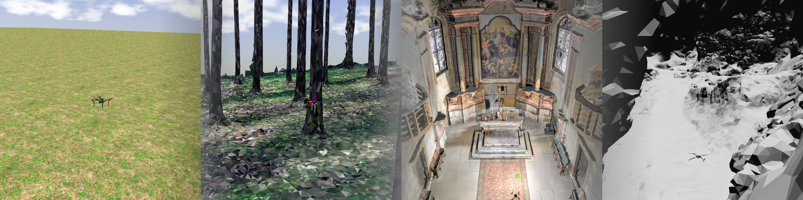

| :warning: **Attention please: This page is outdated.**                                                                                           |
| :---                                                                                                                                             |
| The MRS UAV System 1.5 is being released and this page needs updating. Please, keep in mind that the information on this page might not be valid. |

# How to start the simulation with a custom world



To [start the simulation](https://ctu-mrs.github.io/docs/simulation/howto.html), we use ROS launch file
```bash
roslaunch mrs_simulation simulation.launch gui:=true
```
The launch [`simulation.launch`](https://github.com/ctu-mrs/mrs_simulation/blob/master/launch/simulation.launch) file contains two arguments
```xml
<arg name="world_name" default="grass_plane" />
<arg name="world_file" default="$(find mrs_gazebo_common_resources)/worlds/$(arg world_name).world" />
```
specifying the default world to be `grass_plane` from the [`mrs_gazebo_common_resources`](https://github.com/ctu-mrs/mrs_gazebo_common_resources) package.

## Load a custom world

### Load world from [`mrs_gazebo_common_resources`](https://github.com/ctu-mrs/mrs_gazebo_common_resources/tree/master/worlds)

Pass the **world name** (e.g., `forest`) as an argument to the launch file
```bash
roslaunch mrs_simulation simulation.launch gui:=true world_name:=forest
```

### Load arbitrary custom world

Pass the **world file** as an argument to the launch file using `find` to locate your package
```bash
roslaunch mrs_simulation simulation.launch gui:=true world_file:='$(find custom_gazebo_resources)/worlds/custom_world.world'
```
or use absolute path of the world file
```bash
roslaunch mrs_simulation simulation.launch gui:=true world_file:=/path/to/world/custom_world.world
```

## How to create a custom world

### Create the world manually in a text editor

Create a [completely new](http://gazebosim.org/tutorials/?tut=ros_roslaunch#CreatingaCustomWorldFile) *.world* file or copy & modify an existing file (e.g., [forest.world](https://github.com/ctu-mrs/mrs_gazebo_common_resources/blob/master/worlds/forest.world)).
Make sure your world file contains line
```xml
    <plugin name="mrs_gazebo_static_transform_republisher_plugin" filename="libMRSGazeboStaticTransformRepublisher.so"/>
```
The included [mrs_gazebo_static_transform_republisher](https://github.com/ctu-mrs/mrs_gazebo_common_resources/blob/master/src/world_plugins/static_transform_republisher.cpp) plugin provides static [transforms](https://ctu-mrs.github.io/docs/system/frames_of_reference.html) of all the [spawned sensors](https://ctu-mrs.github.io/docs/simulation/howto.html#2-spawn-a-drone-drones) to the `<uav_name>/fcu` frame.

### Create the world using Gazebo

1. Start a Gazebo simulation
2. Insert models to the world as you wish using the Gazebo GUI
3. Save world to file: `File -> Save as`
4. Make sure the created file contains the `mrs_gazebo_static_transform_republisher` plugin.

# Common issues

## No static transformations

`rosrun rqt_tf_tree rqt_tf_tree` shows no transformations between spawned sensors and the `<uav_name>/fcu` frame?
Make sure your world file contains the `mrs_gazebo_static_transform_republisher` plugin as described [above](https://ctu-mrs.github.io/docs/simulation/custom_world.html#create-the-world-manually-in-a-text-editor).
Lack of static transformations might also prevent start of some systems and hence prevent taking off.


