# How to create a real world elevation map in Gazebo

We will create a 3D model in [Blender](https://www.blender.org/download/) using
[BlenderGIS plugin](https://github.com/domlysz/BlenderGIS) and elevation data from
[opentopography.org](https://opentopography.org/).
We will then export the model as a `.dae` file and a texture as `.tif` to be used in Gazebo.
Finally, we will create a simple Gazebo `.world` to view the created model.

## 1. Getting Blender and the plugin

[Download and install Blender](https://www.blender.org/download/)

[Download BlenderGIS plugin as zip](https://github.com/domlysz/BlenderGIS/archive/refs/heads/master.zip)

In Blender, go to `Edit` -> `Preferences` -> `Add-ons` -> `Install` and select the downloaded zip file


The plugin should now appear in the addons list. Make sure it's enabled (checkbox is checked).

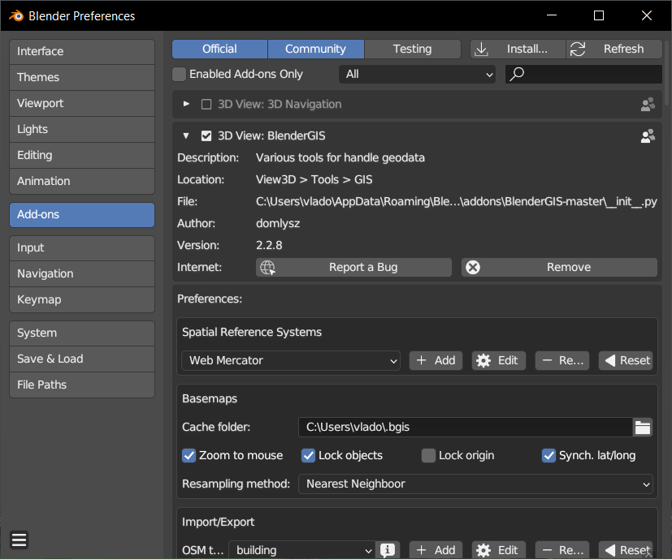

## 2. Creating the textured plane

Once the plugin is installed, you should see the **GIS** button available. Press it, then select `Web geodata` -> `Basemap`

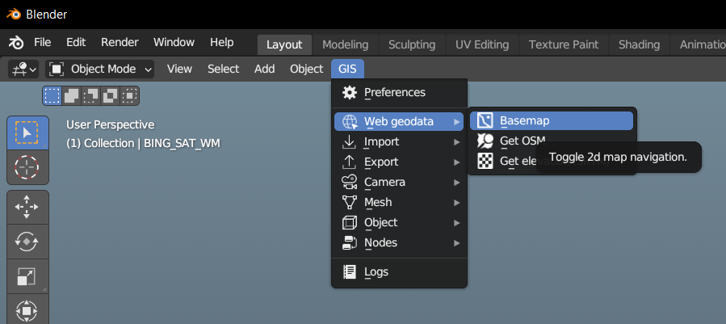

You can change the source (for example to use Bing maps) if you want. Press `OK`.

The 2D map view should appear. You can drag the map and zoom to go the location you want, or you can press `G` to then enter a specific location.

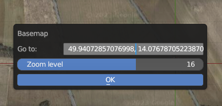

Once you're satisfied with the location and zoom level, press `E` to create a new plane with the texture applied to it.

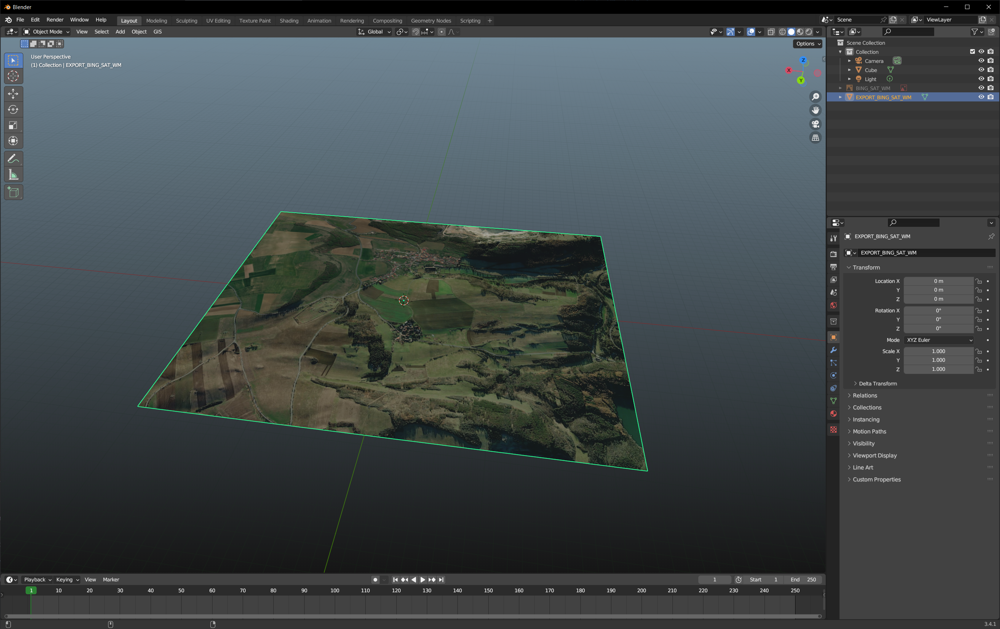

## 3. Adding elevation data

To import the elevation data, we use OpenTopography API. We will need an API key to feed into the plugin. It's free.

Got to [OpenTopography](https://portal.opentopography.org/login?redirect=%2FlidarAuthorizationInfo%3Fs%3Dapi)

Create an account. Select Affiliation: **Academia**, Organization: **Czech Technical University in Prague**.

Then login with the created account. You should see the API key [here](https://portal.opentopography.org/lidarAuthorizationInfo?s=api)

Now in Blender, **select the plane object we've created.**

Go to `GIS` -> `Web geodata` -> `Get elevation (SRTM)`. Enter the API key and press `OK`. This takes some time.
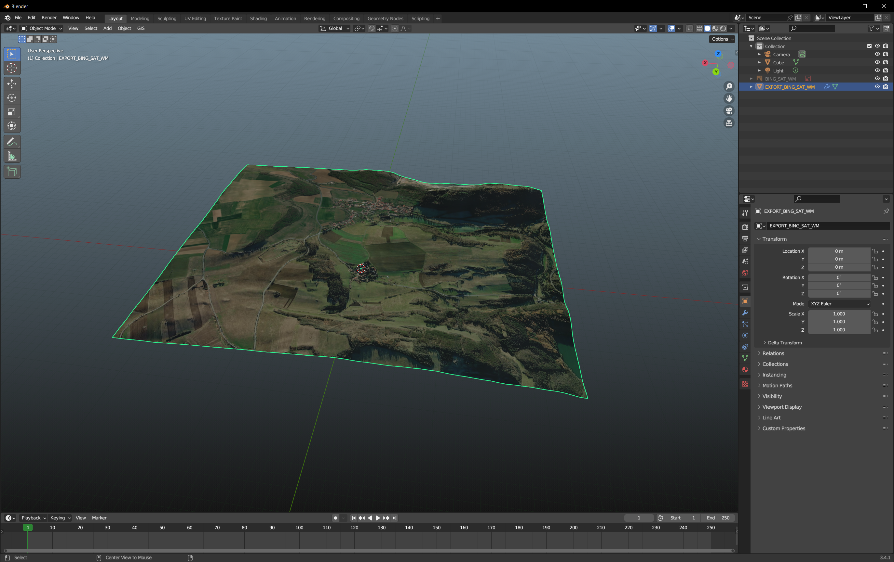

## 4. Adjusting the elevation

Usually we want to adjust our map model so that its origin is at zero. To do that we:

Apply the modifiers: select the plane object, presss `Ctrl+A` and select `Apply` -> `Visual Geometry to Mesh`
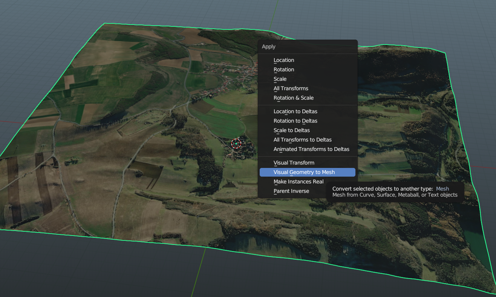

Now, because the plugin is creating a plane based on the screen ratio, the plane will not be a perfect rectangle. What we can do is:

- Select the plane
- Go to the edit mode
- Select the top view
- Select a vertex that is the closest one to the origin
  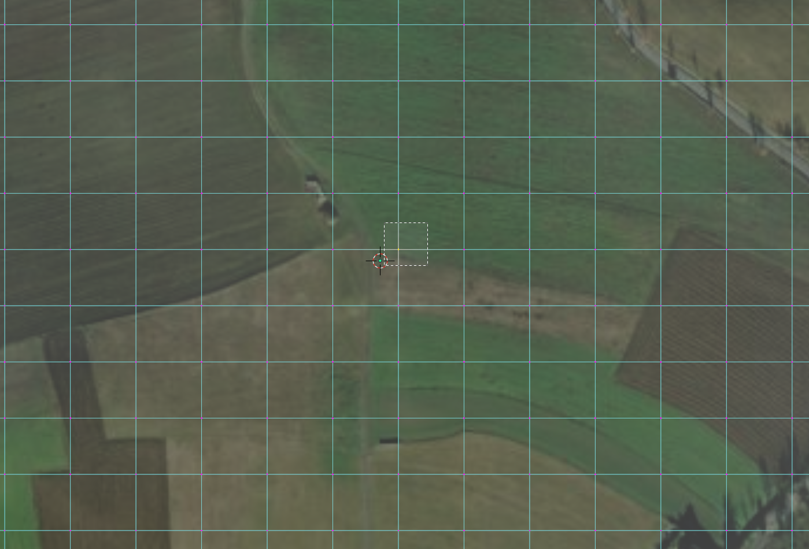
- Now we can see its global coordinates. We want to move all of our vertices so that this point moves to the origin.
  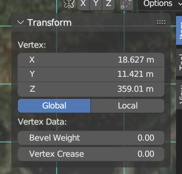
- To do that we can copy the `X` position, then select **all vertices** (`a`), then subtract the copied value from the median's `X`:
  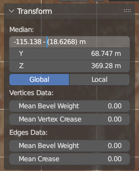
- Repeat the same for the `Y` and `Z`.

## 5. Exporting the model

We export our model as Collada `.dae` file. Select the plane object, go to `File` -> `Export` -> `Collada (.dae)`.

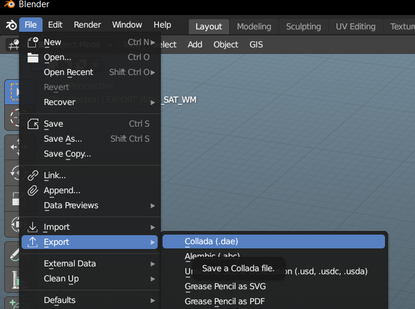

Check `Selection Only`, check `Global Orientation` -> `Apply`, and select `X` as forward axis and `Z` as up axis:

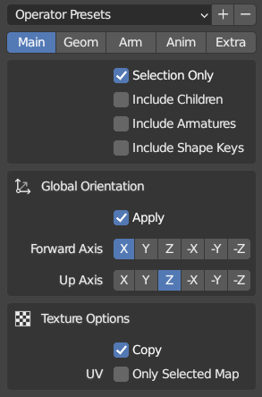

Press `Export COLLADA` and save the file somewhere. There should be two files created: the `.dae` and the `.tif` texture.

## 6. Importing to the Gazebo world.

Create a simple `test.world` file with the following content:

```xml
<?xml version="1.0"?>
<sdf version="1.4">
    <world name="default">
        <include>
            <uri>model://sun</uri>
        </include>
        <model name="myModel">
            <pose>0 0 0 0 0 0</pose>
            <static>true</static>
            <link name="body">
                <visual name="visual">
                    <geometry>
                        <mesh>
                            <uri>file://myModel.dae</uri>
                        </mesh>
                    </geometry>
                </visual>
            </link>
        </model>
    </world>
</sdf>
```

Place the `myModel.dae` and the corresponding `.tif` texture files in the same folder as the `test.world` file.

Finally, run Gazebo with the `test.world` file (you may want to zoom out a bit):

```bash
gazebo test.world
```

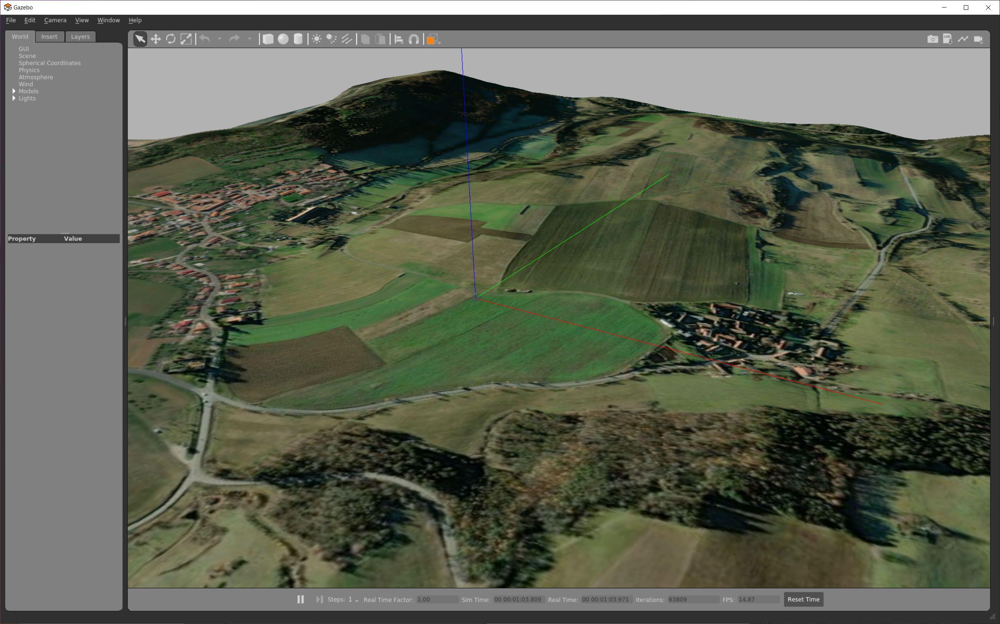
