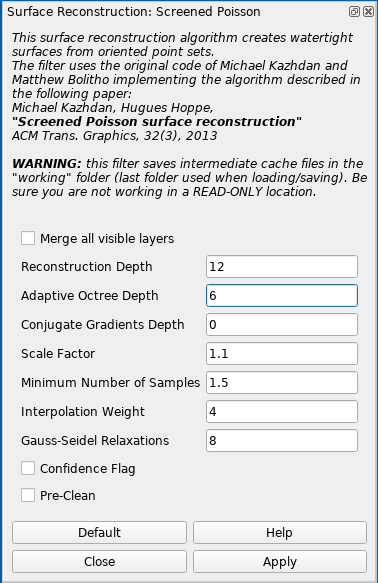
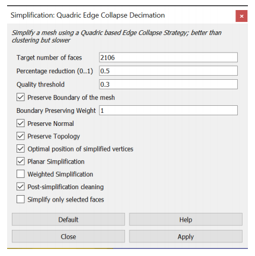
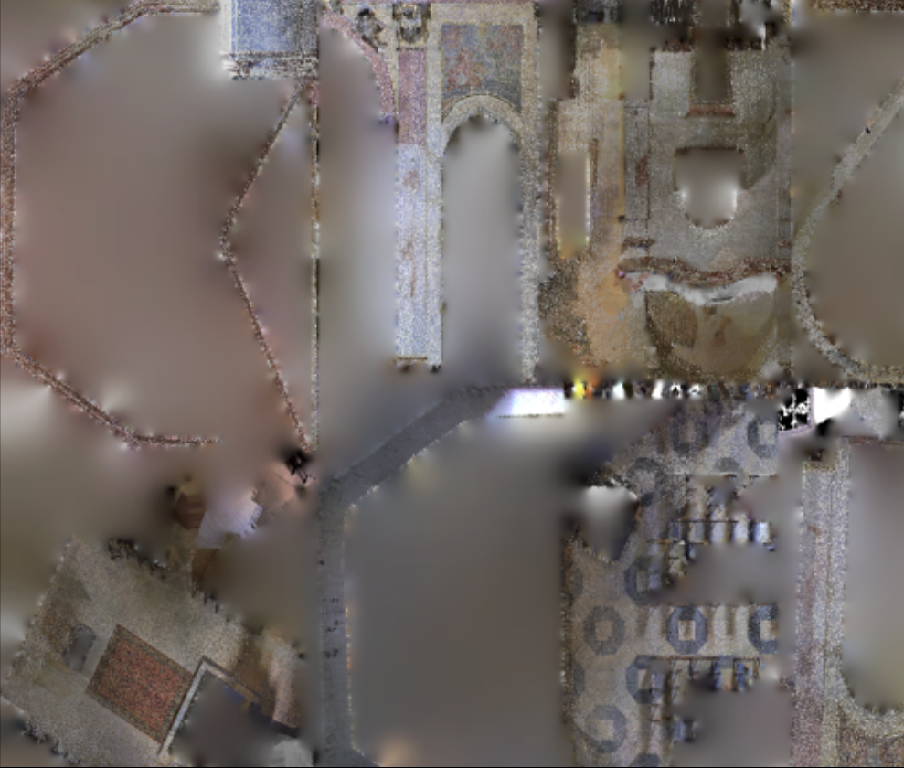
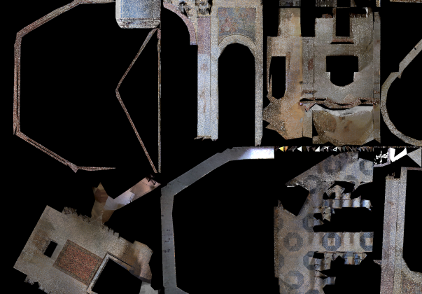

## Leica Cyclone Register 360
* Please press the question mark symbol **(?)** for detailed manual. You can find it in the top program bar
* Nice [video](https://www.youtube.com/watch?v=AV0LPKowOXU&t=1s) guide

### Import
1. [Leica Cyclone Field 360](https://leica-geosystems.com/products/laser-scanners/software/leica-cyclone/leica-cyclone-field-360)
    - Allows to match scans on the field while scanning. Saves a lot of time.
    - Recommend to use Ipad instead of any Android device. Response and transfer time was much better for an Ipad device. Works even for several high quality scans.
    - Matched scans can be transferred to the Cyclone Register 360 directly from the device.
2. Using PC
    - If scanned with sufficient density, the **Auto Cloud** option can be checekd upon importing, which will automatically bind the scans together.

### Review and Optimize
* The precision of scan matching can be improved by editing the points used for cloud-to-cloud matching. These points can be removed from matching proces but still can be used for visualisation later on. Explained [here](https://youtu.be/AV0LPKowOXU?t=1574). Really useful if you have buildings and trees together (static and dynamic structures).
* If having scans between outdorr/indorr environment, it is better to merge outdoor and indoor separately. Then merge them together. Meanwhile, cut off the visual points that are throught the windows/mirrors because they will just probably make some ghosts.
* **There is a new surface tool to cut off some anomalies, as humans, ghosts etc from final merge. Try it out**
* There should be usually only **one bundle**. However, during the automatic bing process, there might be separate bundles created.
* Select two scans and click **Visual Alignment** if not satisfied with the automatic binding process. Scans can be aligned in xy-axes and z-axis separately.
* If you change the view into **Bundle Cloud** mode, you can create **Limit Boxes**. These can be later on exported separately for more precise detail analysis.

### Export
* **PTX** format is most suitable, because it containt normals for all vertices. It is really useful for further mesh creation. However, meshlab cannot import the single *.ptx* file, hence it is important to check the **separate files** button.
* **PTS** is useful for sharing the pointclouds with no intenetion to do a mesh

## Meshlab
### General tips
* Use the **Linux AppImage** from [Meshlab official website](https://www.meshlab.net/#download)
* Better live rendering
    1. Tools -> Options
    2. Scroll down to maxGPUMemDedicatedTechnology
    3. Set it according to our GPU memory, e.g. for 4000 MB RAM, use slightly lower to 3500 MB
    4. After restart open some large model. On left down panel, there is information about FPS and rendering mode:
        - **BO_RENDERING** (Buffer Object Rendering) - everything is running on the GPU, fast
        - **IMMEDIATE_MODE_RENDERING** - only CPU, much slower
* **DO NOT FORGET TO SAVE REGULARLY YOUR WORK! MESHLAB LIKES TO CRASH**
* Run the Meshlab from the commandline to be able to watch the events.

#### Useful links
* [Recommended YouTube Meshlab tutorials](https://www.youtube.com/channel/UC70CKZQPj_ZAJ0Osrm6TyTg)
* [Another PDF Meshlab tutorial](http://www.heritagedoc.pt/doc/Meshlab_Tutorial_iitd.pdf)
* [Basic texturing guide](https://github.com/gsilano/CrazyS/wiki/Working-With-Meshes-in-Gazebo)

### Basic issue fix

### Import and merge
* For every **PTX** file a windows appears. Check **LEICA: flip normal direction**. Otherwise, do not change and click **OK** to import.
* At the end, merge all imported layers into one. Click on the one of the layer with **right mouse button -> Flatten Visible Layers**. Check **Keep unreferenced vertices** and click **Apply**.
* Use the tool **Select Faces/Vertices inside polyline area** to clean the pointcloud.
    - Make sure to have active layer(blue color) you want to clean!
* **IMPORTANT**: Adjust the PointCloud coordinate system. It is useful to do ASAP at the beginning of the process.
    - Show the coordinate system with the *Draw XYZ axes in world coordinates* icon
    - Click the *Manipulators tool* icon
    - Follow the instruction to adjust the position of the pointcloud
    - If you are stasified with the adjustement, firstly **save the Meshlab project**. It keeps the transformation from the original position in the readable XML format simple savefile.
    - Run *Matrix: Freeze Current Matrix* function to apply the transformation on current file.
    - Save the final *.ply* file

### Cleaning
* I did not find any that useful filters to clean the pointcloud in the Meshlab. I recommend to perform filtering in [CloudCompare](https://www.danielgm.net/cc/).
* CloudCompare gives two options:
    1. **[Noise filter](http://www.cloudcompare.org/doc/wiki/index.php?title=Noise_filter)**
    2. **[SOR Filter](https://www.cloudcompare.org/doc/wiki/index.php?title=SOR_filter)** - recommend to use. Try to adjust the values according to the particular example.
* Export the file in the binary **.PLY** format for further use in Meshlab.

### Simplification
* If you would like to use only the pointcloud, you can keep it as large as it is, but usually it is more practical to decrease the amount of vertices.
    - **Poisson-disk Sampling** - You can define exact number of samples or explicit radius(distance) between samples. I would recommend to use the *world unit* explicit radius. Generally, Meshlab does not scale everything to meters, but if you used pointcloud from Leica scanning, you can assume metric units. Hence set about 0.01 *world unit* should be about a vertex per 1cm. Reasonable value is around 0.02-0.05. Personally, I would go for 0.0.2/0.03 to make the whole process faster for large models. Make sure to check **Base Mesh Subsampling**
    - **Point Cloud Simplification** - Define number of samples or world unit you would like to have and click **Apply**. It uses some "heuristic" to keep the most of points. Usually, set the number of samples lower than you want. It will always give you more.
        - If you use the world size, it will have similar result as the *Poisson-disk Sampling* method
* I have not studied the difference between both methods, but the **Poisson-disk Sampling** is used more.

### Mesh computing
* Mesh computing requires a huge amount of RAM! It is recommended to have at least 32 GB RAM with some backup swap. If you can provide 64 GB RAM, even better!
* The input pointcloud has to be simplified to be able to mesh it. The ideal number of vertices is 6-10 milions.
* The general rule: Better to create a huge model and simplify it than create a small model right away.
    - **Surface Reconstruction: Screened Poission** - this methos is useful for most cases. It usually works well for closed environemnts as buildings. Various parameters are possible to set. I have found useful to increase the **Reconstruction Depth**. The "optimal" number is between 12-16. The higher the number, the more detailed is the model The RAM demand increases higher than linear. Similar is the *Adaptive Ocree Depth* parameter. Leave it as default or slightly increase the value. Example of the set values is in the image below.\
    
    - **Surface Reconstruction: Ball Pivoting** - single thread, slow. Creates loose pointcloud with bunch of holes.
    - **Surface Reconstruction: VGC** - single thread, slow. Suitable for smaller "open" models as electrical tower. It crashes a lot(Segmentation fault). Check **Vertex Splatting** box before executing. 
* The mesh processing can take a long time, check the commandline for further details.
* Simplify the model with **Simplification: Quadric Edge Collapse Decimation** functionality.
    - I recommend to use the checkboxes as shown in the image. Most of those preserve the original shape and the planarity as well. Other parameters in the image are just an example. The higher the default mesh, the longer the processing time. At the beginning, it could be around 30 minutes for 1GB mesh. Meshlab show the percentage done for this method.
    - Save the model into *.ply** and check the file size. Recommend *.ply* file size in between **10-150MB**, depending on the application. For texture processing, the lower the better. The texture will cover inperfections. For model with no texture, the quality is visible more. If you would like to use the model in the simulation, assume **1.5x** times larger final exported file, so shrink the file accordingly. If exported with texture later on, the size will be about **2.5x** times bigger. These numbers depends on the amount of saved information in the *.ply* file.\
    

### Texture
**A good quality texture can significantly visualy improve the low mesh model**
1. **Simple (primitive) texture - FAST AND EASY**
    * Go to **'Filters → Sampling → Vertex Attribute Transfer'**. Make sure the 'Transfer Color' option is checked and press 'Apply' to transfer the colour of the points onto the mesh.
    * Go to **'Filters → Texture → Parametrization: Trivial Per-Triangle'**. Set **Inter-Triangle border** to 5 for smoother transition between triangles. The higher the number, the bigger the texture will be. Press **'Apply'** to generate the faces from which the mesh texture will be created. If you receive an error about the inter-triangle border being too much, try increasing the **Texture dimension**.
    * Go to **'Filters → Texture → Vertex Color to Texture'**. Specify the texture file name and resolution for the mesh. The resolution should give the **Texture dimension** parameter from the previous step, e.g. **Texture width * Texture height = Texture Dimension**. Then press 'Apply' to create it.
2. **Good quality texture - SLOW BUT NICE**
    - Recommend to use low quality *.ply* file about 10MB ~ 250k faces. If double the amount of faces (500k) the Blender process time will be really long.
    1. **[Blender](https://www.blender.org/)**
        - Import the *.ply* mesh file
        - Change default **Object mode** to **Edit mode**
        - Select all data with *a* key
        - Open UV Mapping menu with *u* key
        - Select **Smart UV Project**
        - Keep the default values and press *OK*.
        - Do something else. It takes a long time to process. Average an hour, depending on the model size. (250k faces ~ 1 hour 15 minutes, 500k faces ~ 3 hours)
        - When finished, split the screen and change the **Editor Type** to **UV Editor**. It shows the texture parametrization.
        - Exprot the file as *.ply*
    2. **Meshlab**
        - Import the Blender processed *.ply* file 
        - Run **Convert PerVertex UV to PerWedge UV** to convert Blender parametrization into Meshlab convention
        - Import the original *.ply* pointcloud with coloured vertices.
            - note: I have tried to use the high resolution mesh to transfer the color, but it has lower number of points giving worse texture quality
        - *Recommend step*: Hide the both models if running on PC with low graphic memory before further steps. Usually crash the Meshlab if not.
        - Open **Transfer: Vertex Attributes to Texture (1 or 2 meshes)** tool
            - Set the **Source Mesh** as the high quality pointcloud file
            - Set the **Target Mesh** as the parametrized texture file
            - Name the **Texture file** with *.png* extension and no path in the name.
            - Define the texture dimension in preferably multiplications of 2.
                - The higher the texture dimension, the better will be the final result. However, the larger will be the final file. Recommend to start with *8192x8192* res - *50MB* file. Even try the *32768x32768* res - *1GB* file. The difference will be visible. Depends on the application. The quality depends on the input pointcloud as well. The more detailed, the better.
                - Aftewards, it is possible to convert the texture to *.jpg* as shown below
                - *65536x65536* gives 2GB *.png* texture and takes ~ 3 hours
                - *32768x32768* gives 1GB *.png* texture and takes ~ 1 hour
            - The **Max Dist Search** parameter does not change the quality of the mesh. Keep it default.
            - Check **Assing Texture** checkbox.
            - Uncheck **Fill Texture** checkbox. If you leave it checked, the final size of the texture file will be slightly higher due to filling of the empty texture file space with color.
               | 
            - Click **Apply**
            - The process takes usually a lot of time. The cmd line will show some **QImage::pixel: coordinate (number,number) out of range** messages. It means it cannot fit the point from the pointcloud into the desired texture. However, this is not a problem. The texture from Blender is not predefined for specific dimension, hence arbitrary resolution will result in this message.
        - Save the final *.ply* file
    3. **Texture simplification**
        - Current texture is quite large and not that practicaly useful. Gazebo has its own [limitation](https://answers.gazebosim.org//question/1331/solved-jpeg-file-make-gazebo-die/) to load a large textures.
        - I recommend to convert it to *.jpg* with the [convert](https://linux.die.net/man/1/convert) tool: *convert input.png -quality 20 output.jpg*. The 20% quality is sufficient. The imagemagick tool might have some RAM/disk limitations set in default config */etc/ImageMagick-version/policy.xml*. Check it if you have errors.
        - For Gazebo use, you have to resize the image with *convert input -resample 16384x16384 output*. Otherwise, you will be unable to load the texture.
        - Do not forget to "resave" the *.ply* file with the converted texture in Meshlab.
            - Press *Export Mesh* icon
            - You should see your previous *.png* texture on the right side of the popup window.
            - Click *Rename Texture* then *Search Texture* and choose the *.jpg* one.
            - Save the *.ply* file.

3. EXPERIMENTAL - [Capturing Reality](https://www.capturingreality.com/)
    - A professional software to create models from photos, laser scans, drone photos, etc.
    - Offers [PPI licensing](https://www.capturingreality.com/Products) which allows to create the model and pay only for the result.
    - Only works with Windows and require NVIDIA card with [CUDA 3.0+](https://support.capturingreality.com/hc/en-us/articles/115001524071-OS-and-hardware-requirements)
    - Current issues:
        - To import **.ply** file, it has to contain [specific property](https://support.capturingreality.com/hc/en-us/community/posts/360009516459-Is-it-possible-to-import-unregistered-PLY-format-point-clouds-) which we cannot guarantee from Meshlab export.
        - The **.e57** format has some error while importing.
        - It seems only **.ptx** format will work as import.
        - I would recommend to watch first [YouTube](https://www.youtube.com/watch?v=y3aNUBckwnE&list=PL56jeA0rCS3LWuahdfIFWp1d0WDuEKVqe&index=28) series about the process. It seems it takes a lot of effort to do it. It cannot import final mesh, the whole process must be done inside.
        - It would require a powerful PC to do it right.
        - Im not sure about the final size, but it should be compressable.
        - 
4. EXPERIMENTAL - Leica Cyclone 3DR
    - Provides quite a bad quality mesh with a lot of imperfections. Meshlab does much better Mesh
    - Texture is bad as well.
    - Procesing is fast but not good quality. 
    - It can do a nice texture from photos, but I did not have a time to look at it more deeply.
    - We would have to buy it!

5. Other possibilities of texture
    - Photogrametry software [link](https://all3dp.com/1/best-photogrammetry-software/). Some of them offers texture from images.
    - Meshroom - seems nice but have not tested yet. Requires CUDA, but might work without CUDA [link](https://github.com/alicevision/meshroom/wiki/Draft-Meshing)
    - 
        

### Extra - Web format *.glb*
* [Original guide](https://mrs.felk.cvut.cz/gitlab/bednaj14/meshlab/blob/master/modely_report.pdf)
* The convert tool needs to have max *16384x16384* texture. Otherwise it will not work.

### Export
* **DAE** is the most suitable format for Gazebo.
* While exporting, you can choose to export following parameters:
    - Vert
        - **Color** - **UNCLICK ALWAYS** because color is not shown from vertices but from the texture
        - **Normals** - required always
        - **TexCoord** - **UNCLICK ALWAYS** because we used the Wedge TexCoord
    - Wedge
        - **TexCoord** - only for meshes with texture, this will increase the **DAE** filesize of about 2x times
* The *.dae* is exportable on 32 GB RAM system only for ~700 MB *.ply* files

## Blender
* Great tutorial how to do the [camera movements](https://www.youtube.com/watch?v=a7qyW1G350g&t=111s&ab_channel=Polyfjord)
* Always use the *.dae* model - fast loading and proper texture rendering
* I used Eeevee rendering mode, the fastest and sufficient with default settings
