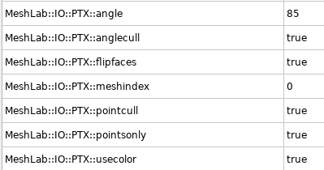
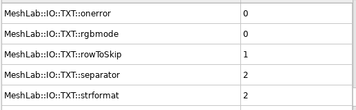
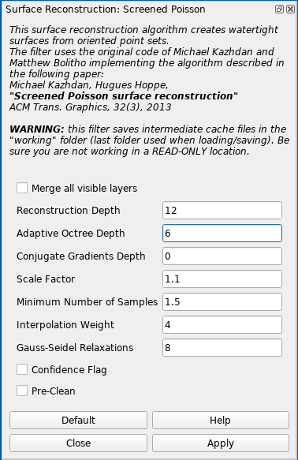

# Meshlab
## General tips
* Use the **Linux AppImage** from [Meshlab official website](https://www.meshlab.net/#download).
* Better live rendering
    1. `Tools -> Options`
    2. Scroll down to maxGPUMemDedicatedTechnology
    3. Set it according to our GPU memory, e.g., for 4000 MB RAM, use slightly lower to 3500 MB
    4. After restart open some large model. On left down panel, there is information about FPS and rendering mode:
        - **BO_RENDERING** (Buffer Object Rendering): everything is running on the GPU, fast
        - **IMMEDIATE_MODE_RENDERING**: only CPU, much slower
* **DO NOT FORGET TO SAVE REGULARLY YOUR WORK! MESHLAB LIKES TO CRASH**
* Run the Meshlab from the commandline to be able to watch the events.

### Useful links
* [Recommended YouTube Meshlab tutorials](https://www.youtube.com/channel/UC70CKZQPj_ZAJ0Osrm6TyTg)
* [Another PDF Meshlab tutorial](http://www.heritagedoc.pt/doc/Meshlab_Tutorial_iitd.pdf)
* [Basic texturing guide](https://github.com/gsilano/CrazyS/wiki/Working-With-Meshes-in-Gazebo)

## Import and merge
1. **PTX**
    - Newest version of Meshlab has a new setting in the `Settings->Tools` for each file format. Please set it as shown in the image\
   
    - At the end, merge all imported layers into one. Click on the one of the layer with `Right mouse button -> Flatten Visible Layers`. Check **Keep unreferenced vertices** and click **Apply**.
    - Use the tool **Select Faces/Vertices inside polyline area** to clean the pointcloud.
    - Make sure to have the layer you want to clean active (in blue color)!
* **IMPORTANT**: Adjust the PointCloud coordinate system. It is useful to do ASAP at the beginning of the process.
    - Show the coordinate system with the *Draw XYZ axes in world coordinates* icon
    - Click the *Manipulators tool* icon
    - Follow the instruction to adjust the position of the pointcloud
    - If you are stasified with the adjustement, firstly **save the Meshlab project**. It keeps the transformation from the original position in the readable XML format simple savefile.
    - Run *Matrix: Freeze Current Matrix* function to apply the transformation on current file.
    - Save the final *.ply* file

2. **PTS**
    - Newest version of Meshlab (2021.05) has a new setting in the **Settings->Tools** for each file format. Please set it as shown in the image\
   
    - Imported *.pts* file has to be renamed to *.txt*.
    - *Point format* as *X Y Z Reflectance R G B*
    - *Separator* as *SPACE*
    - Click *OK*

## Cleaning: not useful 
* I did not find any that useful filters to clean the pointcloud in the Meshlab. I recommend to perform filtering in [CloudCompare](https://ctu-mrs.github.io/docs/software/3d_model_processing/cloudcompare).
* CloudCompare gives two options:
    1. **[Noise filter](http://www.cloudcompare.org/doc/wiki/index.php?title=Noise_filter)**
    2. **[SOR Filter](https://www.cloudcompare.org/doc/wiki/index.php?title=SOR_filter)**: recommend to use. Try to adjust the values according to the particular example.
* Export the file in the binary **.PLY** format for further use in Meshlab.

## Simplification
* If you would like to use only the pointcloud, you can keep it as large as it is, but usually it is more practical to decrease the amount of vertices.
    - **Poisson-disk Sampling**: You can define exact number of samples or explicit radius (distance) between samples. I would recommend to use the *world unit* explicit radius. Generally, Meshlab does not scale everything to meters, but if you used pointcloud from Leica scanning, you can assume metric units. Hence set about 0.01 *world unit* should be about one vertex per 1 cm. Reasonable value is around 0.02--0.05. Personally, I would go for 0.02/0.03 to make the whole process faster for large models. Make sure to check **Base Mesh Subsampling**.
    - **Point Cloud Simplification**: Define number of samples or world units you would like to have and click **Apply**. It uses some "heuristic" to keep the most of points. Usually, set the number of samples lower than you want. It will always give you more.
        - If you use the world size, it will have similar result as the *Poisson-disk Sampling* method.
* I have not studied the difference between both methods, but the **Poisson-disk Sampling** is used more.

## Mesh computing
* Mesh computing requires a huge amount of RAM! It is recommended to have at least 32 GB RAM with some backup swap. If you can provide 64 GB RAM, even better!
* The input pointcloud has to be simplified to be able to mesh it. The ideal number of vertices is 6--10 milions.
* The general rule: Better to create a huge model and simplify it than create a small model right away.
* **AMD processors are much faster on Ubuntu to create the mesh**: It takes much longer time for Intel to do the same task.
    - **Surface Reconstruction: Screened Poission**: this methos is useful for most cases. It usually works well for closed environemnts as buildings. Various parameters are possible to set. I have found useful to increase the **Reconstruction Depth**. The "optimal" number is between 12--16. The higher the number, the more detailed is the model. The RAM demands increases faster than linear. Similar is the *Adaptive Ocree Depth* parameter. Leave it as default or slightly increase the value. Example of the set values is in the image below.\
    
    - **Surface Reconstruction: Ball Pivoting**: Single thread, slow. Creates loose pointcloud with bunch of holes.
    - **Surface Reconstruction: VGC**: Single thread, slow. Suitable for smaller "open" models as electrical tower. It crashes a lot (Segmentation fault). Check **Vertex Splatting** box before executing. 
* The mesh processing can take a long time, check the commandline for further details.
* Simplify the model with **Simplification: Quadric Edge Collapse Decimation** functionality.
    - I recommend to use the checkboxes as shown in the image. Most of those preserve the original shape and the planarity as well. Other parameters in the image are just an example. The higher the default mesh, the longer the processing time. At the beginning, it could be around 30 minutes for 1GB mesh. Meshlab show the percentage done for this method.
    - Save the model into *.ply** and check the file size. Recommend *.ply* file size in between **10--150MB**, depending on the application. For texture processing, the lower the better. The texture will cover inperfections. For model with no texture, the quality is visible more. If you would like to use the model in the simulation, assume **1.5x** times larger final exported file, so shrink the file accordingly. If exported with texture later on, the size will be about **2.5x** times bigger. These numbers depends on the amount of saved information in the *.ply* file.\
    
