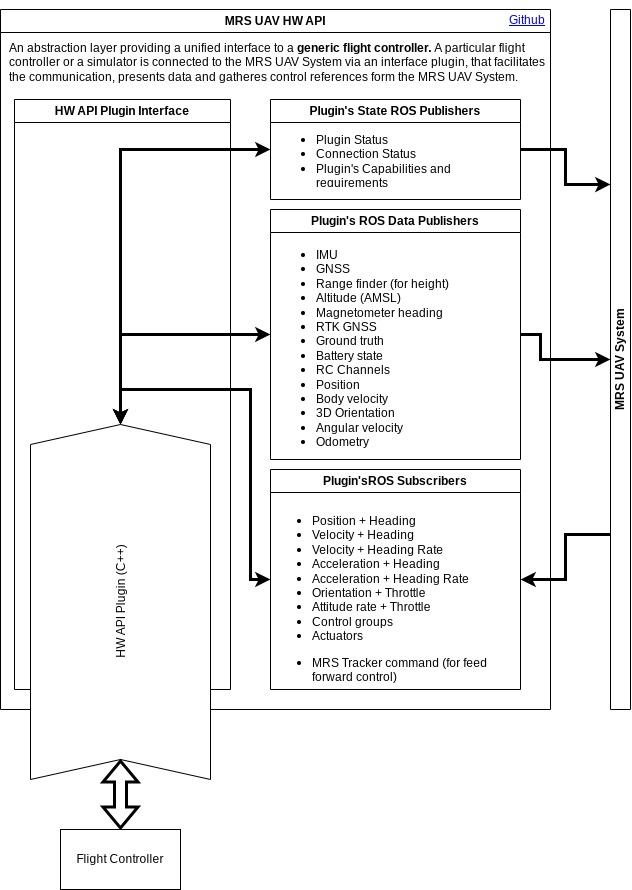

# MRS UAV HW API ([Docs](https://ctu-mrs.github.io/mrs_uav_hw_api/))

An abstraction layer between the [MRS UAV System](https://github.com/ctu-mrs/mrs_uav_system) and a UAV flight controller.

> :warning: **Attention please: This README is needs work.**
>
> The MRS UAV System 1.5 is being released and this page needs updating. Please, keep in mind that the information on this page might not be valid.

## What does it do?

This nodes provides an interface between any UAV flight controller (and any Simulator) and the [core](https://github.com/ctu-mrs/mrs_uav_core) of the MRS UAV System.
On one side, the HW API provides a unified ROS interfaces for the [core](https://github.com/ctu-mrs/mrs_uav_core) as if it was a **generic flight controller**.
On the other side, the communication with a particular hardware (or simulator) can be orchestrated using whatever is required.

## Documentation

[https://ctu-mrs.github.io/mrs_uav_hw_api/](https://ctu-mrs.github.io/mrs_uav_hw_api/)

### Control output from the MRS UAV System

The control output can be any of the following:

* 3D **Position** + **Heading**
* 3D body-frame **Velocity** + **Heading**
* 3D body-frame **Velocity** + **Heading rate**
* 3D body-frame **Acceleration** + **Heading**
* 3D body-frame **Acceleration** + **Heading rate**
* 3D world-frame **Attitude** + **Throttle**
* body-frame **Attitude rate** + **Throttle**
* **Control groups**
* individual **Actuators'** throttle

### Data provided to the MRS UAV System

TODO

## Example HW API Plugins

* [PX4 Plugin](https://github.com/ctu-mrs/mrs_uav_px4_api)
* [CoppeliaSim Plugin](https://github.com/ctu-mrs/mrs_uav_coppelia_simulation)
* [MRS Simulator Plugin](https://github.com/ctu-mrs/mrs_multirotor_simulator)
* [DJI Tello](https://github.com/ctu-mrs/mrs_uav_dji_tello_api)
