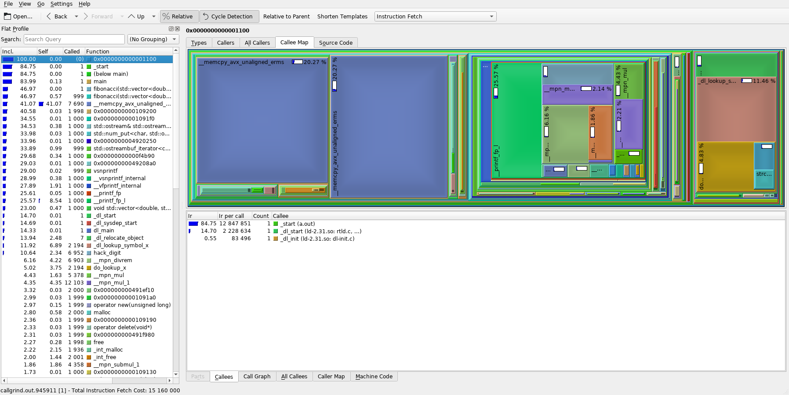
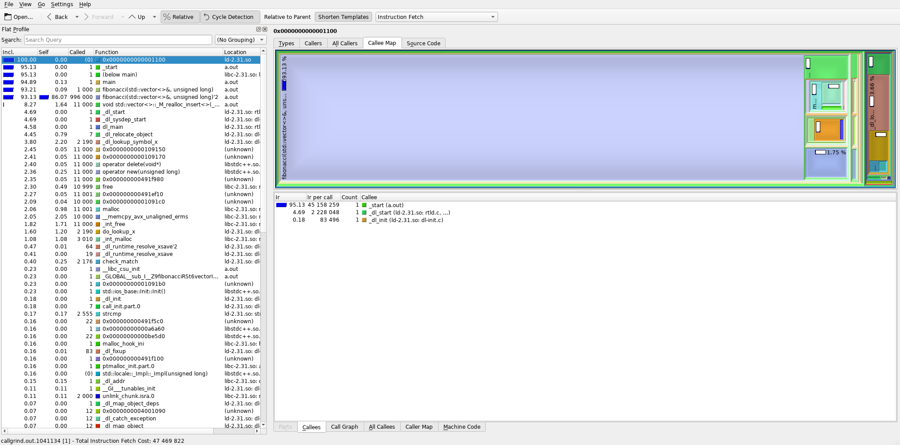

# Profiling methods for C++

This article presents several common methods for profiling your C++ algorithms.
In case you're currently asking yourself "what the hell is profiling?", it is a process of finding which parts of your code are slow or inefficient and ideally also of possible ways to optimize it.
We will use the following (**truly terrible!**) implementation of the Fibonacci sequence for demostration purposes:

``` C++
#include <iostream>
#include <vector>

std::vector<double> fibonacci(std::vector<double> seq, size_t N)
{
  if (seq.size() < 2)
    seq.push_back(seq.size());
  else
    seq.push_back(seq.at(seq.size()-1) + seq.at(seq.size()-2));

  if (seq.size() < N)
    return fibonacci(seq, N);
  else
    return seq;
}

int main()
{
  const size_t N_elems = 1000;

  // calculate the first 1000 elements of the Fibonacci sequence
  const auto sequence = fibonacci({}, N_elems);

  // print out the result
  for (const auto& num : sequence)
    std::cout << num << std::endl;

  return 0;
}
```

*Note:* The above implementation is bad from a performance point of view because the `std::vector` in the `fibonacci()` function is copied and re-initialized over and over, which is extremely inefficient.
The fix would be for example to pass it by `const` reference instead of by value.

## Profiling by measuring time in code

The most straightforward way to measure performance of your code is one that you may already have used.
Simply compare the current time before and after running the piece of code you want to measure.
To improve accuracy of the measurement, it's a good idea to run the code repeatedly if that's applicable to your situation.
Running the code multiple times and taking the average helps filter out sporadic influences such as preemption by other programs.
You should also make sure to ensure that the load on your PC during testing is minimal or consistent with the assumed conditions during deployment.

If we wanted to measure how long it takes our implementation to calculate the first 1000 members of the Fibonacci sequence, we could modify our piece of code using this method to look something like this:

*Note:* You should use a steady clock (e.g. `ros::SteadyTime` or `std::chrono::steady_clock` in pure C++) to ensure there are no hiccups in the clock due to time synchronization, daylight saving time, etc., which could cause errorneous measurements.

``` C++
#include <iostream>
#include <vector>
#include <chrono>

using namespace std::chrono;

std::vector<double> fibonacci(std::vector<double> seq, size_t N)
{
  if (seq.size() < 2)
    seq.push_back(seq.size());
  else
    seq.push_back(seq.at(seq.size()-1) + seq.at(seq.size()-2));

  if (seq.size() < N)
    return fibonacci(seq, N);
  else
    return seq;
}

int main()
{
  const size_t N_test = 1000;
  const size_t N_elems = 1000;

  // save the time before running the algorithm
  const auto start_t = steady_clock::now();
  for (size_t it = 0; it < N_test; it++)
    const auto sequence = fibonacci({}, N_elems);

  // save the time after running the algorithm N_test-times
  const auto end_t = steady_clock::now();

  // calculate the average duration of running the algorithm once
  const auto avg_us = duration_cast<microseconds>((end_t - start_t) / N_test);

  std::cout << "Average time: " << avg_us.count() << "us" << std::endl;

  return 0;
}
```

You can save this code to `fibonacci.cpp` and compile and run it with `g++ fibonacci.cpp && ./a.out`.
On my PC with a Ryzen 9 3900X CPU the resulting timing is something between 1770us and 1870us, which is quite a wide spread (we can get a more consistent measurement by increasing `N_test`).
You could also measure just a single iteration, which is used e.g. to check if everything's OK when your algorithm is running during an experiment.

However, **we have made one important mistake** -- we have not enabled the compile-time optimization!
Before manually optimizing your code, make sure that the machine has done its part (see also [Premature optimization](#premature-optimization)).
Let's fix this by changing the compilation command to `g++ fibonacci.cpp -O3 && ./a.out`.
Now, I get an average run duration of 1500-1560 -- for free!
If you're working with a ROS package, optimizations should be automatically enabled for the `RELEASE` and `REL_WITH_DEB_INFO` catkin profiles with the MRS setup, or you can enforce them by adding the following line to your `CMakeLists.txt` file:

``` CMake
add_compile_options("-O3")
```

Check out also the [`mrs_lib::ScopeTimer`](https://ctu-mrs.github.io/mrs_lib/classmrs__lib_1_1ScopeTimer.html).
You can just initialize  a `mrs_lib::ScopeTimer` object at the start of a function implementing and specify checkpoints after parts of the code you want to measure.
The duration from object initialization until the checkpoints and the object's destruction will be automatically measured and printed to console.
Our code could then look something like this:

``` C++
#include <iostream>
#include <vector>
#include <mrs_lib/scope_timer.h>

std::vector<double> fibonacci(std::vector<double> seq, size_t N)
{
  if (seq.size() < 2)
    seq.push_back(seq.size());
  else
    seq.push_back(seq.at(seq.size()-1) + seq.at(seq.size()-2));

  if (seq.size() < N)
    return fibonacci(seq, N);
  else
    return seq;
}

int main()
{
  mrs_lib::ScopeTimer tim("fibonacci");
  const size_t N_elems = 1000;

  // calculate the first 1000 elements of the Fibonacci sequence
  const auto sequence = fibonacci({}, N_elems);
  tim.checkpoint("seq_calc");

  // print out the result
  for (const auto& num : sequence)
    std::cout << num << std::endl;

  return 0;
}
```

### Pros:

1. Simple, quick to understand and implement.
2. Although not absolutely reliable, it's a way to estimate how long your piece of code will take to execute with a specific PC setup.
3. Can be easily used to compare performance of different algorithms.
4. Can be easily used to estimate the function of run duration over datasize (e.g. by measuring for increasing `N_elems` in the above code) -- useful for confirming hypotheses about asymptotic complexity etc.
5. Useful for online diagnostics of runtime problems e.g. during experiments.
It's useful to have add the [`mrs_lib::ScopeTimer`](https://ctu-mrs.github.io/mrs_lib/classmrs__lib_1_1ScopeTimer.html) to time-critical parts of your code so that you can diagnose when your code takes atypically long to execute e.g. due to singularities in input data etc.

### Cons:

1. The average run duration over multiple runs of the same piece of code is typically not the same as a one-shot duration of the same piece of code due to how modern CPUs work (see e.g. [branch prediction](https://en.wikipedia.org/wiki/Branch_predictor)).
The one-shot duration will mostly be longer.
2. The actual duration can depend on the data provided to the algorithm.
It may not always be trivial to generate a sufficient number of samples of valid data to thoroughly test the algorithm (e.g. unbiased generation of valid rotation matrices).
3. Non-trivial to integrate with more complex programs without heavily modifying the code potentially resulting in code bloat.
4. Unsuitable for deep debugging of existing programs -- "Why is my mapping/planning/detection/whatever algorithm so slow?"
5. How to debug multi-threaded programs?


## Profiling with concurrency

If your program is slow even though your algorithms seem to all execute quickly, there may some synchronization problem waiting to be discovered.
Maybe your super-efficient algorithm is simply waiting for data from another part of the system too long?
Or maybe it's waiting for another part of your program to release a lock on some resource.
It can also be the case that some problem only arises from time to time - for example sometimes one thread finishes faster than another which causes a deadlock.

For debugging similar problems, it's useful to see a timeline of when certain parts of the code are executing during runtime when such problems arise.
Enter the [`mrs_lib::Profiler`](https://ctu-mrs.github.io/mrs_lib/classmrs__lib_1_1Profiler.html).
This class works by publishing information about when a code section starts and ends to a ROS topic.
The ROS messages can be saved to a rosbag and then visualized using the [visualization tool](TODO @Tomáš) to get the timeline.

TODO: @Tomáš - finish documentation of the `mrs_lib::Profiler`, add an example and possibly also finish this section :D
Currently, I'm not sure how to use its API and how to visualize the results.

### Pros:

1. A suitable method to debug concurrency problems.
2. A suitable method to debug sporadic "hiccups" of periodically executed code.
3. Also provides similar diagnostics as the previous method.

### Cons:

1. Can't provide diagnostics during actual runtime e.g. in experiments.
Data has to be processed offline, post-mortem.
2. Non-trivial to integrate with more complex programs without heavily modifying the code potentially resulting in code bloat.
3. Unsuitable for deep debugging of existing programs -- "Why is my mapping/planning/detection/whatever algorithm so slow?"


## Profiling using random sampling

The most sophisticated profiling method we'll tackle in this article relies on random sampling.
It works by randomly interrupting your program and logging the current call stack of the program to a file.
Parts of the code that take more time are more probable to be running when the program is interrupted and therefore will be more represented in the logged call stacks.

You can manually simulate this method by running your program in GDB (see the page [Debugging with GDB](https://ctu-mrs.github.io/docs/software/gdb.html)), randomly interrupting it with `Ctrl+C`, printing out the call stack using the `backtrace` (`bt`) command, and saving it down -- repeating this many times.
Then you can check how are the various functions represented in the call stacks and statistically determine what percentage of the total run duration which functions take.

This method has the great advantage that you see not only which piece of code is running the most, but also from where it gets called the most (since the program saves the whole callstack) and vice versa -- you can see which functions called by a function of interest take the most of its run duration.
In other words -- **this method tells you directly on which functions to focus** to optimize your code and which have a negligible influence on the run duration (see also [Premature optimization](#premature-optimization)).

For our toy program, we can use Valgrind's [Callgrind tool](https://valgrind.org/docs/manual/cl-manual.html) to perform the random sampling simply by calling

```
g++ fibonacci.cpp -O3 && valgrind --tool=callgrind --callgrind-out-file=callgrind.out ./a.out
```

which will compile the `fibonacci.cpp` program with optimizations and then run the program in Callgrind, outputting the data to `callgrind.out`.
Notice that the program will run significantly slower than if you simply run it without Callgrind.

*Note:* All these tools can be installed in Ubuntu by running `sudo apt install valgrind kcachegrind`.

*Note:* To run the tool with a ROS launchfile, add the command as a `launch-prefix` parameter of the `node` tag (i.e. `<node ... launch-prefix="valgrind --tool=callgrind" >`). The output file will by default be created in the `~/.ros` folder. An example of the `node` tag with Callgrind enabled:

Now, the data can be visualized using another tool - [KCachegrind](https://kcachegrind.github.io/html/Home.html).
Simply call

```
kcachegrind callgrind.out
```

and you should see something similar to the image below.



*Note:* If you want to be able to see the code in the `Source code` tab, you need to compile the program with the debugging symbols enabled using the `-g` compile option.
Debugging symbols should be automatically enabled for the `DEBUG` and `REL_WITH_DEB_INFO` catkin profiles or can be enforced in the `CMakeLists.txt` file analogically to the `-O3` flag as discussed above.

The left column lists the program's functions ordered by default from the one that was most represented in the call stacks at the top to the least represented one at the bottom.
The numbers on the left (and the blue bars) represent the call percentage of each function.
The right part shows a graph of functions called by the currently selected function (in the left column) with each the size of the corresponding rectangle representing the call percentage relative to the selected function (parent).

With this knowledge, we can already see from the image, that almost half of the program's run duration is taken up by memory copying (the large blue rectangles `__memcpy_avx_unaligned_erms`)!
As discussed in the Note in the intro section, this is expected because our toy program is terribly written, but for a more complex program, this may not be as obvious.

Furthermore, by looking at the left column, we can see that our `fibonacci()` function interestingly only takes less than half of the total calls.
By selecting the `main()` function in the left column and playing around a bit, we can find out that `fibonacci()` takes up 55% of the `main()`'s execution and the rest is taken up by the `std::ostream` implementation that does the printing of our sequence to the console.
And `main()` itself only takes up around 84% of the total execution -- the rest is some service code for setting up heap and stack, actually starting our program, etc., which is more pronounced because our actual program's execution is actually relatively short.

In any case, just with these two commands, we've been able to identify the main culprit slowing our program down and now we can finally fix it!
Let's use a slightly different definition for `fibonacci()` and try to measure it's performance again:

``` C++
#include <iostream>
#include <vector>
#include <chrono>

using namespace std::chrono;

void fibonacci(std::vector<double>& seq, size_t N)
{
  if (seq.size() < 2)
    seq.push_back(seq.size());
  else
    seq.push_back(seq.at(seq.size()-1) + seq.at(seq.size()-2));

  if (seq.size() < N)
    fibonacci(seq, N);
}

int main()
{
  const size_t N_test = 1000;
  const size_t N_elems = 1000;

  // save the time before running the algorithm
  const auto start_t = steady_clock::now();
  for (size_t it = 0; it < N_test; it++)
  {
    std::vector<double> sequence;
    fibonacci(sequence, N_elems);
  }

  // save the time after running the algorithm N_test-times
  const auto end_t = steady_clock::now();

  // calculate the average duration of running the algorithm once
  const auto avg_us = duration_cast<microseconds>((end_t - start_t) / N_test);

  std::cout << "Average time: " << avg_us.count() << "us" << std::endl;

  return 0;
}
```

With the new implementation, I got a timing from 4us to 8us, so around 200x improvement over the original implementation!
As you can see, in comparison with the other methods, random sampling provided us with much more insight into where we can actually improve the program without having to guess (and thus avoiding [Premature optimization](#premature-optimization)).

### Pros:

1. Provides the deepest insight into the program's performance and which parts have the best potential for optimization.

### Cons:

1. The most complicated tool to use.
The data and visualization is noisy with a lot of unimportant information and requires a good understanding of C++ to comprehend.
2. Significantly slows your program down which may make it unusable in some cases when timing can be crucial for the program's functioning.
3. Cannot be used for online diagnostics.
4. Doesn't actually measure the run duration of the functions, just the ratio (percentage) relative to the total run duration.

## Premature optimization

**Avoid premature optimization!**
But what even is premature optimization?
It's optimizing before you measure.
In other words, it's optimizing while you're writing code without even knowing how the code behaves.

Let's take our toy program as an example.
You may be tempted to further optimize the code e.g. by not using the `at()` method and instead using the `operator[]` method for element access because you know that `at()` checks out-of-bounds access while `operator[]` doesn't.
But in this case, we check that the container has a `size() >= 2`, so the out-of-bounds check is a waste of cycles, right!?
Let's optimize it away to gain more of those those sweet cycles for our actually useful code!

That'd be premature optimization.
If we use the profiler again to check the above code (see image below), we find out that almost 94% of all cycles are now taken up by the `fibonacci()` function (which is good! Those are the useful cycles.) and about 8% of all cycles are taken up by `std::vector<>::_M_realloc_insert<>()` -- that is the reallocation of the `sequence` container (these two numbers add up to >100% because part of the reallocation takes place inside `fibonacci()`).
The `at()` method is not even present in the logged call stacks, because it takes up so little calls that the random sampler didn't even once interrupt the program while it was running!



Instead, we could focus on optimizing the `fibonacci()` function itself (i.e. remove recursion and use a sequential algoritm instead) -- or use `sequence.reserve(N_elems)` before calling the `fibonacci()` function to reduce the number of reallocations.
The `at()` method is actually a good coding practice because if someone were to take our code as is and modify it to remove the check for the containers size before the element access for some reason, the `at()` would help catch this bug, potetially saving you significantly more time than you'd spend prematurely optimizing it or even debugging a sporadic segfault caused by an out-of-bounds access.

Overall, if your program is slow, remember to measure first, optimize later.

*Note:* Using common good coding practices such as passing objects by `const` reference is **not** premature optimization and will save you a lot of time with debugging, profiling, and optimizing, and can even save you from premature optimization by making the program efficient by default.
