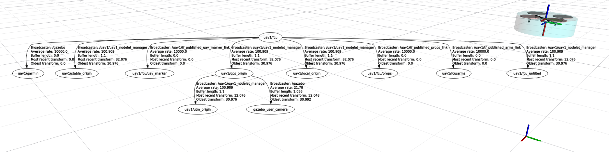
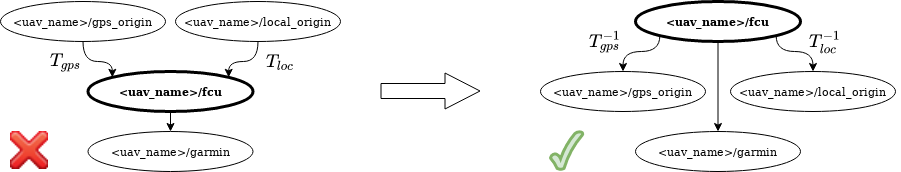

# Frames of Reference



As described in the [Transformations](transformations.md) manual, the MRS control system enables to send commands to a UAV in all coordinate frames for which a transformation to the control frame exists.
The coordinate frames that are used within MRS system are listed below. 

The graphical illustration of relations among particular frames can be displayed with rqt utility `tf_tree` by executing command:
```bash
rosrun rqt_tf_tree rqt_tf_tree
```
or using the main RQT application:
```bash
rqt
```

## Multi-frame Localization Problem

Coordinate systems for mobile robots follow hierarchical convention (check coordinate frames convention [REP-105](https://www.ros.org/reps/rep-0105.html) used with ROS):
```bash
world -> map -> odometry -> fcu -> sensors
```
The [transformations](https://ctu-mrs.github.io/docs/system/transformations.html) (`->`) among coordination frames are maintained by [tf2 ROS library](http://wiki.ros.org/tf2).
The `tf2` library requires the mutual transformations to be stored in a **tree structure**, where each node has a single *parent* and there exists only a single **root** node with no *parent*.

But, maintaining the **tree structure** is impossible for multiple *world*/*map*/*odometry* coordinate frames.

The MRS system solves this by having the `<uav_name>/fcu` coordinate frame as the **root** node.
A *frame* following the hierarchical order `<uav_name>/fcu -> frame` is kept untouched.
However, a *frame* following the order `frame -> <uav_name>/fcu` is stored as a *children* of `<uav_name>/fcu` by inverting the order and the transformation.



## Multi-UAV TF Tree
`TFConnectorDummy` node within the `mrs_uav_odometry` package connects TF trees of multiple UAVs by connecting them through a new **root** node.
How to use: see [example launch file](https://github.com/ctu-mrs/mrs_uav_odometry/blob/master/launch/tf_connector.launch) and [example config file](https://github.com/ctu-mrs/mrs_uav_odometry/blob/master/config/tf_connector.yaml).
Remark that the `TFConnectorDummy` node can connect only trees containing a common (equal) frame --- e.g., coordination frame of GPS `<uav_name>/gps_origin`.

## Elementary frames

The most important frames, that are used in MRS system and are automatically created for each UAV, are:

* **\<uav_name\>/fcu**
  * Flight Controller Unit coordinate frame, a.k.a., the **body frame** of the UAV
  * z-axis is parallel to the thrust force produced by the propellers
* **\<uav_name\>/fcu_untilted**
  * coordinate frame with coincident center and orientation with the `<uav_name>/fcu` frame, but xy-plane parallel to xy-plane of of the world.
  * enables commanding UAV in the `<uav_name>/fcu` frame without being affected by the UAV tilt
* **\<uav_name\>/local_origin**
  * coordinate frame with center and orientation cooincident with the starting point and orientation of the UAV 
* **\<uav_name\>/stable_origin**
  * coordinate frame used for stable odometry, which does not jump when a state estimator is switched
* **\<uav_name\>/gps_origin**
  * coordinate frame representing the GPS frame
  * enables commanding multiple UAVs in a common coordinate frame
* **\<uav_name\>/rtk_origin**
  * coordinate frame representing the RTK-GPS frame
  * enables commanding multiple UAVs in a common coordinate frame

where the `<uav_name>` is the unique name of a UAV.

## Sensor frames

In addition to elementary frames, that are automatically created for each UAV, coordinate frames of sensors are created according to configuration of particular UAVs specified in a spawn command.
The sensor frames includes

* **\<uav_name\>/garmin**
* **\<uav_name\>/rplidar**
* **\<uav_name\>/os1_sensor**
* **\<uav_name\>/bluefox_optflow**
* ...

## Additional frames

Last group of frames used in MRS system is formed by coordinate frames created by addditional sotware (e.g., systems for localization).
This group incorporates 

* **\<uav_name\>/aloam_origin**
* **\<uav_name\>/hector_origin**
* ...
