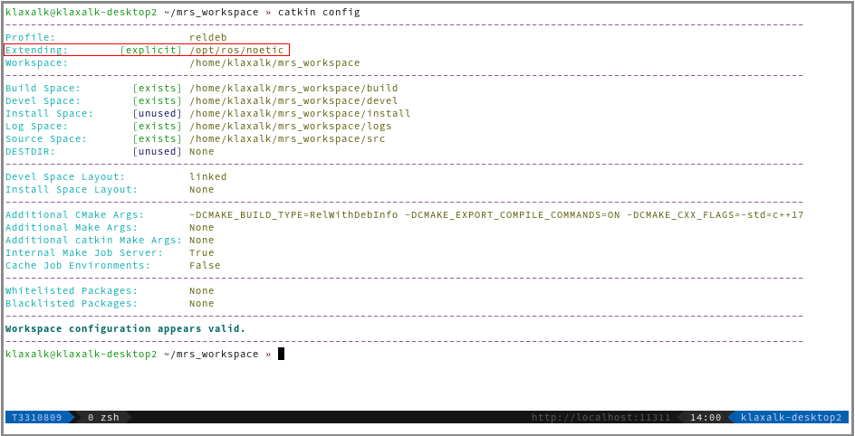

# Managing ROS Workspaces

This guide is an important and mandatory reading for all MRS members.
Please, make a coffee and take your time to carefully study it, because it will make your (and Tomas's) life easier and it will help you avoid some compilation difficulties.

## TL;DR & Tips

* Do not place your software in the `mrs_workspace`, `modules_workspace` or other workspaces that contain MRS software.
* Learn to configure the workspaces by hand, learn to [setup](https://ctu-mrs.github.io/docs/system/managing_ros_workspaces.html#the-tools-to-manage-a-workspace) and [verify](https://ctu-mrs.github.io/docs/system/managing_ros_workspaces.html#the-tools-to-manage-a-workspace) dependencies between the workspaces.
* Do not `source` more than one workspace in your `~/.bashrc` or `~/.zshrc`, only [source the bottom-most workspace](https://ctu-mrs.github.io/docs/system/managing_ros_workspaces.html#sourcing-the-workspace).
* Be mindful about the [workspace hierarchy](https://ctu-mrs.github.io/docs/system/managing_ros_workspaces.html#recommended-workspace-hierarchy). It will allow you to work more efficiently.
* It is possible to maintain multiple copies of a workspace, each with a different build type or particular version of the software.
* Link packages from `~/git` to your workspaces, instead of directly cloning them into the `src` folder.
* Do not modify `mrs_workspace` and `modules_workspace` on a real drone. Place your packages in a custom workspace.

## What is a ROS Workspace?

ROS workspace (_workspace_ from now on) is a dedicated build space for ROS packages.
A workspace is supposed to cluster together related packages, for which it manages a set of build profiles, each with a custom set of CMAKE arguments.

### Workspace structure

Each maintained ROS workspace should have two following top-level structure:

```
workspace
├── build
├── devel
├── logs
└── src
```

where the **build**, **devel** and **logs** folder are generated by a build system, and the **src** contains the user's packages.

## The tools to manage a workspace?

**Beware!** Common folk on the internet will guide you towards using the _catkin_make_ command.
Don't listen to everything you hear on the internet.
We use the [**catkin_tools**](https://catkin-tools.readthedocs.io/en/latest/) package that extends the function of the original _catkin_make_.

### Creating a workspace

1. create a directory for the workspace
```bash
mkdir -p ~/my_workspace/src
```
2. move to the root of the workspace
```bash
cd ~/my_workspace
```
3. call ```catkin_tools```'s init command
```bash
catkin init
```

### Building a workspace

1. put at least one ROS package somewhere into `~/my_workspace/src`
2. call ```catkin_tools```'s build command
```bash
catkin build
```

### Building a particular package

1. if you are in a subdirectory of the package, do
```bash
catkin build --this
```
or using our alias
```bash
catkin bt
```
2. you can invoke build using the package name form anywhere form the workspace
```bash
catkin build <package_name>
```

### Cleaning the workspace

Cleaning can be performed in two ways:

1. manually, by deleting the generated folder
```bash
cd ~/my_workspace
rm -rf build devel logs
```
2. automatically using the `catkin`'s clean command
```bash
cd ~/my_workspace
catkin clean
```

### Sourcing the workspace

Specify to `catkin` which workspace shall be loaded by sourcing the bottom-most workspace in the hierarchy in your `~/.bashrc`:
```bash
source $HOME/my_workspace/devel/setup.bash
```
or in `~/.zshrc`:
```bash
source $HOME/my_workspace/devel/setup.zsh
```
**BEWARE!** Unless you are 100% sure that your workspaces are correctly set and do not contain identical packages, do not source more than one workspace in your `.bashrc` or `.zshrc`.
Source only the bottom-most workspace, extending hierarchy will handle the rest.

## Recommended workspace hierarchy

Workspaces can be linked together such that dependencies between the workspaces can be satisfied.
Linking of workspaces is an integral mechanism for separating logical packages into groups.
We can recommend creating the following workspaces and populating them with the following packages.


Workspaces that contain MRS software should not contain any user software.

### ~/mrs_workspace

Should extend ROS:
```bash
catkin config --extend /opt/ros/noetic
```
Should contain:

* [uav_core](http://github.com/ctu-mrs/uav_core)
* [simulation](http://github.com/ctu-mrs/simulation)

### ~/modules_workspace (optional)

Should extend `~/mrs_workspace`:
```bash
catkin config --extend ~/mrs_workspace/devel
```
Should contain:

* [uav_modules](http://github.com/ctu-mrs/uav_modules)

### ~/octomap_workspace (optional)

Should extend `~/modules_workspace`:
```bash
catkin config --extend ~/modules_workspace/devel
```
Should contain:

* [octomap_mapping_planning](http://github.com/ctu-mrs/octomap_mapping_planning)

### ~/custom_workspace (optional)

A custom workspace can extend whichever from the existing workspaces based on its dependencies.
It is recommended to follow the [recommended workspace hierarchy](https://ctu-mrs.github.io/docs/system/managing_ros_workspaces.html#recommended-workspace-hierarchy) when setting up a custom workspace.

It should extend the bottom-most workspace in the hierarchy, e.g., the `modules_workspace`:
```bash
catkin config --extend ~/modules_workspace/devel
```
Put your packages to `~/my_workspace/src`, [build](https://ctu-mrs.github.io/docs/system/managing_ros_workspaces.html#building-a-workspace) the workspace and you are set.

## Workspaces on a real UAV

The MRS workspaces on a real UAV are typically shared.
Therefore, the `mrs_workspace` and `modules_workspace` should not be customized or modified for each particular experiment.
On the other hand, a UAV user may expect that theese workspaces are _vanilla_ and can be therefore updated to the current version.
When a user prepares for an experiment, he should place his packages into his own dedicated workspace (e.g., `john_workspace`).

## Build profiles

Workspace can maintain a set of pre-configured build profiles.
A build profile provides custom compilation flags to all packages.
This is typically used to specify the workspace-wide optimization level.

### MRS Build profiles

We create three build profiles that correspond to CMake build profiles:

| name       |         | description                                     | optimization |
|------------|---------|-------------------------------------------------|--------------|
| debug      |         | corresponds to cmake's `Debug` profile          | -O0 -g       |
| **reldeb** | default | corresponds to cmake's `RelWithDebInfo` profile | -O2 -g       |
| release    |         | corresponds to cmake's `Release` profile        | -O3          |

The profiles are automatically pre-configured while using our shell alias for [`catkin init`](https://github.com/ctu-mrs/uav_core/blob/master/miscellaneous/shell_additions/shell_additions.sh).
The profiles can be switched by calling `catkin profile set <profile name>`.
After the profile is switched, the whole workspace needs to be [cleaned](https://ctu-mrs.github.io/docs/system/managing_ros_workspaces.html#cleaning-the-workspace) and [recompiled](https://ctu-mrs.github.io/docs/system/managing_ros_workspaces.html#building-a-workspace).
See [GCC optimization](https://wiki.gentoo.org/wiki/GCC_optimization#-O) for info about the optimization flags.

## Package blacklisting

A package can be exluded from the build by:

1. creating the `CATKIN_IGNORE` file in the package root, or
2. by blacklisting it in a workspace using `catkin config --blacklist <package_name>`.

## Verifying the state of a workspace

Use the command `catkin config` to obtain the current configuration for your workspace.
The output for the **mrs_workpace** should contain the following:

Notice the _explicit_ extending of `/opt/ros/noetic`, which should be found only in **mrs_workspace** (since this is the top-level workspace of the MRS UAV system).

The output for the **modules_workspace** should be similar to the following:

