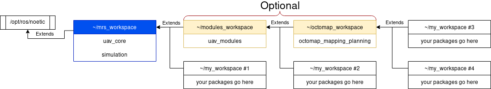
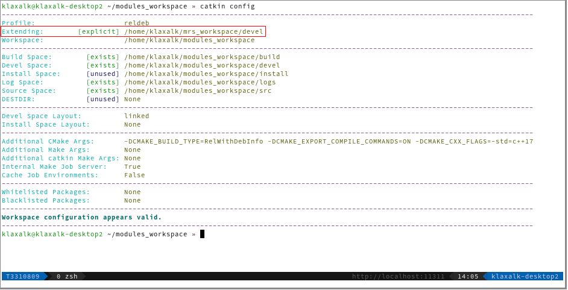

# Managing ROS Workspaces

This guide is an important and mandatory reading for all MRS members.
Please, make a coffee and take your time to carefully study it, because it will make your (and Tomas's) life easier and it will help you avoid some compilation difficulties.

## TL;RD & Tips

* Do not place your software in the `mrs_workspace`, `modules_workspace` or other workspaces that contain MRS software.
* Learn to configure the workspaces by hand, learn to setup and verify dependencies between the workspaces.
* Do not `source` more than one workspace in your `.bashrc` or `.zshrc`, only source the bottom-most workspace.
* Be mindful about the workspace hierarchy. It will allow you to work more efficiently.
* It is possible to maintain multiple coppies of a workspace, each with a different build type or particular version of the software.

## What is a ROS Workspace?

ROS workspace (_workspace_ from now on) is a dedicated build space for ROS packages.
A workspace is supposed to cluster together related packages, for which it manages a set of build profiles, each with a custom set of CMAKE arguments.

### Workspace structure

Each maintained ROS workspace should have two following top-level structure:

```
workspace
├── build
├── devel
├── logs
└── src
```

where the **build**, **devel** and **logs** folder are generated by a build system, and the **src** contains the user'[s](s) packages.

## The tools to manage a workspace?

**Beware!** I common folk on the internet will guide you towards using the _catkin_make_ command.
Don't listen to everything you hear on the internet.
We use the **catkin tools** package ([link](https://catkin-tools.readthedocs.io/en/latest/)), that extends the function of the original _catkin_make_.

## Basic workspace operations

### Creating a workspace

1. create a directory for the workspace
```bash
mkdir -p ~/my_workspace/src
```
2. move to the root of the workspace
```bash
cd ~/my_workspace
```
3. call ```catkin tools```'s init command
```bash
catkin init
```

### Building a workspace

1. put at least one ROS package somewhere into `~/my_workspace/src`
2. call ```catkin tools```'s build command
```bash
catkin build
```

### Building a particular package

1. if you are in a subdirectory of the package, do
```bash
catkin build --this
```
or using our alias
```bash
catkin bt
```
2. you can invoke build using the package name form anywhere form the workspace
```bash
catkin build <my_package_name>
```

### Cleaning the workspace

Cleaning can be performed in two ways

1. manually, bu deleting the generates folder
```bash
cd ~/my_workspace
rm -rf build devel logs
```
2. automatically using the `catkin`'s clean command
```bash
cd ~/my_workspace
catkin clean
```

## Advanced workspace operations

### Extending another workspace

Workspaces can be linked togher such that dependencies between the workspaces can be satisfied.
Linking of workspaces is an integral mechanism for separating logical package into groups.

## Recommended workspace hierarchy

We can recommend creating the following workspaces and popullating them with the following packages.

Workspaces that contain MRS software should not contain any user software.

### ~/mrs_workspace

Should extend ROS:
```bash
catkin config --extend /opt/ros/noetic
```
Should contain:

* [uav_core](http://github.com/ctu-mrs/uav_core)
* [simulation](http://github.com/ctu-mrs/simulation)

### ~/modules_workspace

* should extend mrs_workspace:
```bash
catkin config --extend ~/mrs_workspace/devel
```

### ~/octomap_workspace

* should extend modules_workspace:
```bash
catkin config --extend ~/modules_workspace/devel
```

### a user_workspace

* can extend wichever from the existing workspaces based on its dependencies

## Build profiles

Workspace can maintain a set of pre-configured build profiles.
A build profile provides custom compilation flags to all packages.
This is typically used to specify the workspace-wide optimization level.

### MRS Build profiles

We create three build profiles that correspond to CMake build profiles:

| name       |         | description                                   | optimization |
|------------|---------|-----------------------------------------------|--------------|
| debug      |         | corresponds to cmake's Debug profile          | -O0 -g       |
| **reldeb** | default | corresponds to cmake's RelWithDebInfo profile | -O2 -g       |
| release    |         | corresponds to cmake's Release profile        | -O2          |

The profiles are automatically pre-configurer while using our shell alias for `catkin init` ([link](https://github.com/ctu-mrs/uav_core/blob/master/miscellaneous/shell_additions/shell_additions.sh)).
The profiles can be switched by calling `catkin profile set <profile name>`.
After the profile is switched, the whole workspace needs to be cleand and recompiled.

## Package blacklisting

A package can be exluded from the build by:

1) creating the `.CATKIN_IGNORE` file in the package root, or
2) by blacklisting it in a workspace using `catkin config --blacklist`.

## Verifying the state of a workspace

Use the command `catkin config` to obtain the current configuration for your workspace.
The output for the **mrs_workpace** should contain the following:

Notice the _explicit_ extending of `/opt/ros/noetic`, which should be find only in this workspace (since this is the top-level workspace).

The output for the **modules_workspace** should be similar to the following:

