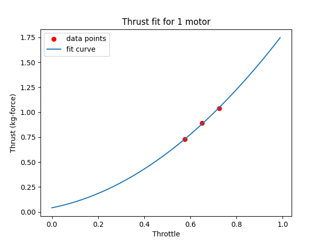

# Motor thrust model

The MRS UAV System requires a model which can estimate the relation between a throttle input and thrust force produced by the rotors.
e.g. we need a model which tells us that when we use 0.6 (60%) throttle, we will get 3.0 kg-force of thrust. (kg-force will be used in this article, as it is easier to imagine and work with than Newtons.  $$ 1 kgForce = 9.81N $$)

The model is just a qudratic curve, which gives us an approximate relationship between input throttle and produced thrust. To obtain the parameters of the quadratic curve,
we need to measure the thrust of the rotors at different throttle values, and then a fit a curve to these measurements.
The thrust-curve parameters are a part of a platform config for a specific UAV.


## Getting the model parameters
There are several ways of measuring the relationship between throttle and thrust. Your goal is to get at least three different measurements of the throttle-thrust relationship. If you have a reliable test data from the manufacturer of the motor and propeller, you can use these (Note that some manufacturers often exaggerate the performance of their motors). If you have a thrust test stand, you can produce the test data yourself. If you have neither of these, you can simply fly your UAV manually with different payload masses attached, and observe the throttle value needed to hover. Note that the model is very simple, it does not take battery voltage and other factors into account, it only provides a rough approximation, which is all we need for the system.

## Example - UAV with different payloads

We take our UAV with no additional payload, measure its mass and fly it manually. While it is hovering high enough above ground (to avoid ground effect), we read out its current throttle value. This can be done either through QGroundControl mavlink inspector, through Mavros or by checking the flight log on the SD card after the flight. Note that throttle is often called "thrust" in the mavlink messages, it is a value between 0 and 1. We then proceed to attach some payload to the UAV, measure the total UAV mass and fly it again. We then compile our test data into a yaml file, which looks like this:

```bash
# num_motors - How many motors were used in this test?
num_motors: 4

# mass (kg) of the UAV, or thrust (kg-force) produced by the motor on the test stand
mass: [
2.909,
3.570,
4.155,
]

# throttle needed to hover - value between 0 and 1, 0=0%, 1=100%
throttle: [
0.577,
0.65,
0.725,
]
```

This file can be then passed to a python script in the [mrs_uav_deployment](https://github.com/ctu-mrs/mrs_uav_deployment/tree/master/miscellaneous/motor_model) repository like this:

```bash
python3 thrust_curve.py example_uav.yaml

```

The script will fit a curve to your data, plot it and display the estimated thrust values at 50% and 100% throttle:
```
Thrust of a single motor at 50% throttle: 0.59 kg-force
Thrust of a single motor at 100% throttle: 1.78 kg-force

Thrust of a drone with 4 motors at 50% throttle: 2.36 kg-force
Thrust of a drone with 4 motors at 100% throttle: 7.11 kg-force
```
If the values looks appropriate, you can proceed. If not, check that your input data is valid. There are some example yaml files in the script folder for inspiration.


The script will produce file named output.yaml, which looks like this:

```bash
motor_params:
  a: 0.282796
  b: -0.180959
  n_motors: 4
```
The a and b are the parameters of the quadratic curve. The approximation is valid for 1 motor, so you need to specify the number of motors that your UAV actually uses. These values should be copied into the platform config for your UAV.

## The model - deeper explanation and uses

The System uses a very simple but reliable model, which relies on the relationship between thrust and angular velocity of the propeller, where the thrust is proportional to the angular velocity squared.
We therefore model the relationship between throttle and thrust as a quadratic curve.
The thrust is modelled as:

$$ T = a\sqrt{f} + b $$

Where $$ T $$ is throttle, $$ a $$ and $$ b $$ are the parameters of the quadratic curve and $$ f $$ is the produced force (thrust).
Note that we only use a quadratic and a constant term. There is no linear term, which makes the model a bit less accurate, but it greatly simplifies the inversion of the equation and avoids some other issues.


We can substitute $$ f = mg $$ and invert the equation, to get an estimate of the current UAV mass based on the used throttle:

$$ m=\frac{1}{g}\left ( \frac{T-b}{a} \right )^{2} $$

This mass estimate is used for landing detection, and can be used for other purposes, like confirmation of payload attachment/release based on change in the mass of the UAV.
