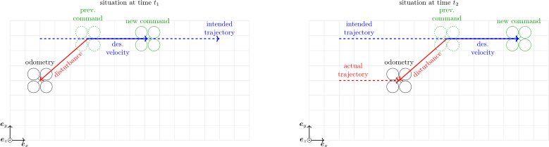

| :warning: **Attention please: This page is outdated.**                                                                                           |
| :---                                                                                                                                             |
| The MRS UAV System 1.5 is being released and this page needs updating. Plase, keep in mind that the information on this page might not be valid. |

## tl;dr:
If you're setting a setpoint reference relative to the current UAV pose, do not use the pose from the [state estimator](https://github.com/ctu-mrs/mrs_uav_odometry) to calculate the new setpoint.
Use the UAV pose from the "commanded pose" topic (currently named `control_manager/position_cmd`) to avoid drift.
Also, read the rest of this page to understand the problem!

## Problem description

Consider the following typical situation: You are attempting to make the UAV remain stationary at its current position.
Although, this is already taken care of by our [feedback controllers](https://github.com/ctu-mrs/mrs_uav_controllers), you might still want to set the control rerefence to induce hover, or alter the desired position slightly to induce movement in a desired direction.
An intuitive (yet wrong) approach is to subscribe to the UAV [odometry](https://github.com/ctu-mrs/mrs_uav_odometry) and start from the current UAV position as the desired command setpoint for the control pipeline.
However, this will most probably cause your UAV to drift, as is illustrated in the following figure.
This is due to the fact, that the UAV is in practice *never* precisely at the commanded position, even when stationary (because of various disturbances, delays, noise in the odometry, UAV dynamics etc.).

More specifically, when you command the UAV at time  to move to its current measured position , it will attempt to go there as well as it can.
However, at time , it will actually reach some other (although potentially very close) position .
Now again, you command the UAV to go to its current measured position .
You can already see, that the commanded position at  is different, than the one at .
Even though you wanted your UAV to stay put, you are actually commanding it to move!

Unfortunately, what you have effectively created is a positive feedback causing the UAV to drift in a certain direction, which is given by random disturbances in the system.
Alternatively, this can be understood as a form of an "addmitance control" --- you are allowing the UAV to stay where it is, even when a disturbance occurs.
**Note that this problem applies to all motion, which is commanded relative to the UAV position!**
The same situation emerges, e.g., when you're trying to fly straight forward and supplying the commands relative to the current UAV odometry position, as illustrated in the following figure.

## Problem solution

The solution is simple --- don't use UAV pose supplied by the [state estimator](https://github.com/ctu-mrs/mrs_uav_odometry) for calculating the relative pose setpoint.
Instead, use the control reference, a.k.a, the "commanded pose" (currently found on the `control_manager/position_cmd` topic), which is the current pose setpoint as calculated by the MRS control pipeline (corresponding to the dotted green UAV positions in the above figures).
Then, the situation from the last figure becomes more like this:

Although there might still be some offset, this offset will be negligible in practice if the controllers are tuned properly, and you will avoid the drift, which is vital.
Do not try to compensate the offset --- that is the work for the [feedback controllers](https://github.com/ctu-mrs/mrs_uav_controllers) (you could introduce different kinds of positive feedback and other badness).

## When this does not apply

If you're setting the UAV pose setpoints for the control system relative to some other objects in the environment, such as in various visual servoing or SLAM scenarios, this problem is not relevant.
Similarly, when you're commanding the UAV through a trajectory, which is defined in absolute coordinetes (such as in the GPS frame), you don't have to worry about the drift, described at this page.

There are also cases, when you're interested in the *actual* position of the UAV, and not the current commanded position (e.g. in the case of physical interaction with the environment, low-level collision avoidance etc.).
Then it is appropriate to use the odometry (measured) UAV position, and not `control_manager/position_cmd`.

*Think about what your specific situation is and what approach to use.*
Just because it works in simulation doesn't mean it's correct!
You can avoid unnecessary drift-caused crashes ruining your experiments (and potentially other people's too).
