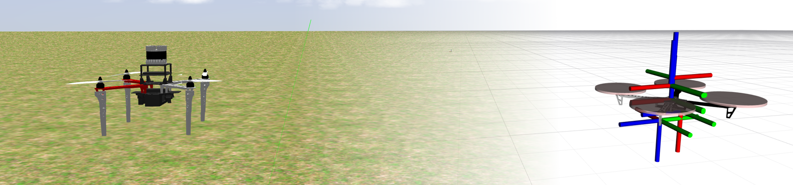

| :warning: **Attention please: This page is outdated.**                                                                                            |
| :---                                                                                                                                              |
| The MRS UAV System 1.5 is being released and this page needs updating. Please, keep in mind that the information on this page might not be valid. |

# Transformations

As a robotic system, the MRS system makes use of many coordinate [reference frames](frames_of_reference.md).
Transformations within the MRS system are maintained by the [tf2 ros package](http://wiki.ros.org/tf2) and [Transformer](https://ctu-mrs.github.io/mrs_lib/classmrs__lib_1_1Transformer.html) from the [mrs_lib package](https://ctu-mrs.github.io/mrs_lib/), which is a tf2 wrapper with several functions simplifying the work with transformations.
The transformations within the MRS system are important not only for tracking the relationship among particular coordinate frames, but they are used also to enable sending commands in various reference frames independently on current control frame.

## MRS Trackers commands with specified *frame_id*

The MRS UAV system provides [topics and services](https://ctu-mrs.github.io/docs/system/uav_ros_interface.html) to command a UAV in any coordinate frame with a known transformation to current control frame without need to transform the desired reference explicitly.
The coordinate frame in which the desired reference is provided has to be specified as a `'frame_id'` in a header of the message.
The frame_id of the coordinate frame is formed by part of the coordinate frame name without the name of UAV (e.g., `frame_id = 'fcu_untilted'` for `'<uav_name>/fcu_untilted'`).

Without specifying the *frame_id*, the frame, which is currently used for control, will be used.

If an invalid *frame_id* is given, the reference is not used.
