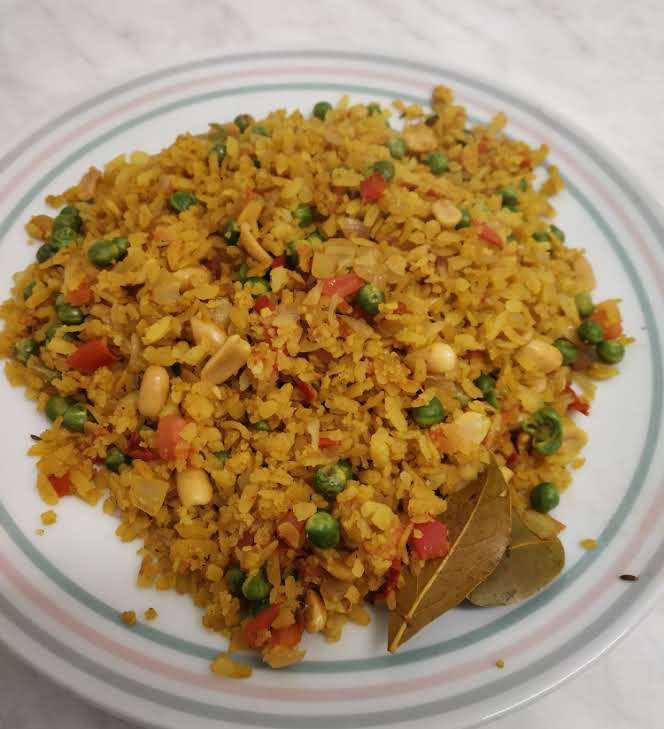
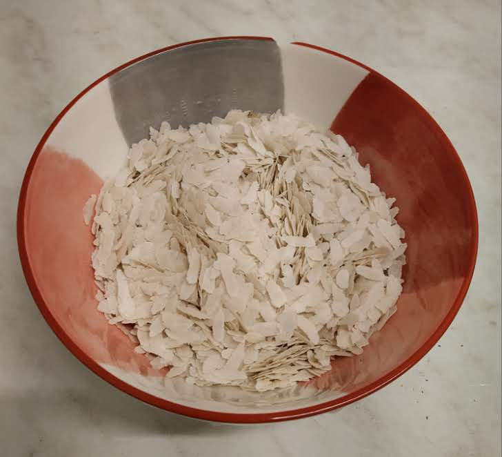
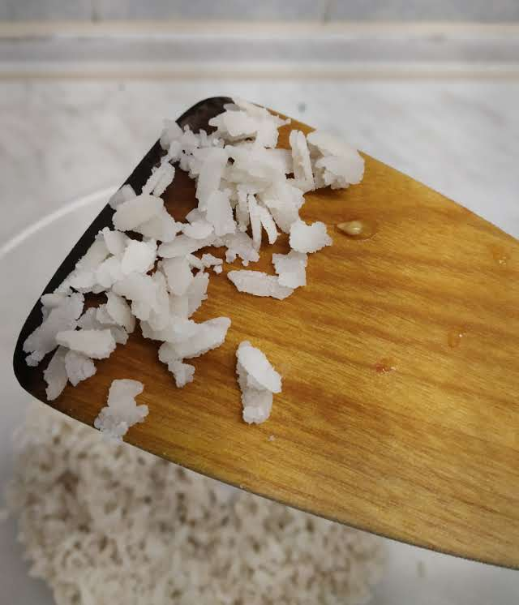
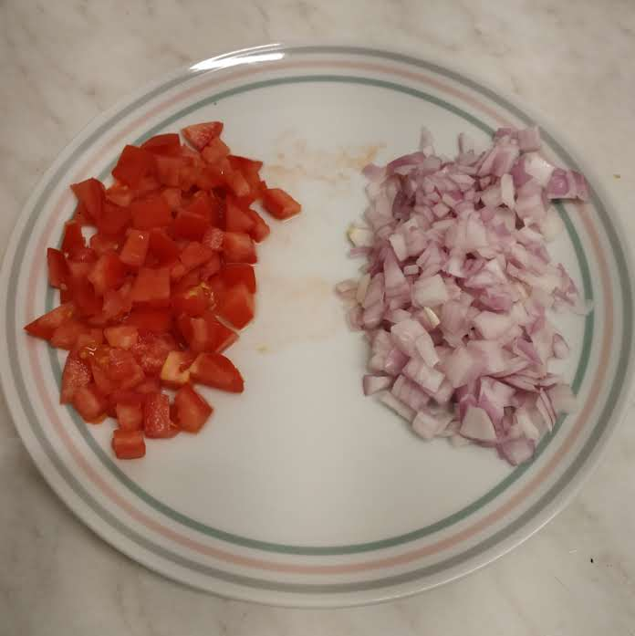
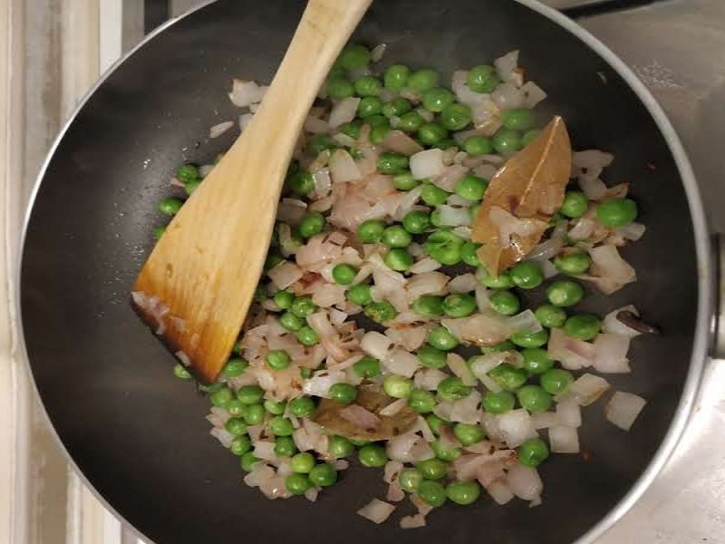
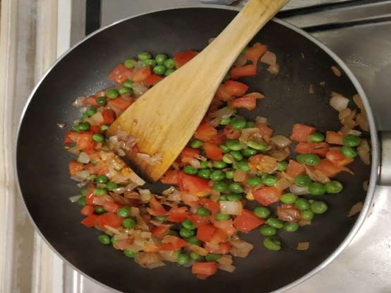
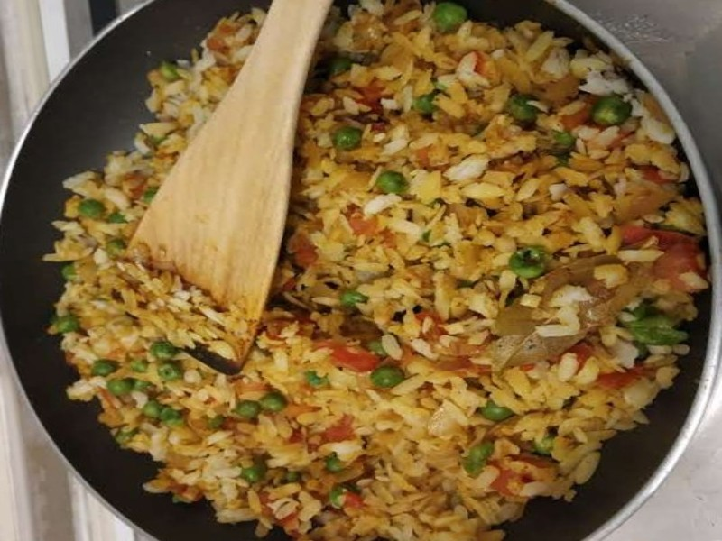
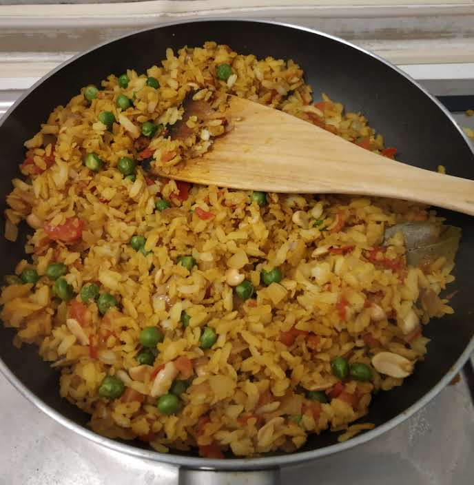

# Afzal's Poha

Poha is a famous breakfast/snack from northern India.
It is simple to make and only require very few ingredients.

## Ingredients

The quatities are for a serving for two meals for one person or just one meal if you like it as much as me.

* 200g poha or rice flakes (Rýžové vločky) 
* 1 tomato
* 1 red onion
* 50 g of frozen peas
* 20 g peanuts
* vegetable oil or butter
* 2 cloves (hřebíček)
* 1/4 teaspoon cumin (kmín)
* 1/4 turmeric powder (kurkuma)
* salt, according to taste
* pepper, according to taste
* chilli powder, according to taste
* 2-3 curry leaves (kari listy) [optional]

## Preparation

- The most critical step is to soak the rice flackes. Put the rice flakes in a large bowl like a salad bowl and pour water until all the flackes are submerged.
- Now, pour the water out, leaving the wet flackes inside the bowl. The rice flakes should not be in water for more than 3 seconds, so pou out the water instantly.
- Mix the flakes well with a spoon to avoid any lumps in the flakes and pour out any excess water.
- Leave the flakes to soak water while you prepare other ingredients.

 | 

- Dice the onion and tomato into fine pieces (~1 cm).
- Defrost the peas to room temperature.

- Put some oil/butter into a non-stick pan and set it to medium heat.
- After the oil is heated, add the cumin, cloves and curry leaves.
- Fry them for 1 minute.

- Add the diced onions and fry until they look a little golden.
- Add the peas and fry them until they are cooked.
- Keep stirring the onions and peas to avoid over cooking.

- Add diced tomatoes.
- Add salt, pepper, turmeric powder and chilli powder.

 | 

- Now, add the soaked poha and mix everything propoerly.
- Keep mixing everything slowly after every 20-30 seconds to avoid over cooking.

 | 

- Turn the heat up or down at any stage if the process seems very slow.
- When the flakes look a a little crisp, the poha is ready to serve.
- Add the peanuts as a topping and enjoy!

