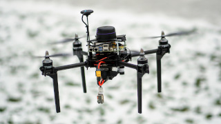

import ImageByColorMode from '../components/ImageByColorMode/ImageByColorMode.js';

<ImageByColorMode 
lightModeImage="./img/mrs_f4f_large_light.png"
darkModeImage="./img/mrs_f4f_large_dark.png"
/>

<h1>MRS UAV System Documentation</h1>

The MRS UAV System is an **open-source software framework** developed by the Multi-Robot Systems Group at Czech Technical University in Prague, designed to assist researchers in **advanced R&D in autonomous UAV systems**, from speed racing and decentralized swarming to GNSS-denied coordination of multi-UAV formations.

  

<Button label="📖 Documentation" link="/docs/introduction" /> will give you **context** and show you the **features** of our system.

Don't forget to check out our <Button label="✏️ blog" link="/blog" /> to read about our latest updates.

**Note on versioning:** Older versions of the documentation are preserved, but not maintained anymore.
