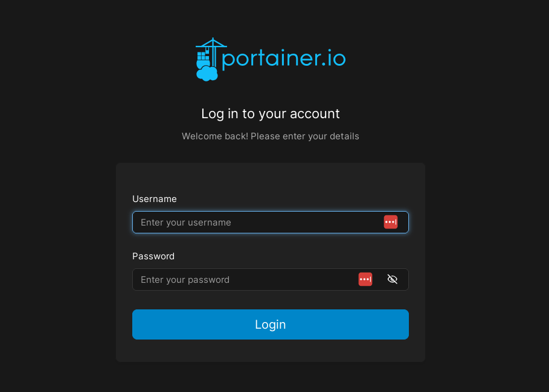

# Connecting to portainer

1. Open your web browser
2. Determine the hostname of the machine that run Portainer (e.g., `localhost`, or `uav1`)
3. Open the url [https://localhost:9443](https://localhost:9443) (substitude your hostname)

