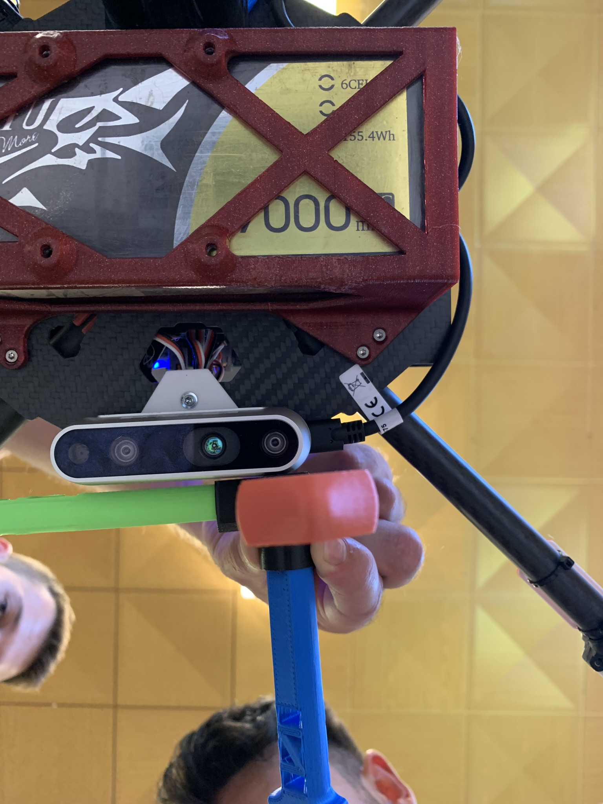

## Camera frame for Realsense D435i

This is the `link` frame of the Realsense D435i.

**Note: *This frame is only for Realsense D435i and you need to be careful to apply it on the larger Realsense D455. If you match the tripod mounting thread hole (1/4-20 UNC) on both the cameras such that they are facing the same direction, they will have the same transform.

