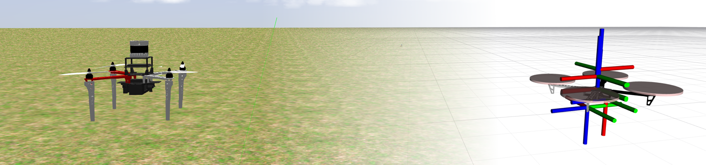

# Transformations

As a robotic system, the MRS system makes use of many coordinate [reference frames](./20-frames_of_reference.md).
Transformations within the MRS system are maintained by the [tf2 ros package](http://wiki.ros.org/tf2) and [Transformer](https://ctu-mrs.github.io/mrs_lib/classmrs__lib_1_1Transformer.html) from the [mrs_lib package](https://ctu-mrs.github.io/mrs_lib/), which is a tf2 wrapper with several functions simplifying the work with transformations.
The transformations within the MRS system are important not only for tracking the relationship among particular coordinate frames, but they are used also to enable sending commands in various reference frames independently on current control frame.

## How to supply the frame_id

The MRS UAV system provides [topics and services](uav_ros_api) to command a UAV in any coordinate frame that is part of the main TF tree.
The coordinate frame in which the desired reference is provided has to be specified in the `'frame_id'` variable of the message header.

### Using the full frame_id

The full name of the `frame_id`, e.g., `uav1/world_origin` is formed by connecting:

* the prefix: `<uav_name>/`
* with the own frame name, e.g., `world_origin`.

Such frame_id, if it exists in the TF Tree, is compatible with both the MRS system and a **third-party software** that uses the TF2 library.

### Using the short frame_id

The short name of the `frame_id`, e.g., `world_origin` does not contain the prefix part.
Short frame_id can be provided when sending data to the MRS System, which **automatically fills in the prefix based on the currently controlled UAV** before transforming the data.

### Leaving it empty

When the `frame_id` is left empty, the MRS System assumes that the data are expressed in the **frame of reference used for feedback control**, a.k.a.,

* the frame_id of the `/<uav_name/estimation_manager/uav_state`, which also is,
* the frame_id produced by the currently active estimator.
