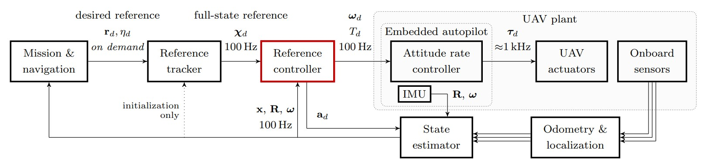

# The Controller plugin interface

The Controller plugin takes current UAV state and command from the [Reference tracker](../../50-features/20-trackers/index.md) and provides the desired control ouptuts, which are sent to the flight controller (Embedded autopilot block in diagram below) via [Hardware API](../01-hardware-api/index.md).
Diagram below shows the data architecture of the MRS system where the block containing the Controller plugin is marked in red.

The controller plugin is compiled as [ROS plugins](http://wiki.ros.org/pluginlib) with the [interface](https://github.com/ctu-mrs/mrs_uav_managers/blob/master/include/mrs_uav_managers/controller.h) defined by the [control manager](https://github.com/ctu-mrs/mrs_uav_managers).
A controller plugin from any ROS package can be loaded dynamically by the [control manager](https://github.com/ctu-mrs/mrs_uav_managers) without it being present during [control manager](https://github.com/ctu-mrs/mrs_uav_managers)'s compile time.
Loaded controllers can be switched by the [control manager](https://github.com/ctu-mrs/mrs_uav_managers) in mid-flight, which allows safe testing of new controllers and adds flexibility to the [MRS UAV system](https://github.com/ctu-mrs/mrs_uav_system).



## Controller plugin - outputs 
The controller plugin can output any of the following control outputs:

  * individual Actuators' throttle
  * Control groups
  * body-frame Attitude rate + Throttle
  * 3D world-frame Attitude + Throttle
  * 3D body-frame Acceleration + Heading rate
  * 3D body-frame Acceleration + Heading
  * 3D body-frame Velocity + Heading rate
  * 3D body-frame Velocity + Heading
  * 3D Position + Heading
  
In the controller plugin source code, you can decide what to return, but it must be available in [Hardware API](../01-hardware-api/index.md).

## Example controller plugin 

An example of a cutom controller plugin can be found at [this link](https://github.com/ctu-mrs/mrs_core_examples/tree/master/cpp/controller_plugin).
It is highly recommended to base your controller plugin on this example.
In the example, there is also a [tmux folder](https://github.com/ctu-mrs/mrs_core_examples/tree/master/cpp/controller_plugin/tmux) containing a script that starts the simulation of a UAV in the [MRS multirotor simulator](https://github.com/ctu-mrs/mrs_multirotor_simulator), where the UAV uses the [example controller plugin](https://github.com/ctu-mrs/mrs_core_examples/tree/master/cpp/controller_plugin).
You have to install [MRS UAV system](https://github.com/ctu-mrs/mrs_uav_system) first to run the example.
To load the controller plugin into the [MRS UAV system](https://github.com/ctu-mrs/mrs_uav_system), you need to provide a custom config file to the [MRS UAV Core](https://github.com/ctu-mrs/mrs_uav_core) containing the parameters for the controller plugin.
The custom config file should contain the following lines (taken from [custom config file of example controller plugin](https://github.com/ctu-mrs/mrs_core_examples/blob/master/cpp/controller_plugin/tmux/config/custom_config.yaml)):
```yaml 
mrs_uav_managers:

  control_manager:

    ExampleController:
      address: "example_controller_plugin/ExampleController"
      namespace: "example_controller"
      eland_threshold: 20.0 # [m], position error triggering eland
      failsafe_threshold: 30.0 # [m], position error triggering failsafe land
      odometry_innovation_threshold: 1.5 # [m], position odometry innovation threshold
      human_switchable: true

      # which outputs the controller can provide
      outputs:
        actuators:             false
        control_group:         false
        attitude_rate:         false
        attitude:              true
        acceleration_hdg_rate: false
        acceleration_hdg:      false
        velocity_hdg_rate:     false
        velocity_hdg:          false
        position:              false

    # list of names of dynamically loaded controllers
    controllers : [
      "ExampleController",
    ]
```

### Parameter description for controller plugin

```address: "example_controller_plugin/ExampleController``` : Specifies the address of the plugin to be loaded into the interface as a controller.  
```namespace: "example_controller"``` : Specifies the namespace of the controller as per the package description in the plugin.  
```eland_threshold: 20.0 # [m]``` :  Specifies the position error in the controller which would trigger the eland, but this doesn't attempt a failsafe landing.  
```failsafe_threshold: 30.0 # [m]``` :  Usually set to a higher value than the eland_threshold, this triggers the failsafe landing where thrust is reduced below expected hover to allow descend while maintaining level flight.  
```odometry_innovation_threshold: 1.5 # [m]``` : Odometry innovation threshold varies between controllers depending on whether they are able to supplement the state estimators such that the internal Kalman innovation of the estimators doesn't exceed a certain value and cause the vehicle to emergency land.  
```human_switchable: true``` : Specifies whether the controller can be switched by the user during flight.  
```outputs``` : Specifies outputs that the controller can provide.  

