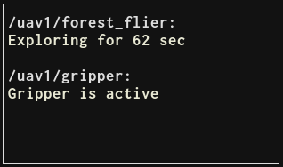

# Status terminal user interface (TUI)


## Real-time Terminal User Interface for monitoring and control

* Displays useful information about the UAV state and sensors
* Provides a basic control interface through which you can move the UAV, monitor your nodes and switch trackers, controllers, estimators gains and constraints
* Especially useful in real world UAV flights, but works as well in simulation
* Written in C++ with ncurses
* Runs on the UAV within its TMUX session
* Works through SSH on a flying UAV, or in a split-mode through nimbro-network (data is being collected on the UAV, transfered over nimbro, and the terminal interface runs on your remote computer)
* vim-like key bindings

### Why is my mrs_uav_status blue?

* By default, mrs_uav_status runs in color-blind mode, where green color is replaced with blue. This helps with visibility if you have red-green color blindness.
* You can disable the color-blind mode in the config file of mrs_uav_status

 

### Controlling the UAV through MRS UAV Status

If the MRS UAV Status window is focused, you can use it to command the UAV. This works in simulation and with a real UAV through SSH.

 * press the 'R' key to enter the "remote" mode. While in this mode, you can fly the UAV with your keyboard:
   * use 'wsad' or 'hjkl' keys to fly laterally
   * use 'qe' keys to change the UAVs heading
   * use 'rf' keys to fly up and down
   * use 'G' to switch between local and global mode, in local mode, the UAV follows the commands in its FCU frame, in global mode the commands are interpretted in the current world frame (X and Y are independed of the UAV's heading)
   * Only one key at a time is registered, multiple key inputs are not supported
   * To exit the remote mode, hit 'Esc'

 

 * Press the 'g' key (as go-to) to set references for the UAV

 

 * Press the 'm' key (as menu) to call basic MRS System services.
   * If the UAV is flying, you can call the 'land' or 'land_home' service
   * If the UAV is on the ground, you can call the 'takeoff' service
   * You can change the controller, tracker, estimator, controller gains and tracker constraints

 

### Display custom messages from your nodes

If you need to monitor some aspect or behaviour of your node, you can display messages from said node in MRS UAV Status.
Simply publish a [std_msgs/String](http://docs.ros.org/melodic/api/std_msgs/html/msg/String.html) message to the topic ```mrs_uav_status/display_string```, and the message, along with the publisher node name, will show in MRS UAV Status.

 

 * By default, only one message can be displayed from one node/nodelet manager.
 * By default, the message will be displayed for 10 seconds
 * You can use several parameters with mrs_uav_status. These parameters are placed at the begining of the string message, like this:
    * ```-id my_id -R -p the rest of my message```
 * -id my_id
    * If you want to display more messages from one node/nodelet manager, you can use the argument -id my_id
    * At the begining of you string, put "-id my_id the rest of my message"
    * Message will be displayed for each unique id
* -p
    * You can add "-p " at the beginning of your string, to make the message persistent, it will not disappear, only if it is overriden by a new message
* -r, -y,- g, -R, -Y -G
    * By default, the messages will be displayed as black/white (depending on the current colorsheme). You can use -r -y -g parameters to set the color to red/yellow/green. If you use
      capital letter as the parameter, it will make the displayed message blink

### Monitoring ROS topic rates

MRS UAV Status can monitor rates of different ROS topics, and warn the user if the topic is published less or more frequently than required, or not published at all. There are two ways how to add monitored topics:

* Static tf
  * If a defined static tf is present, MRS UAV Status will monitor a coresponding topic.
  * This is intended to automatically monitor different sensor configurations.
  * To add more monitored static tfs, modify ```config/status.yaml``` file and add to the ```tf_static_list```
  * Each list member consists of 4 entries separated by spaces:
    * Name of the static tf (```garmin```)
    * Name of the topic to be monitored (```garmin/range```)
    * Name that will be displayed (```Garmin Down```) - this name can contain additional spaces
    * Desired rate of the topic (```50```)

* Any topic
  * If you need to monitor a topic which is not bound to a static tf
  * Add your topic to the want_hz list in ```config/status.yaml```
  * Each list member consists of 3 entries separated by spaces:
    * Name of the topic to be monitored (```bluefox/camera_info```)
    * Name that will be displayed (```Bluefox Optflow```) - this name can contain additional spaces
    * Desired rate of the topic (```50```)

The namespace of the UAV will be added automatically to the tfs and topics (```garmin/range``` -> ```/uav1/garmin/range```)

To monitor a tf/topic outside of the namespace, use "/" as the first character of the tf/topic_name (```/garmin/range```)

 

### Replay status in terminal from a bag file

When replaying a bag file in the terminal, you can view the status from terminal by launching ```roslaunch mrs_uav_status terminal.launch```
